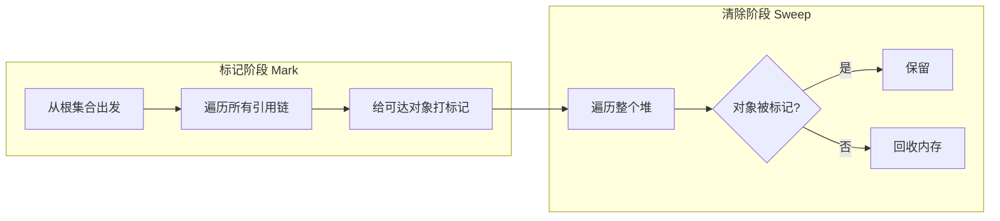
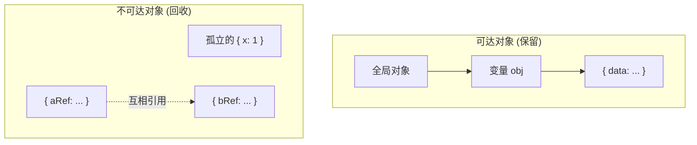
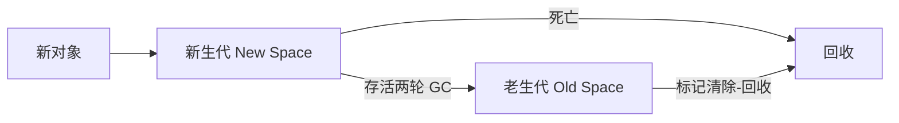

JavaScript 的内存管理遵循"分配、使用、释放"三阶段生命周期，其中释放阶段由垃圾回收器（Garbage Collector, GC）自动完成，开发者无需显式释放内存。但自动不代表无成本，理解 GC 的工作原理对编写高性能代码和排查内存泄漏至关重要。

---

## 内存分区：栈与堆

JS 引擎将内存分为两个区域，各自管理不同类型的值：

| 区域 | 存储内容 | 特征 | 生命周期 |
|---|---|---|---|
| 栈（Stack） | 基本类型值、引用地址 | 空间小、分配快 | 函数退出时自动弹出 |
| 堆（Heap） | 引用类型（Object、Array、Function 等） | 空间大、分配慢 | 由 GC 决定回收时机 |

```js
let a = 42          // 42 本身存在栈上
let b = { x: 1 }    // { x: 1 } 存在堆上，b 在栈上存的是指向堆的地址
```

基本类型按值访问，进出栈随函数调用自动管理；引用类型按地址访问，实际数据驻留在堆中，GC 需要判断它们是否还"有用"。

---

## 引用计数：思路直接但存在致命缺陷

引用计数是最直观的 GC 策略：每个对象维护一个计数器，记录被引用的次数。计数器归零即回收。

```js
let obj = { a: 1 }   // { a: 1 } refCount = 1
let ref = obj        // refCount = 2
obj = null           // refCount = 1
ref = null           // refCount = 0，回收
```

这种策略的致命缺陷是循环引用：

```js
function createCycle() {
  const a = {}
  const b = {}
  a.bRef = b
  b.aRef = a
}
createCycle()
// a 和 b 离开作用域后彼此引用，计数器永不为零，无法回收
```

这正是 IE6/7 时代 DOM 与 JS 对象交叉引用导致内存泄漏的根因。现代引擎已不再单纯依赖引用计数，而是采用更健壮的标记清除策略。

---

## 标记清除：以可达性为判断标准

标记清除（Mark-and-Sweep）是 V8、SpiderMonkey 等现代引擎的核心算法。它不再关心"有几个引用指向它"，而是关心"从根对象出发还能不能访问到它"。



根集合（Root Set）包括全局对象（window/globalThis）、当前执行栈上的局部变量、闭包中被引用的外部变量。从根集合出发，沿着引用链能访问到的对象就是"可达"的，应保留；其余全是垃圾。

循环引用在标记清除下不是问题：两个互相引用的对象如果从根出发都无法到达，标记阶段根本遍历不到它们，清除阶段直接回收。



---

## V8 的分代回收

标记清除遍历整个堆的成本随堆大小线性增长。V8 基于"大部分对象朝生夕死"的观察，将堆分为两代，用不同策略分别管理：



| 特性 | 新生代（New Space） | 老生代（Old Space） |
|---|---|---|
| 空间大小 | 1~8 MB | 可达 GB 级 |
| 回收算法 | Scavenge（半空间复制） | Mark-Sweep-Compact |
| 回收频率 | 高频（Minor GC） | 低频（Major GC） |
| 对象特征 | 临时对象、短暂生命周期 | 持久对象、长期存活的闭包变量 |

### Scavenge：新生代的高效回收

新生代划分为两个等大区域：From 空间（活跃）和 To 空间（空闲）。Minor GC 时将 From 中的存活对象复制到 To，两轮 GC 后仍存活的对象晋升到老生代，其余对象随 From 空间整体释放。复制过程同时完成了碎片整理，回收极快。

### Mark-Sweep-Compact：老生代的完整回收

老生代执行完整的 Mark-Sweep 流程，必要时增加 Compact（碎片整理）步骤：将存活对象向一端移动，腾出连续空闲空间，避免"总空闲空间足够但没有连续大块"导致的对象分配失败。

### 增量标记与三色模型

为避免老生代 GC 导致的长时间暂停（Stop-the-World），V8 将标记阶段拆分为多个小步，与 JS 主线程交替执行：

| 颜色 | 含义 |
|---|---|
| 白色 | 尚未访问，潜在的回收对象 |
| 灰色 | 自身已访问，但子节点未遍历完毕 |
| 黑色 | 自身及其全部子节点均已遍历 |

增量标记期间，JS 代码可能修改引用关系。V8 通过写屏障（Write Barrier）拦截新引用创建，确保不会遗漏新出现的存活对象。

---

## 常见内存泄漏场景

| 场景 | 原因 | 修复 |
|---|---|---|
| 意外全局变量 | 未声明变量自动挂到 window | 使用严格模式或 lint 规则 |
| 遗忘的定时器 | `setInterval` 持有闭包引用 | 页面/组件销毁前调用 `clearInterval` |
| 脱离 DOM 的引用 | JS 变量持有已移除 DOM 节点的引用 | 解除对该节点的所有引用 |
| 闭包误持大对象 | 闭包只用了一个字段，却保留整个外部对象 | 显式解除闭包未使用的引用 |

```js
// 闭包误持大对象的典型场景
function loadData() {
  const allUserData = new Array(1_000_000)  // 大数组
  // 返回的闭包只用了 allUserData 的一个字段
  // 但整个 allUserData 1GB 内存都被保留
  return () => {
    console.log(allUserData.length)
  }
}
const fn = loadData()  // 1GB 永不被回收
```

排查工具：Chrome DevTools 的 Memory 面板（Heap Snapshot 对比 + Allocation Timeline 定位增长点）。

---

## 弱引用：手动介入 GC 边界

ES2021 引入 `WeakRef`，标准中早先已存在的 `WeakMap` 和 `WeakSet` 也基于同样原理：

| 机制 | 行为 |
|---|---|
| `WeakMap` | key 是弱引用，对象被回收后对应条目自动清除 |
| `WeakSet` | 元素是弱引用，对象被回收后自动移出 |
| `WeakRef` | 通过 `.deref()` 访问，可能返回 `undefined`（已被回收） |

弱引用不阻止 GC，适用于缓存、元数据关联等"有就更好、没有也不影响功能"的场景。普通业务代码中不应依赖 WeakRef 做关键逻辑判断。

---

## 总结

JS 的自动内存管理基于可达性分析：从根对象出发能访问到的对象保留，不可达的回收。V8 在此之上叠加了分代回收（新生代用 Scavenge、老生代用 Mark-Sweep-Compact）和增量标记（三色法 + 写屏障），在吞吐量和暂停时间之间取得平衡。日常开发中需要警惕闭包误持大对象、遗忘的定时器和全局变量泄漏三种最常见的内存问题。
