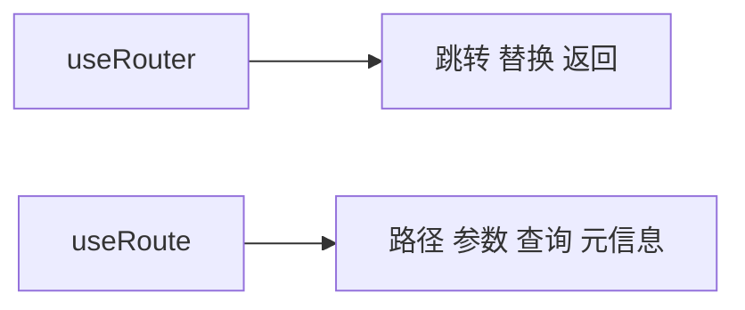
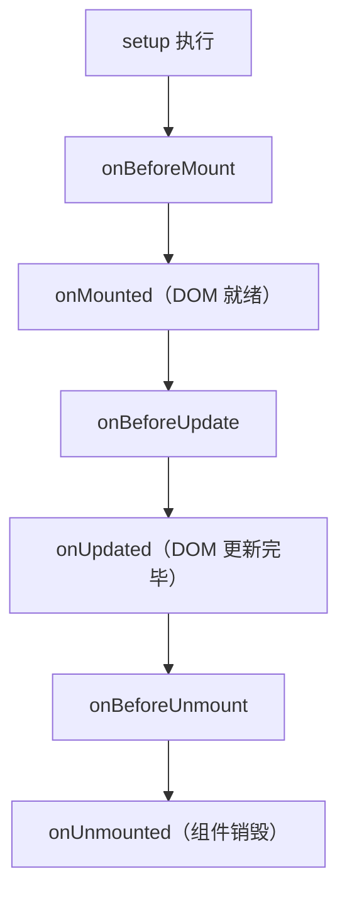
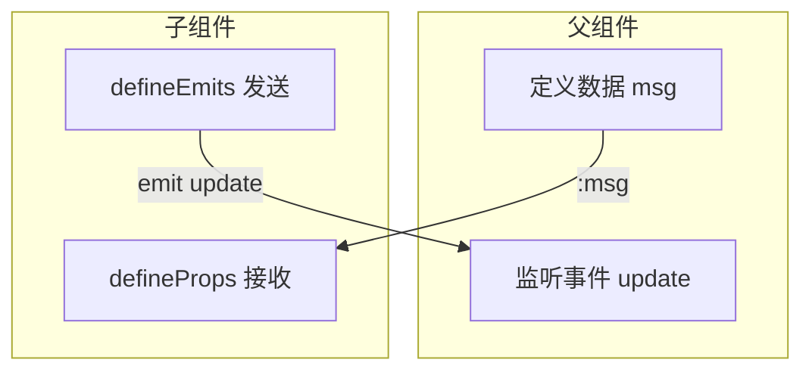

Vue 3 项目中有几个高频操作对象贯穿开发全程：`router` / `route` 控制页面导航与路由状态；Pinia store 负责跨组件状态共享；`ref` / `reactive` / `computed` 是响应式系统的直接操作入口；生命周期钩子提供组件运行的各个截断点；`props` / `emit` / `slots` / `attrs` 则构成了组件间通信的四条基本通道。本文将它们的用途、获取方式和使用场景做一次系统梳理。

---

## 路由：router 与 route

`router` 和 `route` 是 Vue Router 提供的两个核心对象，名字相近但分工相反：

| 对象 | 获取方式 | 职责 | 比喻 |
|---|---|---|---|
| `router` | `useRouter()` | 主动控制跳转（动作） | 方向盘 |
| `route` | `useRoute()` | 读取当前路由信息（状态） | 导航屏幕 |



### router：控制导航

```ts
import { useRouter } from 'vue-router'

const router = useRouter()

router.push('/about')             // 跳转到指定路径
router.push({ name: 'user', params: { id: 1 } })  // 按路由名跳转
router.replace('/login')          // 替换当前历史记录（无返回按钮）
router.back()                     // 返回上一页
router.go(-1)                     // 等价于 back
```

`router.push` 和 `router.replace` 的差异在于浏览器历史记录：`push` 新增一条记录（用户可点返回），`replace` 覆盖当前记录（不可返回）。登录成功后的重定向通常用 `replace`，避免用户返回到登录页。

### route：读取状态

```ts
import { useRoute } from 'vue-router'

const route = useRoute()

route.path          // '/user/1'
route.params.id     // '1'（动态路由 /user/:id）
route.query.search  // 'vue'（查询参数 /list?search=vue）
route.name          // 'user'（路由名称）
route.meta          // { requiresAuth: true }（路由元信息）
route.fullPath      // '/user/1?tab=profile#anchor'（完整路径）
```

`route` 是响应式对象。地址栏变化时，所有依赖 `route.xxx` 的组件会自动重新渲染。

---

## 状态管理：Pinia store

Pinia 是 Vue 3 官方推荐的状态管理库，用于跨组件共享数据。每个 store 通过组合式函数的方式定义和获取：

```ts
// stores/counter.ts
import { defineStore } from 'pinia'
import { ref } from 'vue'

export const useCounterStore = defineStore('counter', () => {
  const count = ref(0)
  const double = computed(() => count.value * 2)

  function increment() {
    count.value++
  }

  return { count, double, increment }
})
```

```vue
<!-- 组件中使用 -->
<script setup>
import { useCounterStore } from '@/stores/counter'

const store = useCounterStore()
// store.count      读取状态
// store.increment() 调用方法
// store.$reset()    重置为初始值
// store.$patch({ count: 10 })  批量更新
</script>
```

与 `useRouter` / `useRoute` 一样，store 通过组合式函数获取实例，组件卸载时引用自动清理。

---

## 响应式核心：ref / reactive / computed

这三个是响应式系统的直接操作入口，所有组件的数据驱动都建立在它们之上：

| API | 适用类型 | script 访问 | template 访问 |
|---|---|---|---|
| `ref()` | 任意类型（基本/对象） | `.value` | 自动解包 |
| `reactive()` | 对象/数组 | 直接 `.prop` | 直接 `.prop` |
| `computed()` | 派生值 | `.value` | 自动解包 |

```ts
import { ref, reactive, computed } from 'vue'

const count = ref(0)                     // count.value++
const state = reactive({ name: 'vue' })  // state.name
const double = computed(() => count.value * 2)  // double.value，依赖变化自动重新计算
```

`computed` 返回的也是 ref 对象，与普通 ref 的区别在于它是惰性求值的：依赖不变则直接返回缓存值，不触发重新计算。

---

## 生命周期钩子

Vue 3 提供了一套函数式生命周期钩子，按组件从创建到销毁的顺序排列：



最常用的三个：

```ts
import { onMounted, onUnmounted } from 'vue'

onMounted(() => {
  // DOM 挂载完毕：发起网络请求、初始化第三方库、操作 DOM 节点
})

onUnmounted(() => {
  // 组件销毁前：清除定时器、取消网络请求、移除事件监听
})
```

所有钩子均需在 `setup()` 或 `<script setup>` 内部同步调用，不能放在异步回调或条件分支中。

---

## 组件通信四通道：props / emit / slots / attrs

Vue 3 的组件间通信遵循单向数据流：父组件通过 props 向下传数据，子组件通过 emit 向上发事件。slots 负责内容分发，attrs 负责未声明属性的透传。



### props：父传子

```vue
<!-- 父组件 -->
<ChildComp :title="pageTitle" :count="5" />

<!-- 子组件 -->
<script setup>
const props = defineProps({
  title: String,
  count: { type: Number, default: 0 }
})
// props.title、props.count 只读
</script>
```

### emit：子传父

```vue
<!-- 子组件 -->
<script setup>
const emit = defineEmits(['close', 'submit'])
emit('close')                       // 通知父组件
emit('submit', { name: 'data' })    // 带数据
</script>

<!-- 父组件 -->
<ChildComp @close="handleClose" @submit="handleSubmit" />
```

### slots：内容分发

```vue
<!-- 父组件使用子组件时传入内容 -->
<Card>
  <h2>标题</h2>
  <p>正文内容</p>
</Card>

<!-- Card.vue：为传入内容提供坑位 -->
<template>
  <div class="card">
    <slot />  <!-- 父组件传入的内容渲染在这里 -->
  </div>
</template>
```

### attrs：属性透传

`useAttrs()` 获取父组件传来的、未在 `defineProps` 中声明的所有属性。典型用途是将 class、style、aria 属性从包装组件透传给底层的原生元素。

```vue
<script setup>
import { useAttrs } from 'vue'
const attrs = useAttrs()
// attrs.class、attrs.id、attrs.style 等
</script>

<template>
  <input v-bind="attrs" />  <!-- 全部透传到原生 input -->
</template>
```

---

## 模板引用：ref 的双重语义

`ref` 在 Vue 中有两种用途：script 中创建响应式变量，模板中获取 DOM 元素或子组件实例。两者通过同名绑定自动关联：

```vue
<template>
  <input ref="inputRef" />
  <ChildComp ref="childRef" />
</template>

<script setup>
import { ref, onMounted } from 'vue'

const inputRef = ref(null)
const childRef = ref(null)

onMounted(() => {
  inputRef.value.focus()        // 原生 DOM 节点
  childRef.value.exposedMethod() // 子组件暴露的方法
})
</script>
```

子组件默认不暴露内部状态给父组件。如需暴露，子组件需使用 `defineExpose`：

```vue
<!-- 子组件 -->
<script setup>
const count = ref(0)
function increment() { count.value++ }
defineExpose({ increment })  // 只有 increment 对外可见
</script>
```

---

## 全局挂载：app 实例

`app` 是 `createApp()` 返回的 Vue 应用根实例，所有插件、全局组件、全局指令都在这里注册：

```ts
import { createApp } from 'vue'
import App from './App.vue'

const app = createApp(App)

app.use(router)          // 注册路由
app.use(pinia)           // 注册状态管理
app.use(ElementPlus)     // 注册 UI 组件库
app.provide('apiBase', 'https://api.example.com')  // 全局注入数据
app.mount('#app')        // 挂载到 DOM
```

`app` 只在 `main.ts` 中操作，组件内部不需要也不应该直接访问它。组件的全局依赖通过插件提供的函数（`useRouter`、`useXxxStore`、`inject`）获取。

---

## 快速索引

| 使用场景 | 调用方式 | 返回值类型 |
|---|---|---|
| 跳转页面 | `useRouter().push('/path')` | Router 实例 |
| 读取当前路由信息 | `useRoute().params / .query / .path` | Route 响应式对象 |
| 跨组件共享数据 | `useXxxStore()` | Store 实例 |
| 创建可变基本类型 | `ref(initValue)` | Ref 对象 |
| 创建可变对象 | `reactive(initObj)` | Proxy 代理对象 |
| 派生新数据 | `computed(() => expr)` | ComputedRef |
| DOM 就绪后执行逻辑 | `onMounted(callback)` | void |
| 获取 DOM 引用 | 模板 `ref="xxx"` + script `ref(null)` | Ref\<HTMLElement\> |
| 父向子传数据 | `defineProps()` | props 对象 |
| 子向父发事件 | `defineEmits()` | emit 函数 |
| 注册全局插件 | `app.use(plugin)`（在 main.ts） | App 实例 |
