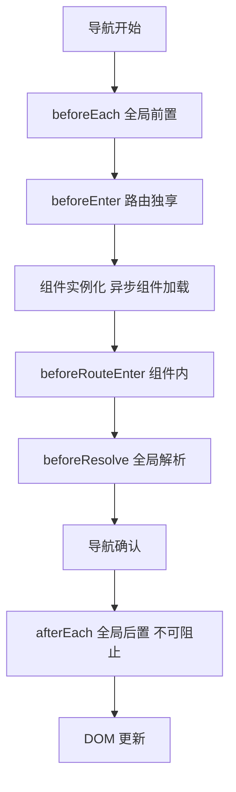
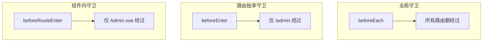
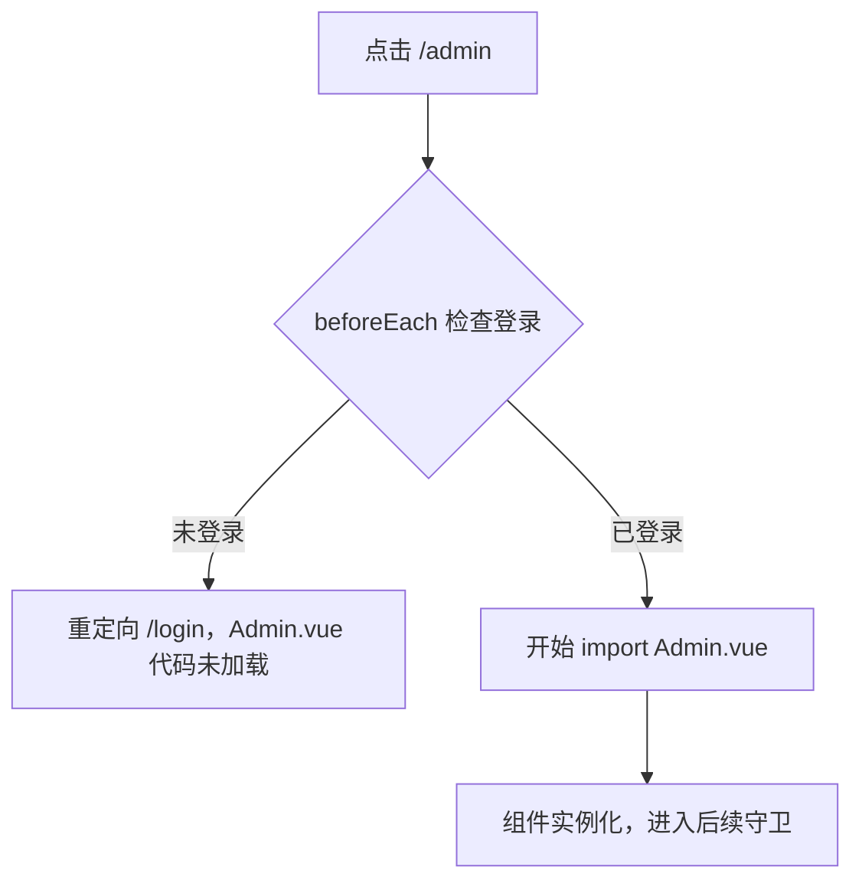

路由守卫（Navigation Guards）是 Vue Router 在页面跳转过程中插入的拦截点。没有守卫时，路由系统只是一个路径到组件的映射表；有了守卫，它变成一道带检查机制的门禁，可以在跳转前校验权限、在跳转后记录日志、在离开时提示保存。

---

## 导航流水线：5 个检查点的执行顺序

Vue Router 将一次完整的路由跳转拆成一条流水线，每个守卫是插在固定位置的钩子函数。钩子的执行顺序严格固定，前一个放行才会推进到后一个：



这 5 个钩子之所以分开，是因为**每个检查点能拿到的上下文不同**。排在越前面的钩子越早执行，但可用的信息也越少；排在越后面的钩子信息越丰富，但拦截成本也越高。

| 钩子 | 执行时机 | 能否访问组件实例 | 能否阻止导航 |
|---|---|---|---|
| `beforeEach` | 导航解析后、组件加载前 | 否 | 是 |
| `beforeEnter` | beforeEach 之后、同路由级 | 否 | 是 |
| `beforeRouteEnter` | 组件实例已创建 | 是（通过 next 回调） | 是 |
| `beforeResolve` | 所有组件内守卫执行完毕 | 否（导航尚未确认） | 是 |
| `afterEach` | 导航已确认 | 否 | 否 |

`beforeEach` 是整个流水线的第一个卡口，设计目标就是在不加载目标组件的前提下快速判断是否放行。如果检查不通过，连目标组件的代码都不会发生下载请求，这是路由守卫与路由懒加载配合的核心价值。

---

## 守卫的三种层级

层级按代码写在什么位置来划分，与流水线上的检查点正交：

| 层级 | 代码位置 | 作用范围 | 对应钩子 |
|---|---|---|---|
| 全局 | `router/index.ts` | 所有路由 | beforeEach, beforeResolve, afterEach |
| 路由独享 | routes 数组某一条路由内 | 单条路由 | beforeEnter |
| 组件内 | 页面组件的 script 中 | 单个组件 | beforeRouteEnter, beforeRouteUpdate, beforeRouteLeave |



三种层级没有互斥关系，一次跳转会按顺序依次触发。全局守卫适合放所有路由通用的逻辑（如登录校验），路由独享守卫适合放某条路由特有的限制（如 VIP 页面），组件内守卫适合放组件自身的进入和离开行为（如表单防误退）。

---

## 登录校验：最常见的守卫模式

以下是一个典型的全局前置守卫实现，用返回值语法（Vue Router 4.x 推荐写法）：

```ts
import { createRouter } from 'vue-router'

const router = createRouter({ /* routes */ })

router.beforeEach((to, from) => {
  // 目标页面需要登录
  if (to.meta.requiresAuth && !getToken()) {
    return '/login'
  }

  // 已登录用户访问登录页，重定向到首页
  if (to.path === '/login' && getToken()) {
    return '/'
  }

  // 无返回值视为放行
})
```

返回值决定行为：`return '/path'` 重定向（启动一次新导航），`return false` 取消（停留在当前页），不返回或返回 `undefined` 放行。

Vue Router 3.x 用的是回调式 `(to, from, next)` 语法，Vue Router 4.x 保留兼容但推荐返回值写法，代码更扁平。

---

## 动态路由：权限模型的进阶用法

登录校验只能判断"是否登录"，无法区分"登录后能看哪些页面"。更精细的权限控制需要**动态路由**模式：登录后根据后端返回的角色权限表，动态将路由注入 router 实例。

```ts
router.beforeEach(async (to) => {
  const token = getToken()

  if (token) {
    // 已登录：拉取用户权限，动态添加路由
    if (!hasLoadedRoutes()) {
      const permissions = await fetchUserPermissions()
      const accessibleRoutes = generateRoutes(permissions)
      accessibleRoutes.forEach(route => router.addRoute(route))
    }
  }

  if (to.meta.requiresAuth && !token) {
    return '/login'
  }
})
```

核心在于 `router.addRoute()`：它在守卫内部调用，向已有的 router 实例追加新路由规则。这使得路由表不再写死在配置文件中，而是根据用户的角色在运行时动态生成。

---

## 组件内守卫：进入、更新与离开

组件内守卫的三个钩子分别对应三种导航事件：

| 钩子 | 触发时机 |
|---|---|
| `beforeRouteEnter` | 导航进入当前组件前 |
| `beforeRouteUpdate` | 当前组件被复用但路由参数变化（如 /user/1 到 /user/2） |
| `beforeRouteLeave` | 导航离开当前组件前 |

```vue
<script setup>
import { onBeforeRouteLeave } from 'vue-router'

// 离开前检查是否有未保存内容
onBeforeRouteLeave((to, from) => {
  if (formHasChanges.value) {
    return window.confirm('未保存的修改将丢失，确定离开？')
  }
})
</script>
```

`beforeRouteUpdate` 是容易被忽略但很实用的钩子：当页面从 `/user/1` 切换到 `/user/2` 时，由于同一组件被复用（不会重新创建），`onMounted` 不会再次触发。此时只能用 `beforeRouteUpdate` 来响应参数变化并重新拉取数据。

---

## 守卫与异步组件的协同

路由守卫与路由懒加载的配合不是功能耦合，而是优化叠加：



守卫检查的是导航确认逻辑，组件加载是独立的网络行为。如果组件采用静态导入（全部打进主 bundle），守卫仍然能阻止渲染，但无法阻止下载；如果采用懒加载，守卫挡住的页面连下载都不会触发。两者独立工作，搭配使用效果更好。

---

## 总结

路由守卫的核心价值是将跳转前的判断逻辑从各个页面组件中抽离到路由层集中管理。全局守卫处理通用检查（登录），路由独享守卫处理特定限制（权限页面），组件内守卫处理个体行为（数据保护）。这三个层级按顺序在导航流水线上执行，与异步组件加载协同，构成了 Vue Router 的权限控制基础。
