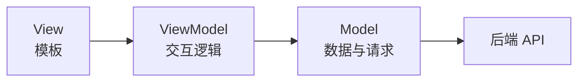
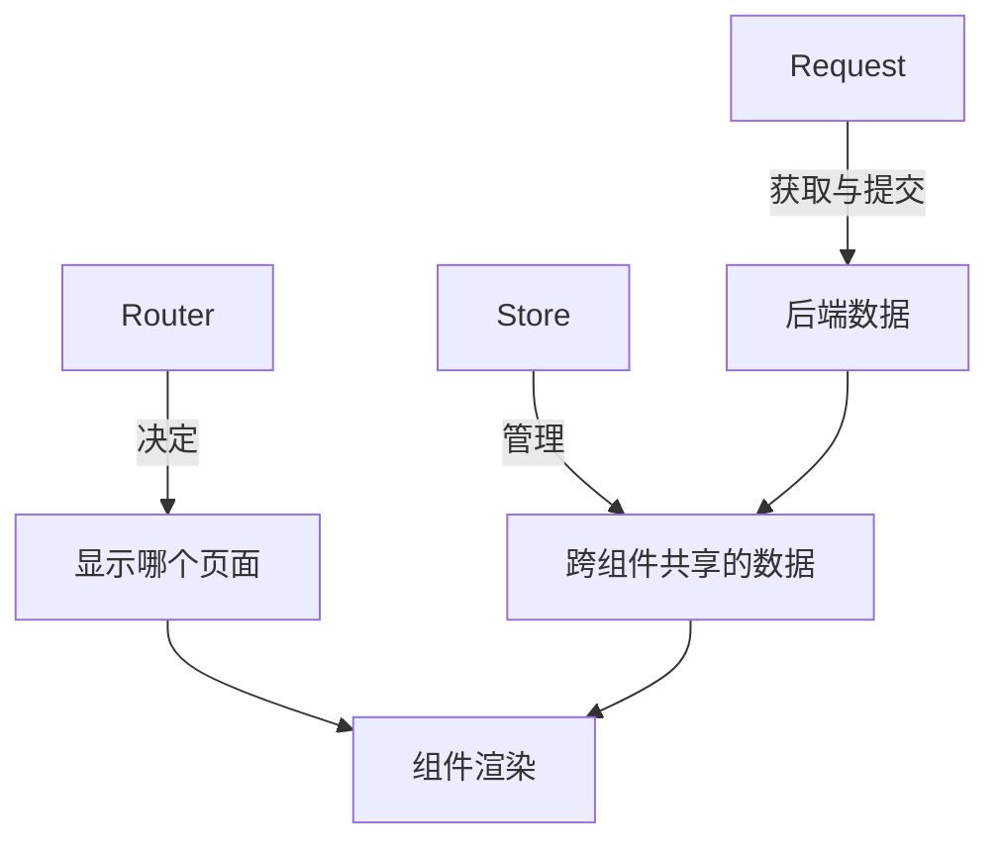
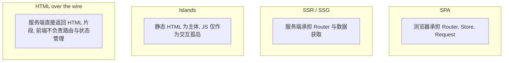

前端项目的代码大致可分为四层：视图、数据结构、业务逻辑、框架处理。前两层与后两层分别对应 MVVM 的 View 和 Model 两端，唯独"业务逻辑"这个词似乎塞不进 M-V-VM 三个字母里。本文讨论业务逻辑的分层归属及其在 SPA 架构中的三种核心形态，并对比其他工程化范式以理解这一分类的适用范围。

---

## 业务逻辑在 MVVM 中的归属

MVVM 的三个角色定义清晰：Model 是数据，View 是界面，ViewModel 是二者间的桥梁。但业务逻辑并不独占其中某一层，而是按"属于谁"分散在 Model 和 ViewModel 中：

| 业务逻辑类型 | 归属 | 示例 |
|---|---|---|
| 数据获取与转换 | Model（延伸） | API 请求、数据格式化、状态存储 |
| 交互流程与用户意图 | ViewModel | 表单提交、弹窗控制、步骤跳转 |
| 访问控制 | 两者之间 | 路由守卫 + 按钮级权限 |



Model 在实际项目中是一个大箩筐，不仅装业务数据本身，也装数据从哪来（API 服务层）、怎么加工（computed）以及存在哪（Pinia store）。ViewModel 则专管用户交互的编排。

---

## SPA 业务逻辑的三种核心形态

在 Vue/React SPA 项目中，业务逻辑主要集中在三种机制上：



### Router：导航即逻辑

路由不仅是 URL 到组件的映射，还承载了权限校验（守卫）、页面重定向、动态路由注册等非视图逻辑。这是 SPA 区别于多页应用的最大特征：页面切换不再由服务器控制，而是前端运行时自行决策。

### Store：状态即逻辑

跨组件共享的数据集中管理后，数据的一致性和变更追踪变得可控。用户的登录态、购物车内容、表单草稿等一旦放入 store，任何组件修改均能在全局同步。

### Request：通信即逻辑

请求的 baseURL、Token 注入、错误拦截、超时重试等通用逻辑一旦从组件中抽离到服务层，组件就只需关心"要什么数据"，而不用重复关注"怎么获取数据"。

三者并非独立运作。一次典型的业务交互经过全链路：

```
URL 变化 → Router 匹配路由 → 页面渲染 → Store 检查缓存
  → 无缓存 → Request 拉取数据 → 更新 Store → 视图响应
```

---

## 并非所有前端都以此为核心

Router + Store + Request 是 SPA 的范式，而非整个前端的范式。以下三种主流方案采用了完全不同的设计：



| | SPA | SSR（Next/Nuxt） | Islands（Astro） | HTMX 类 |
|---|---|---|---|---|
| Router 位置 | 浏览器 | 服务端 + 浏览器 | 不需要 | 后端 |
| Store 位置 | 浏览器内存 | 弱化 | 岛屿内部 | 不需要 |
| Request 位置 | 浏览器调 API | 服务端直查 | 岛屿内部按需 | 浏览器原生 |
| JS 体积 | 大 | 中 | 小 | 极小 |
| 典型场景 | 后台、复杂交互 | 内容站、电商 | 博客、文档站 | 传统服务端应用 |

这些方案的本质差异在于"复杂度放在哪里"：SPA 放在浏览器，SSR 分到服务端，Islands 推到构建时，HTMX 类留在后端。不存在优劣之分，只有场景匹配。

---

## 总结

前端代码的分层意识比具体框架的 API 更重要。视图、数据、业务逻辑、框架处理的四层划分在大项目中保持代码可维护性的基础。MVVM 为组件内部的职责分离提供了设计模型，而 Router、Store、Request 三类机制则覆盖了组件之外的全局业务逻辑。这套模式在 SPA 架构中高度统一，但在其他工程化范式中并非必然。
