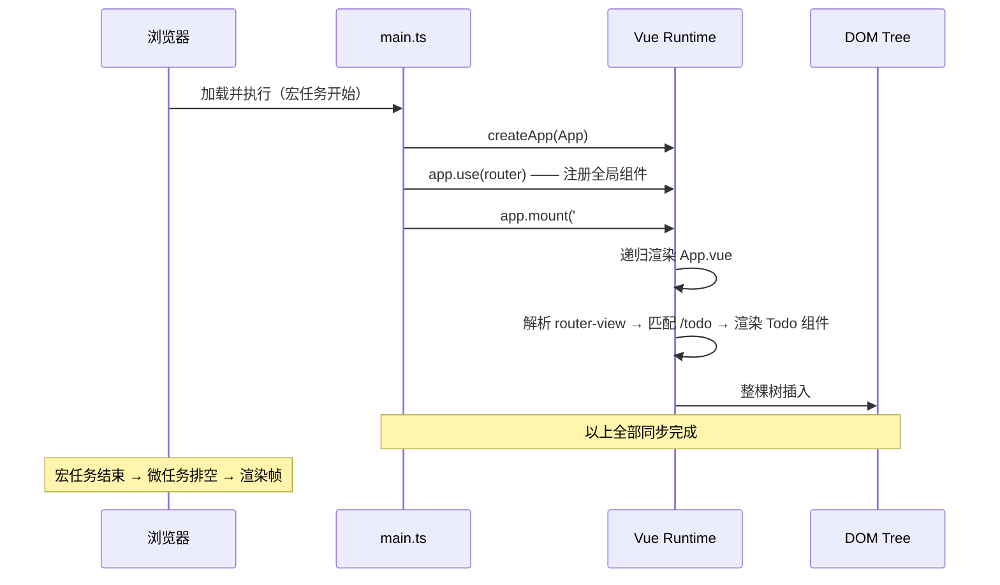
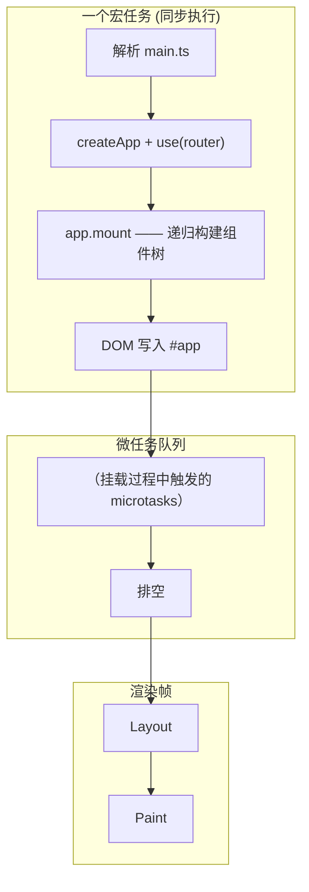
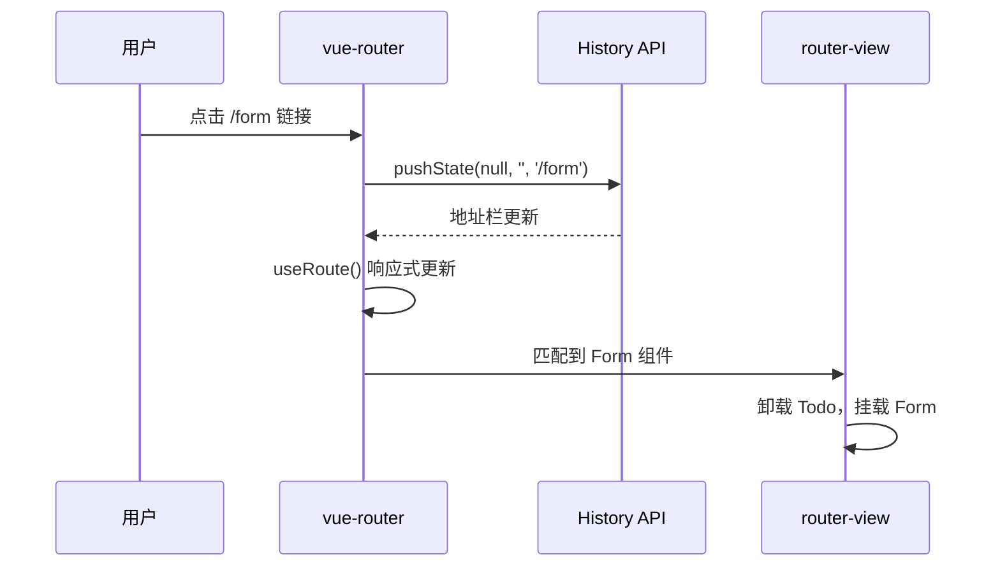

## The three static files: division of roles

一个 Vue SPA 项目有三个文件从不改变形态、却又参与了每一次页面启动：`index.html`、`main.ts`、`App.vue`。它们的职责边界是精确划分的。

**`index.html`：浏览器的入口锚点。** 这是整个应用唯一的 HTML 文件。它的核心内容只有一行 `<div id="app"></div>` 和一行 `<script type="module" src="/src/main.ts"></script>`。前者提供一个 DOM 挂载容器，后者告诉浏览器从这里开始加载 JavaScript。`index.html` 不包含任何业务逻辑，也不感知 Vue 的存在，它只履行 HTML 规范赋予它的职责——定义文档结构并声明脚本依赖。

**`main.ts`：运行时启动脚本。** 浏览器加载并执行 `main.ts` 后，Vue 运行时才开始运转。它的任务分为三步：

```ts
const app = createApp(App);   // ① 创建应用实例
app.use(router);               // ② 注册插件
app.mount('#app');             // ③ 挂载到 DOM
```

`main.ts` 是一个编排者（orchestrator），不负责渲染任何 UI，只负责按正确顺序初始化运行时依赖。路由、状态管理、UI 组件库、全局指令——所有需要在组件渲染前就位的资源，都在 `mount` 调用之前完成注册。

**`App.vue`：组件树的根节点。** 它是最顶层的 Vue 组件，包含一个 `<router-view />` 占位符：

```vue
<template>
  <router-view />
</template>
```

`<router-view />` 不需要在 `App.vue` 中显式 import，因为 `app.use(router)` 已经将该组件注册为全局组件。`App.vue` 并不"包含"其他页面，它只是声明了一个响应式插槽（slot），由 vue-router 根据当前地址栏路径动态填充对应的页面组件。

三层职责可以归纳为一张图：


## Synchronous mount: one macrotask, one call stack

一个常见直觉误区是认为 `app.mount('#app')` 会推一个任务到微任务队列，随后由事件循环调度执行。事实恰好相反：**`mount` 是同步函数，整个组件树的构建在同一个调用栈内一次性完成。**



整个过程发生在一个宏任务内部。`mount` 返回时，整个 Vue 组件树已经构建完成，DOM 已写入页面。浏览器的 layout 和 paint 发生在宏任务结束之后、渲染帧到来之时。因此从代码角度看，Vue 应用的首次渲染是瞬时的——没有异步等待，没有中间状态暴露给用户。

## Event loop perspective

将上述时序嵌入浏览器事件循环模型，可以得到完整的启动全景：



有两点值得注意：（1）组件内部的生命周期钩子（`onMounted`）虽然是"挂载后"执行，但它们仍属于同一个宏任务的同步执行阶段，不是异步回调；（2）微任务队列在此过程中可能被触发（例如 `watchEffect` 的首次同步执行或 `nextTick` 回调），但它们在宏任务结束前就会被排空，不会跨越到下一个宏任务。

## SPA runtime: History API as the enabler

首次挂载完成后，SPA 进入运行时模式。用户点击导航链接时，页面不再发起新的 HTTP 请求，而是由 vue-router 拦截点击事件、调用 `history.pushState` 修改地址栏、触发内部响应式更新、匹配新的路由配置、替换 `<router-view>` 中的组件。



整个过程中，`main.ts` 已不再参与——它只运行一次便退出调用栈。运行时持续运作的是 vue-router 的响应式系统和 `App.vue` 中的 `<router-view>` 插槽。这就是 SPA 与多页应用的本质区别：**导航不销毁 JavaScript 运行时，组件替代表单页替换。**

## Summary

| 文件 | 职责 | 执行次数 |
|------|------|----------|
| `index.html` | 声明容器和脚本入口 | 一次（加载即完成） |
| `main.ts` | 编排初始化顺序，挂载应用 | 一次（mount 返回即完成） |
| `App.vue` | 提供组件树根节点和路由插槽 | 持续（运行时一直存在） |
| 事件循环 | 承载首次渲染和后续微任务排空 | 持续（页面存活期间不断循环） |

三个文件、一个运行时、一个事件循环——Vue SPA 的启动看似简单，背后的时序协作却严格遵循一条单向链路：HTML 提供锚点，JS 编排初始化，组件树同步构建，运行时持续响应地址栏变化。
