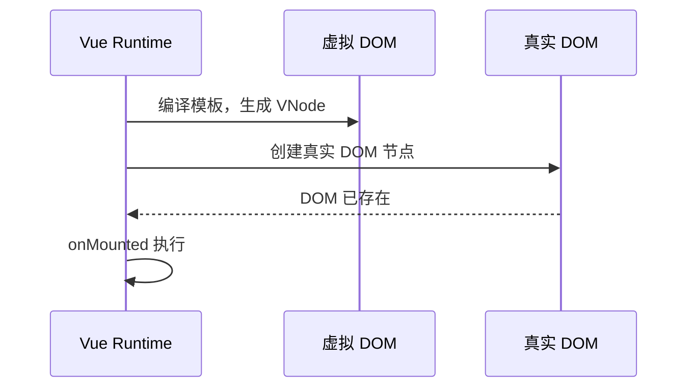

## 什么是生命周期

一个 Vue 组件并不是静态存在的。从它被创建、插入页面、响应数据变化，到最终被移除，整个过程由一系列明确的阶段构成。生命周期钩子（Lifecycle Hooks）就是 Vue 在这些阶段暴露出的回调入口，允许开发者在恰当的时机执行特定逻辑。理解生命周期，本质上是理解组件在运行时被调度的完整时间线。

来自官方文档的生命周期图示：


## 四个主要阶段

Vue 3 组合式 API 中的生命周期钩子可以归纳为四个阶段：创建、挂载、更新、卸载。


每个阶段内部又细分为两个钩子：一个在该阶段开始之前触发，一个在该阶段完成之后触发。这种成对设计提供了更精确的控制粒度。

## 创建阶段：初始化响应式系统

在创建阶段，Vue 解析组件选项、编译模板，并初始化响应式数据。在组合式 API 中，`setup()` 或 `<script setup>` 的同步执行期就发生在这一阶段。

```ts
import { ref, onMounted } from 'vue'

const count = ref(0)

console.log(count.value) // 0，响应式数据已就绪
```

此时模板尚未编译为真实 DOM，因此任何依赖 DOM 的操作都无法进行。若在此阶段调用第三方图表库或尝试聚焦输入框，只能得到空引用。

## 挂载阶段：从虚拟 DOM 到真实 DOM

挂载阶段是组件真正进入页面的时刻。`onBeforeMount` 在真实 DOM 创建之前触发，`onMounted` 在真实 DOM 插入页面之后触发。



```vue
<script setup lang="ts">
import { ref, onMounted } from 'vue'

const inputRef = ref<HTMLInputElement>()

onMounted(() => {
  inputRef.value?.focus()
})
</script>

<template>
  <input ref="inputRef" />
</template>
```

上述示例中，`inputRef.value` 只有在 `onMounted` 之后才指向真实 DOM 节点。若在 `setup` 同步阶段调用 `focus()`，输入框尚未创建，操作不会生效。

## 更新阶段：响应数据变化

当组件的响应式数据发生变化时，Vue 会重新渲染受影响的虚拟 DOM 树，并将差异 patch 到真实 DOM 上。`onBeforeUpdate` 在更新之前触发，`onUpdated` 在更新完成后触发。

```ts
import { ref, onUpdated } from 'vue'

const list = ref<string[]>([])

onUpdated(() => {
  console.log('DOM 已同步到最新数据')
})

function addItem() {
  list.value.push(`item-${list.value.length}`)
}
```

需要避免在 `onUpdated` 内部再次修改响应式数据，否则可能引发无限更新循环。

## 卸载阶段：清理副作用

当组件从页面中移除时，进入卸载阶段。`onBeforeUnmount` 在卸载之前触发，`onUnmounted` 在组件实例销毁之后触发。

```ts
import { onMounted, onUnmounted } from 'vue'

let timer: number

onMounted(() => {
  timer = window.setInterval(() => {
    console.log('tick')
  }, 1000)
})

onUnmounted(() => {
  clearInterval(timer)
})
```

定时器、事件监听、WebSocket 连接等副作用必须在卸载阶段清理，否则会造成内存泄漏。

## 卸载的触发条件

组件从 DOM 中移除的原因有多种，卸载本身是结果而非原因。最常见的触发条件包括以下五种。

**路由切换。** 这是 SPA 中最频繁触发卸载的原因。当地址栏路径变化时，`router-view` 内部会销毁旧页面组件的实例，创建新页面组件的实例。从 `/todo` 切换到 `/form`，意味着 Todo 组件走过 `beforeUnmount` 和 `unmounted`，Form 组件从创建阶段重新起步。

**`v-if` 条件变为 `false`。** 这是与 `v-show` 形成对比的关键点。`v-if` 在条件为假时会完全销毁组件及其 DOM 子树，再次变为真时重新创建；`v-show` 仅切换 `display: none`，组件实例始终存活。频繁切换的面板、标签页内部子内容，往往更适合用 `v-show` 保留状态。

**父组件被销毁。** 当父级组件因路由切换或 `v-if` 等原因被移除时，其所有子组件会跟随父组件一起被递归销毁。

**`:key` 值变化。** Vue 用 `key` 来识别组件的身份。当绑定在组件上的 `key` 值发生变化时，Vue 不会复用旧实例，而是销毁旧组件、创建新组件，触发一次完整的卸载与初始化。

**列表项被删除。** 在 `v-for` 渲染的列表中，当某一项的数据从源数组中移除时，对应 `key` 的组件实例会被销毁并从 DOM 中移除。

SPA 是否频繁卸载组件，取决于设计而非范式本身。将 `v-if` 用于反复切换的内容、以数组下标作为 `key` 导致排序时重建节点，都会造成不必要的频繁装卸。合理的策略包括：使用 `v-show` 保持暂时隐藏的组件存活；利用 `<keep-alive>` 缓存路由页面实例，在切回时不重建；为 `v-for` 指定稳定的 `id` 作为 `key`。`keep-alive` 会让组件从卸载流程中绕开，改为进入缓存状态——不执行 `unmounted` 而是触发 `deactivated`，切回时触发 `activated`。这意味着可以在保留组件状态的同时，避免频繁重建带来的性能开销和数据请求浪费。

## 生命周期钩子的注册时机

生命周期钩子必须在组件初始化阶段同步注册。Vue 内部维护一个"当前活动组件实例"的上下文，只有在同步执行 `<script setup>` 或 `setup()` 期间，这个上下文才指向当前组件。

```vue
<script setup>
import { onMounted } from 'vue'

// ✅ 正确：同步注册
onMounted(() => {
  console.log('mounted')
})

// ❌ 错误：异步注册时上下文已丢失
setTimeout(() => {
  onMounted(() => {
    console.log('不会正常工作')
  })
}, 0)
</script>
```

组件实例对象在异步执行后依然存在，但 Vue 已经失去了"当前正在初始化哪个组件"的上下文，因此无法将钩子正确挂载到对应实例上。

## 选项式与组合式 API 的对应关系

Vue 2 的选项式 API 与 Vue 3 的组合式 API 在生命周期上有一一对应关系：

| 选项式 API | 组合式 API |
|---|---|
| beforeCreate | setup 同步执行期 |
| created | setup 同步执行期 |
| beforeMount | onBeforeMount |
| mounted | onMounted |
| beforeUpdate | onBeforeUpdate |
| updated | onUpdated |
| beforeUnmount | onBeforeUnmount |
| unmounted | onUnmounted |

组合式 API 没有独立的 `onCreated` 钩子，因为 `setup` 本身就在创建阶段执行。

## 总结

生命周期是组件在时间维度上的调度契约。每个钩子都对应组件存在的某个确定阶段，开发者只需要判断当前逻辑依赖的是数据、虚拟 DOM 还是真实 DOM，即可选择正确的入口。掌握生命周期，意味着能够在正确的时间做正确的事，而不是把所有操作都堆在组件首次加载时。
