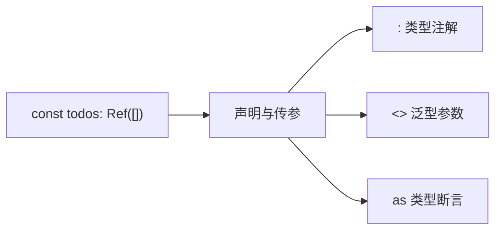
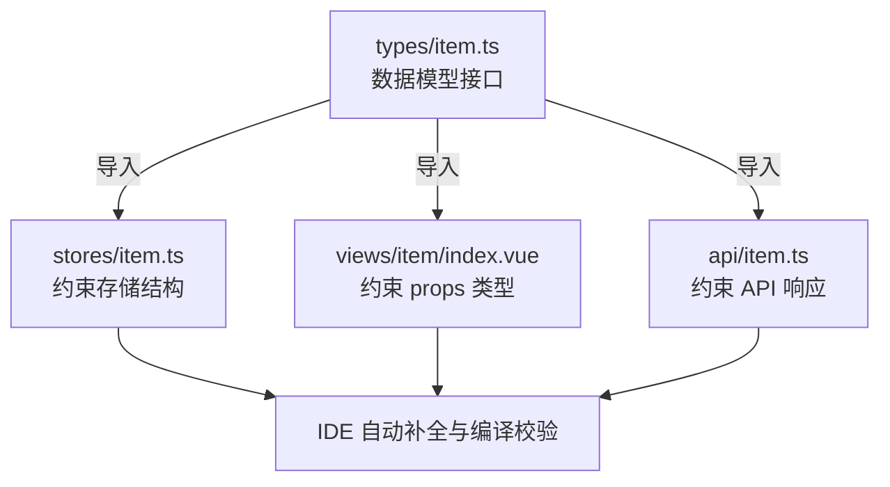

TypeScript 在前端工程中的价值常被简化为"给 JavaScript 加了类型"。这一描述虽然准确，却无法解释为什么同样的类型系统在小型项目中像是额外负担，在大型项目中却成为不可或缺的基础设施。本文以 Vue 项目中的 TypeScript 实践为样本，讨论类型注释的三种形态及其在不同规模项目中的角色差异。

---

## 类型注释的三种语法

在 Vue + TypeScript 项目中，类型信息的传递通过三种符号完成：



### `:` 类型注解：给变量贴标签

```ts
const count: number = 0                                  // 基本类型
const todos: Ref<Todo[]> = ref([])                       // 泛型类型
function addTodo(title: string): void { ... }            // 参数与返回值
```

`:` 声明"这个东西是什么类型"。TypeScript 编译器据此验证赋值、传参、返回值的合法性。这是最基础的用法，覆盖了项目中约 70% 的类型标注场景。

### `<>` 泛型参数：让类型可配置

```ts
const todos = ref<Todo[]>([])                            // 传给 ref 的类型参数
const props = defineProps<{ title: string }>()           // 传给 defineProps 的类型参数
const filter = ref<'all' | 'done' | 'undone'>('all')    // 传给 ref 的字面量联合类型
```

`<>` 的意义是将"类型也作为参数"传入通用函数。`ref()` 本身不知道要包裹什么数据，`ref<Todo[]>` 告诉它"这次包裹的是 Todo 数组"。同一段 `ref` 逻辑，通过泛型参数服务于所有数据类型。

### `as` 类型断言：覆盖编译器的推断

```ts
const el = document.querySelector('.box') as HTMLDivElement
const formRef = ref<FormInstance>()   // ← ref() 的泛型参数，不是 as
```

`as` 的使用场景远少于前两种。它仅在 TypeScript 推断能力不足以覆盖实际运行时类型时作为补充手段，属于"编译器，这次听我的"的兜底机制。项目中出现 `as` 的频率可以作为代码质量的参考指标之一。

---

## 在实际项目中的数据流

以一个典型的数据管理页面为例，类型从定义点向外传播：



类型定义在 `types/` 目录中完成，随后流向状态管理（约束数据存储的结构）、视图组件（约束 props 的类型）、服务层（约束 API 响应的格式）。整个数据链路共享同一份类型定义，任何一个环节的类型变更都受到编译器的统一校验，误传的字段在编码阶段即被拦截。

```ts
// types/item.ts — 唯一的数据结构定义
interface Item {
  id: string
  title: string
  done: boolean
  createdAt: number
}

// stores/item.ts — 类型自动传播
const items = ref<Item[]>([])

// views/item/index.vue — props 类型校验
defineProps<{ item: Item }>()

// api/item.ts — API 响应类型
function fetchItems(): Promise<Item[]> { ... }
```

---

## 从个人项目到团队项目：类型覆盖的扩展

随着项目规模和参与人数的增长，类型系统的覆盖面也在扩大：

| 层面 | 个人项目 | 团队协作项目 |
|---|---|---|
| 数据模型 | 少数几个接口定义 | 按业务模块拆分的多层级接口（`api/`、`store/types`、各模块内 `type.ts`） |
| 路由 | `RouteRecordRaw[]` 基本标注 | 完整的路由类型推导，配合 `vue-router/auto-routes` 自动生成 |
| 组件 | `defineProps` 的基本用法 | `defineProps` + `defineEmits` + slots 泛型类型 |
| API 层 | `Promise<T>` 基础类型标注 | Axios 拦截器的泛型扩展、响应数据统一包装类型 |
| 工具函数 | 仅核心函数添加类型 | `utils/` 下全部公共函数的参数与返回值标注 |
| 配置与插件 | 通常无类型标注 | 构建配置、指令注册、全局注入均有类型约束 |

核心差异不是用法上的新语法，而是类型定义的**覆盖密度**。个人项目的类型标注聚焦在主要数据流路径上；团队项目将类型覆盖扩展到工具函数、构建配置、指令注册等非业务路径，形成全链路的类型安全网。

---

## 生产环境中的 TS 实践

在团队协作、长期迭代的生产项目中，TypeScript 承担三项任务，每一项都超出了"类型检查"的字面含义：

### 编译时契约

多人并行开发时，接口定义（如 `types/item.ts`）充当组件间、模块间的数据契约。A 修改了接口字段，所有依赖该接口的模块（组件、store、API 调用）立即在编译阶段暴露问题，而非等到运行时才在浏览器控制台浮现。Git 合并冲突时，TypeScript 的错误列表比代码审查者的目光更先抵达问题现场。

### 重构的安全网

删除一个已废弃的字段、重命名一个被多处引用的方法、调整路由参数的结构，这些操作在纯 JavaScript 项目中是手动搜索加人工判断，在 TypeScript 项目中是一键重命名加全量编译校验。类型系统将重构的操作成本从线性增长（项目越大搜索越久）压平为常量（编译器遍历抽象语法树）。

### 文档即代码

```ts
// 不需要注释也能理解的数据结构
interface UserProfile {
  id: string
  nickname: string
  avatar?: string                          // 可选字段由 ? 表达
  role: 'admin' | 'editor' | 'viewer'     // 联合类型表达可能的取值集合
}
```

类型定义本身就是一份不会过期的文档。新成员阅读 `interface` 定义所需的时间远少于阅读代码逻辑推断字段含义的时间。代码即文档的实践中，类型系统提供了比 JSDoc 注释更可靠的单点真相源。

---

## 小结

TypeScript 在 Vue 项目中的角色可以从三个层次理解。语法层：`:` 注解、`<>` 泛型、`as` 断言三种符号覆盖所有类型标注场景。架构层：`types/` 目录作为数据契约的中心，向 `stores/`、`views/`、`api/` 辐射类型约束，形成全链路类型安全。工程层：编译时契约替代运行时排查、类型系统作为重构安全网、接口定义作为不会过期的文档。项目规模决定了这三个层次的激活程度：个人项目以语法层为主，团队项目扩展到架构层，生产环境三者全开。TypeScript 的价值不与代码行数成比例，而与项目参与者数量和迭代周期长度的乘积呈正相关。
