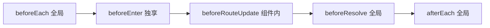
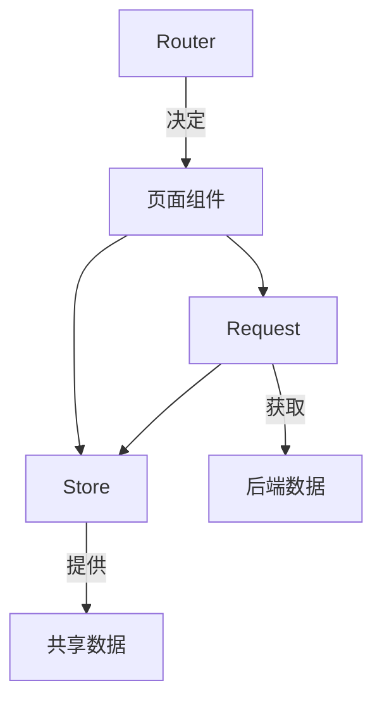

组件化解决了 UI 的组织问题，但一个完整的 SPA 还需要回答两个问题：页面之间如何切换，以及跨组件的数据如何共享。Vue Router 和 Pinia 分别承担了这两个角色，构成 Vue 工程化体系的左右支柱。

---

## Vue Router：导航即架构

### 路由实例的创建

```ts
import { createRouter, createWebHistory } from 'vue-router'

const router = createRouter({
  history: createWebHistory(),
  routes: [
    { path: '/', redirect: '/home' },
    { path: '/home', component: () => import('@/views/home/index.vue') },
    { path: '/user/:id', component: () => import('@/views/user/index.vue') },
    { path: '/:pathMatch(.*)*', redirect: '/error/404' },
  ],
})
```

`createRouter` 返回的 `router` 实例是整个应用的唯一导航中枢，在 `main.ts` 中通过 `app.use(router)` 注册后，所有组件均可通过 `useRouter()` 获取其实例引用。

### 三种 History 模式

| 模式 | URL 示例 | 底层机制 |
|---|---|---|
| WebHistory | `/user/1` | HTML5 History API（pushState） |
| WebHashHistory | `/#/user/1` | `location.hash`（`#` 后内容不发给服务器） |
| MemoryHistory | 无地址栏变化 | 纯内存栈，用于 SSR/测试 |

生产环境首选 WebHistory：URL 干净、支持 SSR、SEO 友好。HashHistory 仅在无法配置服务器（静态托管）时作为降级方案。

### 动态路由与嵌套路由

```ts
{
  path: '/user/:id',          // :id 为动态参数
  component: UserLayout,      // 父级作为布局壳
  children: [
    { path: '', component: UserHome },          // /user/123
    { path: 'profile', component: UserProfile }, // /user/123/profile
  ],
}
```

嵌套路由的父级组件内必须放置 `<router-view>` 作为子路由的渲染出口。Layout 作为父路由时路径设 `/` 或 `''`，不会污染子路由 URL。

### useRoute 与 useRouter

| | useRoute() | useRouter() |
|---|---|---|
| 类比 | 仪表盘（读） | 方向盘（写） |
| 返回 | 当前路由对象（path、params、query、meta） | 路由器实例（push、replace、back） |
| 响应式 | 是，依赖变化自动重算 | 否，仅提供操作命令 |

二者分属不同职责边界：`route` 只读保证了导航状态的唯一可信源，`router` 专注动作不与路径追踪耦合。

### 组件复用与参数变化

当 `/user/johnny` 跳转到 `/user/jolyne` 时，同一组件实例被复用（不销毁不重建），生命周期钩子不会再次执行。两种响应方式：

```ts
// 方式一：watch 路由参数
watch(() => route.params.id, (newId) => fetchUser(newId))

// 方式二：导航守卫
onBeforeRouteUpdate((to) => fetchUser(to.params.id))
```

### 导航守卫管线

守卫按固定顺序依次执行，前一个放行后一个才进入：



守卫的核心用途是权限控制：读取 `to.meta.requiresAuth`，未登录则返回 `/login` 终止本次导航。

---

## Pinia：状态高于组件

### 裸 reactive 的局限

```ts
// 能跑，但仅此而已
export const state = reactive({ user: null })
```

全局 `reactive` 对象能实现跨组件共享，但缺少 DevTools 调试、SSR 安全隔离、HMR 状态保留、插件生态等工程化能力。Pinia 在同样的响应式内核上包装了这些附加值。

### Setup Store = 高阶 Composable

```ts
export const useTodoStore = defineStore('todo', () => {
  const todos = ref<Todo[]>([])                            // state
  const doneCount = computed(() => todos.value.filter(t => t.completed).length)  // getter

  function add(title: string) { ... }                      // action
  function remove(id: string) { ... }
  function toggle(id: string) { ... }

  return { todos, doneCount, add, remove, toggle }
})
```

`defineStore` 接收一个回调函数，回调中返回的所有属性和方法构成 store 实例的公开接口。内部使用 Vue 原生的 `ref`、`computed`、`function`，与组件 `<script setup>` 写法完全一致。

| Pinia 概念 | Vue 对应 | 作用 |
|---|---|---|
| state | `ref` / `reactive` | 存储数据 |
| getter | `computed` | 派生计算，有缓存 |
| action | 普通函数 | 修改 state，可异步 |

与 Vuex 的区别：无 `mutations` 层，直接修改 state；不再区分同步异步；天然支持 TypeScript 类型推导。

### 按需注册，按需调用

```ts
// main.ts：注册 Pinia 实例到 Vue 应用
app.use(createPinia())

// 任何组件：调用时创建或复用 store 实例
const store = useTodoStore()
```

`defineStore` 只定义结构不创建实例；`useXxxStore()` 首次调用时创建单例，后续调用返回同一实例。这种按需连接模式让入口文件保持简洁。

---

## 两大支柱的协同



一次典型的业务导航链路：路由匹配页面 → 组件渲染 → store 检查缓存 → 无缓存则请求层拉取 → 更新 store → 视图响应。Router 控制"显示哪个页面"，Store 管理"数据归谁管"，二者在 SPA 中构成骨架级的基础设施。

---

## 速查清单

**Vue Router**
- `createRouter` + `createWebHistory` 创建实例，`app.use()` 注册
- 动态参数 `:id` 通过 `route.params` 获取
- 嵌套路由父级设 `path: '/'`，子级通过 `<router-view>` 渲染
- `useRoute()` 只读当前路由状态，`useRouter()` 执行导航操作
- 同组件参数变化用 `watch(() => route.params)` 或 `onBeforeRouteUpdate`
- 守卫执行顺序：`beforeEach` → `beforeEnter` → 组件内 → `beforeResolve` → `afterEach`

**Pinia**
- Setup Store 用 `defineStore` + 回调函数，返回 `ref`/`computed`/`function`
- State = ref，Getter = computed，Action = function
- `createPinia()` + `app.use()` 注册，`useXxxStore()` 按需获取实例
- `$reset` 重置 state，`$patch` 批量更新
