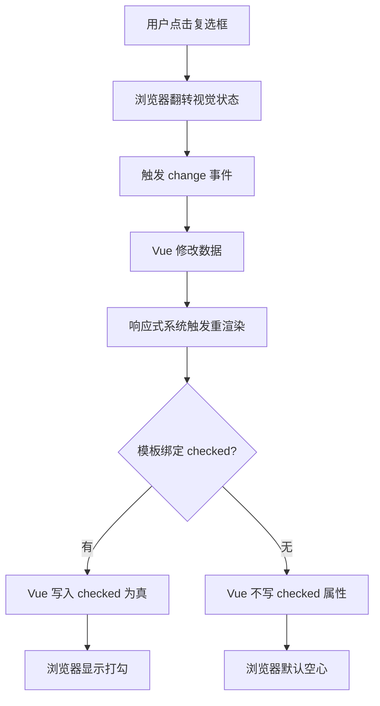

初次用 Vue 写表单时容易出现一种困惑：`<input>` 已经绑定了 `@change` 事件来修改数据，为什么还需要 `:checked="value"`？毕竟 `@change` 跑通以后，数据不是已经更新了吗？

重新渲染后复选框的状态跟点击时的视觉效果不一致，往往就是缺了这个绑定。

## 浏览器和 Vue 是两条线

当用户点击一个复选框时，实际发生了两件独立的事。

第一件发生在浏览器层：浏览器在事件触发之前就翻转了复选框的视觉状态。如果原来没有勾选，浏览器立刻画上一个勾。这个动作发生在一切 JavaScript 代码执行之前，是 HTML 规范定义的原生行为。

第二件发生在 Vue 层：`@change` 事件触发，绑定的方法修改了响应式数据。数据变了，Vue 的响应式系统通知组件重新渲染。重渲染时，Vue 根据模板重新生成虚拟 DOM，然后写入真实 DOM。

问题就出在第二步的最后环节。当 Vue 重渲染 `<input>` 时，如果模板里没有 `:checked` 绑定，Vue 生成的是一个不带 `checked` 属性的原生 `<input>` 标签。浏览器收到这个新标签，按照默认规则将其渲染为空心的未选中状态。

于是数据里 `completed` 是 `true`，界面上却是 □。第一条线画的勾，被第二条线的重渲染覆盖掉了。

## 受控与不受控

这个行为指向一个更底层的概念：表单元素的"受控"与"不受控"。

没有 `:checked` 绑定时，复选框的状态完全由浏览器的内部机制管理。点击后浏览器自己翻转，Vue 无法干预最终呈现。这是一个**不受控**组件。

加上 `:checked="value"` 后，复选框的状态不再由浏览器自由决定。每次渲染时，Vue 根据数据的值明确设置 `checked` 属性的真假。浏览器只是执行 Vue 写下来的指令。这是一个**受控**组件。

这并不是复选框独有的机制。文本输入框的 `v-model` 实质上也做了同样的事：`:value` 接管显示，`@input` 接管修改。区别在于文本输入框的重渲染通常不会改变光标位置和已输入文字（因为 `:value` 把显示同步回去了），而复选框天然只有真和假两个状态，缺了 `:checked` 就会在重渲染时回退到默认的空心状态。

## Vue 不读 DOM

这个现象揭示了一个理解 Vue 的关键前提：**Vue 不读取 DOM 的当前状态，Vue 只向 DOM 写入自己数据模型的投射结果。** 浏览器的原生行为是独立的一条线，Vue 的响应式渲染是另一条线。`:checked` 的作用不是在点击时"读取浏览器当前状态"，而是在重渲染时"告诉浏览器应该显示什么状态"。两条线通过这个绑定合龙为一。

所有原生表单控件都适用这一规律：`:checked` 对应复选框和单选框，`:value` 对应文本输入。它们的共同作用是接管浏览器的默认渲染，使 DOM 始终与数据模型保持一致。这不是防御性编码的冗余，而是数据驱动视图这一承诺得以兑现的必经通路。
