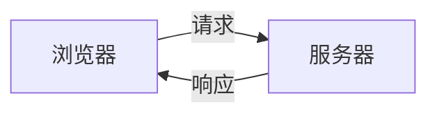
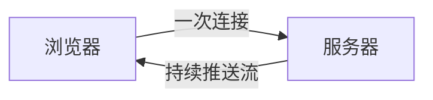
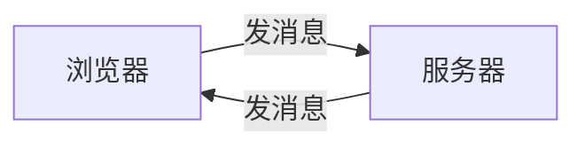

浏览器与服务器之间的数据传递，存在三种典型机制。传统 HTTP 是问答式，服务器处于被动。SSE 让服务器获得单向推送的能力。WebSocket 则建立双向实时通道。三者之间的差异，源于一个核心问题：服务器能否主动向浏览器发送数据。

## 传统 HTTP：一问一答

传统 HTTP 遵循严格的请求响应模型。浏览器是唯一主动方，服务器始终等待请求到来，才有开口的机会。

在这个模型下，服务器想通知浏览器有新消息，只能等浏览器再次发问。若想实现实时效果，浏览器需要不停轮询，例如每隔几秒询问一次"有更新吗"。这种方式既浪费请求，实时性也差。

## SSE：单向推送

SSE 全称 Server Sent Events，即服务器推送事件。它基于普通 HTTP，却把通道改成单向的持续数据流。

连接建立后，服务器可以源源不断地向浏览器写入数据，浏览器只需被动接收。SSE 是单向的，浏览器想往这个通道发消息，必须另外开一个普通请求。

SSE 的典型场景是 AI 流式回答。模型逐字生成内容，服务器每生成一段就推送一段，浏览器实时渲染。断线后 EventSource 会自动重连，这是内置能力。

## WebSocket：双向实时

WebSocket 使用独立的 ws 协议，连接建立后双方都能主动发消息。

"双向"的含义是，连接建立后任何一方都能随时发送数据，不必等待对方先开口。聊天室是典型场景，别人发来的消息浏览器事先不知道，服务器能直接推送过来，浏览器也能随时回复。

WebSocket 不自动重连，需要自行处理，这是它与 SSE 的一个工程差异。

## 三者的对比

| 维度 | 传统 HTTP | SSE | WebSocket |
|---|---|---|---|
| 方向 | 请求响应 | 服务器到浏览器单向 | 双向 |
| 协议 | HTTP | HTTP | ws |
| 自动重连 | 不涉及 | 内置 | 需要自己写 |
| 数据格式 | 任意 | 纯文本 | 文本和二进制 |

## 如何选择

选择依据是数据流向。只有服务器主动推、客户端基本只接收的场景，用 SSE，例如流式回答和通知流。需要双方高频互动的场景，用 WebSocket，例如聊天室和协同编辑。一次性请求用传统 HTTP 即可。
