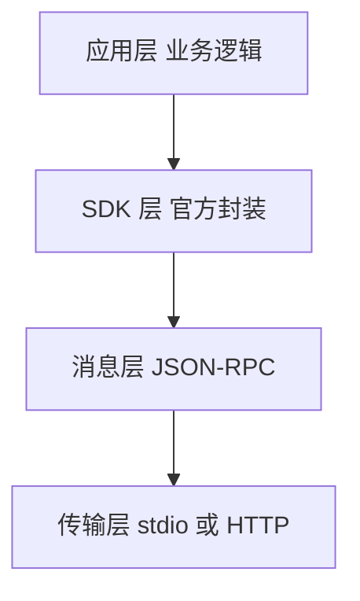
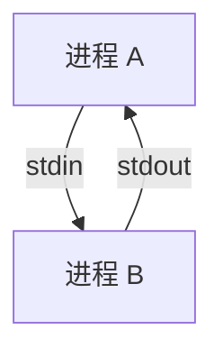

MCP 全称 Model Context Protocol，是 AI 调用外部工具的一套标准协议。它要解决的问题很朴素：让一个 AI 应用不管面对多少个工具，都用同一种方式去调用，而不是每个工具学一套接法。

理解 MCP，不能只停留在"标准协议"四个字。拆开看，它是一套从业务逻辑一路下沉到进程通信的分层结构。每一层只做一件事，层与层之间靠干净接口对接。

## 四层结构总览

MCP 从上到下分为四层，越往上越贴近业务，越往下越贴近机器。



- 应用层：开发者写的工具定义与调用逻辑
- SDK 层：官方库把协议细节封装成高层 API
- 消息层：请求与响应统一编码成 JSON-RPC 2.0
- 传输层：数据通过哪种通道在两个进程间流动

## 应用层：业务本身

应用层是开发者唯一需要手写的地方。一个工具从定义到调用，都在这一层完成。

```javascript
// MCP Server 侧：注册一个工具
server.registerTool('get_current_time', {
  description: '获取当前时间',
  inputSchema: z.object({})
}, async () => {
  return new Date().toLocaleString()
})

// MCP Client 侧：调用这个工具
const result = await client.callTool({ name: 'get_current_time', arguments: {} })
```

这一层关心的只有业务问题：工具叫什么、接受什么参数、执行什么逻辑、返回什么结果。协议如何传输，这里完全不用考虑。

## 工具返回值：双层结构

工具执行完要返回结果，这个结果的格式不是开发者随意定的，而是 MCP 协议规定的 `CallToolResult` 类型。它的结构是：

```text
CallToolResult {
  content: [ ... ]              ← 必须，内容块数组
  structuredContent?: { ... }   ← 可选，结构化数据
  isError?: boolean             ← 可选，是否出错
}
```

`content` 是必填的，`structuredContent` 是可选的。一个工具返回时，典型的长相是：

```javascript
function toTextContent(value) {
  return {
    content: [
      { type: 'text', text: JSON.stringify(value, null, 2) }
    ],
    structuredContent: value
  }
}
```

为什么要分成两层？因为同一份结果要服务两种完全不同的消费者，而它们要的东西不一样。

```text
消费者一：模型
  模型只能读文本或图片这类内容块
  它需要的是 content，一段能直接看进去的文字

消费者二：程序代码
  程序需要的是类型安全、能直接取值的原始对象
  它需要的是 structuredContent，能直接 structured.citations 这样访问
```

如果只给一种，就有一方难受：只给纯文本，程序要解析 JSON 字符串才能取到数据；只给结构化对象，模型根本没法读一个 JS 对象。所以协议干脆两份都给，各取所需。

在实际项目里，这个设计的落地是：`content` 里的文本回填给模型继续推理，`structuredContent` 里的字段交给程序逻辑直接使用。一份结果，两条路，互不干扰。

## SDK 层：协议的封装

开发者写的是 callTool，但工具调用真正要走协议，两者之间需要翻译。SDK 层承担这个角色，官方提供的 @modelcontextprotocol/sdk 把协议细节全部藏了起来。

```text
开发者只写         SDK 内部自动完成
client.listTools   → 序列化成 JSON-RPC 的 tools/list 请求
client.callTool    → 序列化成 JSON-RPC 的 tools/call 请求
拿到返回值         → 反序列化 JSON-RPC 响应，还原成 JS 对象
```

SDK 层的价值在于，开发者不必知道底层消息长什么样。换一个传输方式，只要换一个 Transport 对象，上层调用代码一行不用改。

## 消息层：JSON-RPC 2.0

消息层定义了一种统一的编码格式。无论工具调用还是结果返回，都表达成标准的 JSON-RPC 2.0 消息。

一次工具调用的请求，本质是这样一段结构：

```json
{
  "jsonrpc": "2.0",
  "id": 1,
  "method": "tools/call",
  "params": { "name": "get_current_time", "arguments": {} }
}
```

对应的响应则是：

```json
{
  "jsonrpc": "2.0",
  "id": 1,
  "result": { "content": [{ "type": "text", "text": "2026-08-13 17:20" }] }
}
```

JSON-RPC 是独立于 MCP 的通用远程调用协议，MCP 只是借用了它作为消息载体。method 字段承载了 tools/list、tools/call 这些 MCP 定义的调用名称。

## 传输层：stdio 与 HTTP

传输层决定消息通过哪种物理通道流动。MCP 支持多种传输方式，最常见的是 stdio 与 HTTP。



stdio 传输依赖子进程的标准输入输出。父进程 spawn 出子进程，两者通过 stdin 与 stdout 两根管道互相写读。它适合本机场景，简单且安全，因为不监听端口，外部无法连接。

HTTP 传输则适合跨机器场景，MCP Server 暴露一个 HTTP 端点，Client 通过 SSE 或 WebSocket 连接。两者选型的依据是进程是否在同一台机器上。

## 分层的意义

四层结构带来的好处是清晰的解耦。业务逻辑不感知消息格式，消息格式不依赖传输通道。想从 stdio 换成 HTTP，只改传输层；想调整工具逻辑，只改应用层。

```text
换工具逻辑   → 只动应用层
换传输方式   → 只动传输层
其余两层    → 保持不变
```

这正是协议分层的通用价值，与 HTTP 分层、操作系统分层一脉相承。每一层都向上层隐藏复杂度，向下层提供稳定接口。

## 小结

MCP 不是黑盒，而是一条四层流水线。业务逻辑定义工具，SDK 封装协议，JSON-RPC 编码消息，传输层搬运数据。理解这条流水线，就能从"知道 MCP 是标准协议"，深入到"知道它每一层在做什么"。
