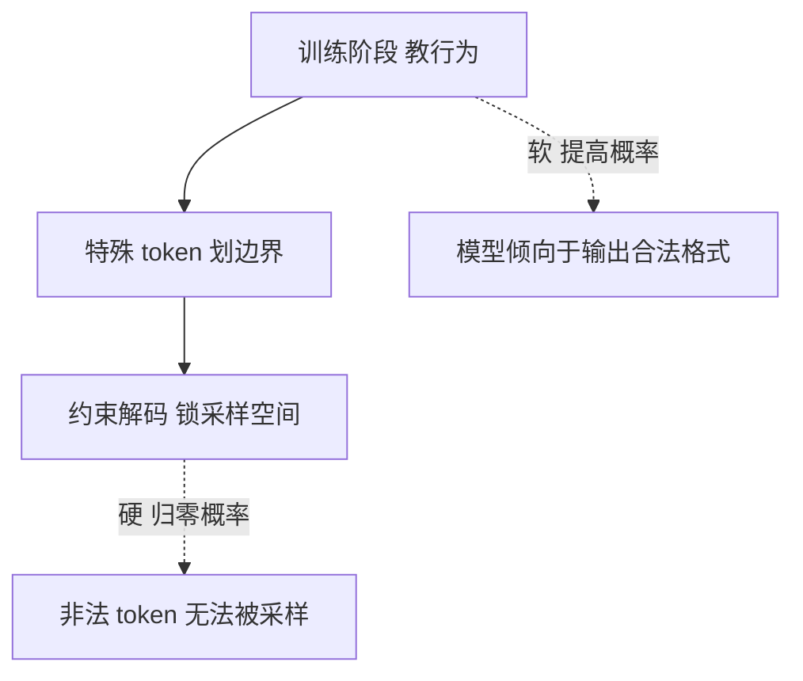
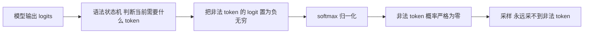

大模型本质上是一个预测下一个 token 的概率机器。无论对话多么流畅，它输出的永远只是一段字节流，而不是一次真实的动作。当对话系统需要"查时间""查天气""调数据库"这些真实能力时，就必须解决一个根本问题：如何让一段概率性的 token 流，变成一段代码可以精确捕捉、可以执行的指令。

Function Calling 就是这个问题的一个答案。要理解它，需要先看清它和早期"prompt 约束"的本质差异，再拆开它底层的三层实现。

## 作用：让模型"说出"它想调什么

在没有 Function Calling 之前，模型面对"现在几点"这样的问题，只能用文字回答，而它其实并不知道当前时间。模型只是一个语言生成器，没有"手"，无法真正访问系统时钟。

Function Calling 的思路是绕开这个限制：不让模型真的去执行，而是让模型"说出"它想调用哪个函数、传什么参数，再由外部的代码真正去执行。

```text
① 外部把工具定义（名称、描述、参数格式）发给模型
② 模型根据用户的话，判断要不要用工具、用哪个、传什么参数
③ 模型不执行，只返回一个结构化的"调用请求"
④ 外部代码解析这个请求，真正执行工具
⑤ 执行结果回填给模型，模型据此生成最终回答
```

关键点在于：模型从头到尾没有自己查时间，它只是表达了"想查时间"的意图，真正查时间的是外部代码。模型是决策者，代码是执行者。这就是 Function Calling 的全部作用。

## 早期方案：prompt 约束，靠赌概率

在原生 Function Calling 出现之前，开发者用 prompt 来"调教"模型输出固定格式。

```text
在提示词里写：
"如果你想查时间，请只输出 JSON，不要多余解释：
 {"tool": "get_time"}"
```

然后代码去解析这段 JSON。这个方案的问题是：模型不一定每次都老实照做。

```text
模型可能输出：
{"tool": "get_time"} 好的我来查一下
                ↑ 多了一句话，解析失败

或者：
{"tool": "get_time"，}   ← 多一个逗号，解析失败
```

根源在于 transformer 的输出本质是概率采样。prompt 只能让"输出合法 JSON"这件事的概率变高，比如从 50% 提高到 95%，但永远无法归零那 5% 的翻车可能。开发者只能靠"反复调教 + 解析容错"来兜底。

早期 Function Calling 不稳定，根本原因就在这里：它在用"建议"赌概率，而不是用"强制"锁结果。

## 原生方案：三层实现，从软到硬

原生 Function Calling 没有改变 transformer 的机制，模型每一步输出仍然是概率分布加采样。厂商改变的是"采样时允许采哪些 token"。这个能力由三层组合实现，从软到硬。



### 第一层：训练阶段，教会行为

厂商在训练模型时，用大量"工具调用"格式的样本做监督微调和强化学习。训练数据里塞满了这样的对话：

```text
用户：现在几点？
模型：<tool_call>get_current_time()</tool_call>
系统：现在时间是 14:20
模型：现在是 14:20
```

模型被反复训练后，学会了在需要外部工具时，输出工具调用而不是瞎编答案。这一层的作用是"教行为"，让模型倾向于在正确时机输出正确格式。但它只提高概率，不保证结果。

### 第二层：特殊 token，划出边界

很多实现会用特殊 token 把工具调用区域框起来，例如：

```text
<|function_call|> {"name": "get_time", "arguments": {}} <|end_function_call|>
```

这些 token 在训练中被教会，模型学会在这个 token 之后开始输出结构化内容。它的好处是边界清晰，解析时不容易串味。但这一层仍然是概率，模型依然可能在该输出左花括号时输出了左括号。

### 第三层：约束解码，强制语法合法

这是真正让"保证"成立的一层，也是和 prompt 的本质区别所在。

transformer 每步采样的流程是这样的：

```text
① 模型算出整个词表每个 token 的分数（logits）
② softmax 把分数转成概率分布
③ 按概率采样下一个 token
```

约束解码在第二步和第三步之间插了一刀。它维护一个语法状态机，实时追踪"当前正在解析的 JSON 需要什么"，然后根据这个状态，把不合法 token 的分数强行设为负无穷。



关键在那一步置负无穷。softmax 的公式决定了，负无穷的输入经过指数运算后严格为零，这个 token 的概率就被硬性压成零。采样时它在数学上不可能被选中。

这就是"保证"的来源：不是模型被调教得更乖了，而是采样空间被锁死了。模型哪怕"想"输出一个非法字符，那个字符的概率已经被归零，物理上采不出来。

## 本质区别：建议与强制

prompt 约束和原生 Function Calling 的区别，一句话可以概括：一个靠"劝"，一个靠"锁"。

| 维度 | prompt 约束 | 原生 Function Calling |
|---|---|---|
| 手段 | 提示词引导 | 训练 + 特殊 token + 约束解码 |
| 原理 | 提高合法输出的概率 | 归零非法 token 的概率 |
| 可靠性 | 有概率翻车 | 数学上格式合法 |
| 本质 | 建议，模型可能不听 | 强制，模型想错都错不了 |

prompt 是在结果上赌概率，约束解码是在采样前锁死合法空间。这就是为什么原生 Function Calling 可靠，而早期 prompt 调教不稳定。

## 各家厂商的实现程度

原生 Function Calling 已经是主流闭源模型的标配能力，各家的落地时间有先后，成熟度略有差异。

```text
OpenAI        2023 年 6 月率先推出，成熟度最高，
              支持 auto、none、required 三种 tool_choice，支持并行调用
Anthropic     以 tool use 形式提供，2023 年引入
Google        Gemini 提供 function calling
通义千问 Qwen  提供 OpenAI 兼容的 tools 与 tool_choice，
              这也是实际项目里使用的接口形态
开源生态      靠推理侧约束解码库实现类似效果，
              如 llama.cpp 的 grammar、vLLM 的 guided decoding、
              Outlines、guidance 等
```

值得注意的一点是，各家实现深度并不完全一致。有的厂商训练和约束解码都做了，保证极强；有的可能只做了训练层面，保证率就没那么高。因此即便调用原生接口，客户端仍然要保留容错逻辑。

## 一个必须澄清的边界

约束解码解决的是"格式合法"，并不解决"内容正确"。

```text
约束解码保证：
  模型返回的 JSON 结构一定合法，能被解析

约束解码不保证：
  模型传的参数值一定正确
  模型不会传一个不存在的参数名
  模型不会在错误的时机调用工具
```

所以即便有了原生 Function Calling，那种"容错 + 重试"的思路依然需要。格式对了，参数本身对不对，还要靠代码兜底。

## 小结

Function Calling 要解决的问题，是让一段概率性的 token 流变成可执行的指令。早期的 prompt 约束靠"建议"赌概率，有翻车风险；原生的 Function Calling 靠"训练 + 特殊 token + 约束解码"三层组合，其中约束解码通过把非法 token 的概率归零，从数学上保证了格式合法。

两者的本质差异是建议与强制。模型永远不会真正拥有"手"，它只会输出 token；约束解码做的，只是让这段 token 流恰好落在合法格式的空间里。真正执行动作的，永远是外部的代码。

当这些概念串在一起，一个 agent 的完整图景就清晰了：模型负责决策（吐 token），约束解码保证决策的格式，外部代码负责执行，而 Function Calling 就是连接"想"与"做"的那根管道。
