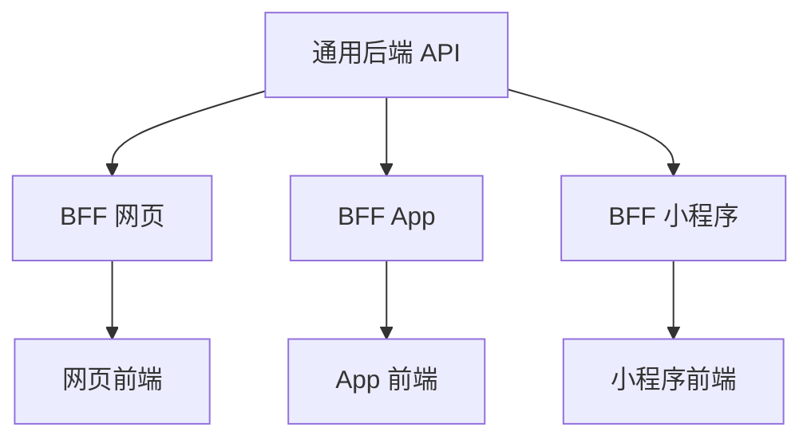

BFF 全称 Backend For Frontend，直译是"为前端而生的后端"。它不是一个具体的技术或框架，而是一种架构模式。理解它，要从一个朴素的矛盾讲起：后端想提供一个通用接口服务所有端，但每一个端想要的数据都不一样。

## 痛点：一个接口服务所有端，对谁都不太合适

传统架构里，后端团队通常只提供一套"大而全"的通用 API。所有客户端，无论是网页、App 还是小程序，都去调同一批接口。这套设计的出发点很好：一次开发，处处复用。

但问题在于，不同端的诉求差异很大。

```text
网页版：屏幕大，要展示完整商品详情，还要评论、推荐、库存、优惠
App 版：要省流量，只要价格、图片、名称这几个核心字段
小程序：屏幕更小，可能只需要一个价格和一张图
```

而后端只有一个 `/product/:id` 接口，返回二十个字段。于是三个端都只能去调这个接口，各自再从中挑自己需要的部分。网页想要"详情加评论加推荐"三个数据，就得调三个接口，自己在前端拼。App 拿到了二十个字段，却只用其中三个，白白浪费流量。

通用后端的困境就在这里：它为了"通用"牺牲了"合适"，结果对每个端都不太合适。

## 方案：给每个端配一个专属中间层

BFF 的思路很直接：在通用后端和具体前端之间，插入一层专门为某个前端定制的服务。



每一个 BFF 只为一个端服务，干的活是同一类：把通用后端那些"通用但不好用"的数据，加工成"这个端正好需要"的数据。

## BFF 的三个核心职责

拆开看，BFF 做的事可以归纳成三件。

### 聚合

一个页面需要的数据，往往分散在多个后端接口里。BFF 负责把这些接口的结果合并成一次返回，让前端只调一次就能拿全。

```javascript
// 网页版 BFF：一次请求，聚合详情、评论、推荐三个数据
app.get('/api/web/product/:id', async (req, res) => {
  const id = req.params.id
  const [detail, comments, recommend] = await Promise.all([
    fetch(`/product/${id}`),
    fetch(`/product/${id}/comments`),
    fetch(`/product/${id}/recommend`)
  ])
  res.json({ detail, comments, recommend })
})
```

前端不需要再自己串三个请求，BFF 把这层编排的复杂度接了过去。

### 裁剪

后端返回的字段很多，但某一个端只需要其中几个。BFF 负责把多余字段裁掉，只留需要的部分。

```javascript
// App 版 BFF：只返回 App 需要的三个字段，省流量
app.get('/api/app/product/:id', async (req, res) => {
  const detail = await fetch(`/product/${id}`)
  res.json({
    name: detail.name,
    price: detail.price,
    image: detail.image
  })
})
```

同样的商品接口，网页版返回完整信息，App 版只返回三个字段。裁剪让每个端拿到"刚刚好"的数据。

### 适配

不同的端，鉴权方式、数据格式、错误处理可能都不一样。BFF 负责把这些差异各自消化，让通用后端不用关心"是谁在调用"。

```text
网页版：用 Cookie 鉴权，错误返回 HTML 页面
App 版：用 Token 鉴权，错误返回 JSON 结构
小程序：用微信登录态，错误返回特定错误码
```

这些差异都收敛在各端自己的 BFF 里，通用后端保持纯粹。

## 什么时候该用 BFF，什么时候不该用

BFF 不是银弹。它解决的是"多端 + 通用后端"这个特定场景下的问题。

适合引入 BFF 的信号：

```text
① 有多个前端（网页、App、小程序），且各自需求差异明显
② 后端接口是大而全的，前端要自己拼接口、裁字段
③ 不同端的鉴权、格式、错误处理各不相同
④ 后端不愿意（或不应该）为每个端的特殊需求改通用接口
```

不适合引入 BFF 的信号：

```text
① 只有一个前端，加一层 BFF 是多余的中间跳板
② 后端接口已经按端设计好了，前端拿到的就是刚好需要的数据
③ 团队小、迭代快，多一层服务反而拖慢节奏
```

判断标准可以简化为一句：如果有多个端在"迁就"同一个通用接口，就值得引入 BFF；如果只有一个端，直接让后端按这个端的需要设计接口即可。

## Node 为什么天生适合做 BFF

BFF 干的活是调接口、等返回、拼数据、裁字段，这些几乎全是 I/O 密集操作。而 Node 恰好就是为这种场景而生的。

```text
I/O 不阻塞    Node 的事件循环和异步模型，让"同时等多个接口返回"变得高效
数据就是 JSON  BFF 处理的是 JSON，而 JS 处理 JSON 最顺手
同一种语言    前端写 TS，BFF 也写 TS，一个团队能同时维护前后端
类型可共享    接口的字段和类型，前后端能共用一套 TS 类型定义
```

同语言这一点尤为关键。前端工程师切入 BFF 的成本很低，因为还是写 JS，只是从"管界面"变成了"管数据编排"。数据模型还能在前后端之间共享，减少重复定义和字段对不上的问题。

## 一个完整的 BFF 实例

假设一个电商系统，通用后端提供商品、订单、用户三组接口，现在有两个前端：网页版和 App 版。

网页版的产品详情页，需要同时展示商品详情、用户评价和猜你喜欢三个区域。这三个数据分属三个接口，如果前端直接调，要发三次请求，还要自己处理"三个请求都成功才渲染"的逻辑。用 BFF 后，网页版只调一次：

```javascript
// 网页版 BFF
app.get('/api/web/product-page/:id', async (req, res) => {
  const id = req.params.id
  const [detail, comments, recommend] = await Promise.all([
    request('/product/' + id),
    request('/product/' + id + '/comments'),
    request('/product/' + id + '/recommend')
  ])
  res.json({ detail, comments, recommend })
})
```

App 版的产品页只要核心信息，且要省流量，它的 BFF 就裁剪掉大部分字段：

```javascript
// App 版 BFF
app.get('/api/app/product/:id', async (req, res) => {
  const detail = await request('/product/' + id)
  res.json({
    id: detail.id,
    name: detail.name,
    price: detail.price,
    image: detail.cover
  })
})
```

两个 BFF 面向同一个通用后端，各自输出适合自己端的数据。网页版拿到的是一份完整聚合结果，App 版拿到的是精简后的四个字段。通用后端不需要为任何一端做特殊适配。

## 与前端开发者的关系

对前端开发者而言，BFF 的价值在于把"前端被迫做的那部分后端工作"收归到一个合适的层。很多前端项目里，组件里写着一堆接口拼装、字段裁剪、错误分支的代码，这些代码本质上属于后端逻辑，却散落在视图层。BFF 提供了一个归属地。

一个值得注意的现象是，很多"AI 应用"的前端架构，天然带有 BFF 的影子。前端负责界面，中间一层 Node 服务负责聚合大模型调用、工具调用、数据裁剪，再适配成前端需要的形式。这一层 Node 服务，本质上就是一个"为这个前端定制的 BFF"。

## 小结

BFF 的定位可以浓缩成一张表。

| 维度 | 说明 |
|---|---|
| 全称 | Backend For Frontend |
| 本质 | 架构模式，不是具体技术 |
| 位置 | 通用后端和具体前端之间 |
| 职责 | 聚合、裁剪、适配 |
| 适用 | 多端 + 通用后端的场景 |
| 不适用 | 单前端、接口已按端设计 |
| 推荐技术 | Node（I/O 密集 + 同语言） |
| 判断标准 | 是否有多个端在迁就同一个通用接口 |

BFF 解决的核心矛盾只有一个：后端想通用，前端想要合适。它用"给每个端配一个专属中间层"的办法，让通用后端保持纯粹，同时让每个前端拿到刚刚好的数据。理解了"聚合、裁剪、适配"这三个词，也就理解了 BFF 的全部理念。
