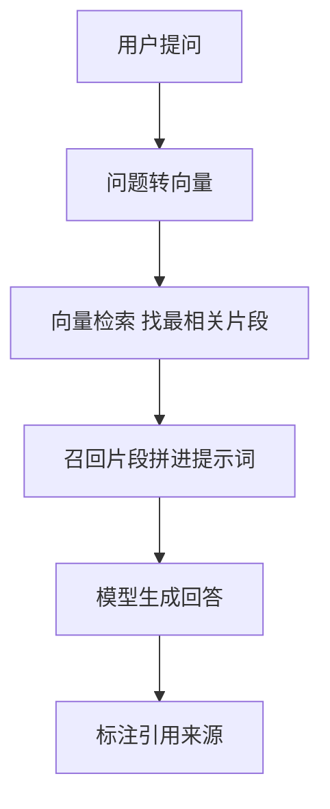
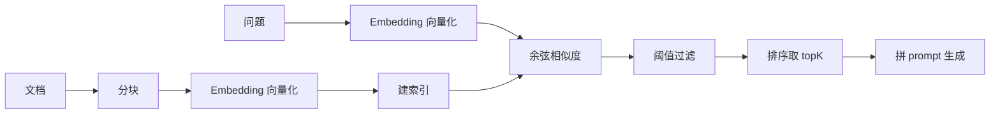
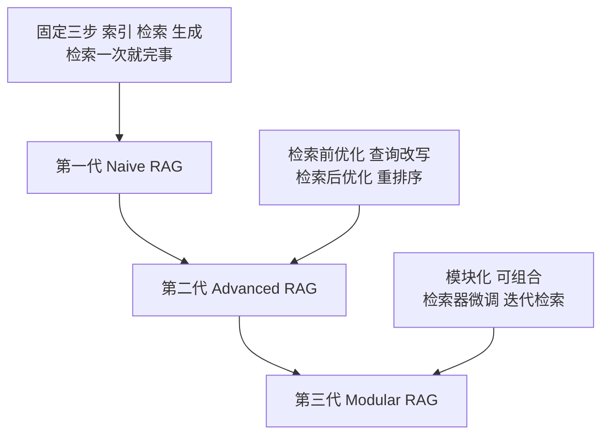

大模型有一个先天矛盾：它知道很多，却总有不知道的事。训练数据有截止日期，截止之后的世界它一无所知；它没见过私有文档，却常常被要求回答"我们公司的年假政策是什么"。更麻烦的是，不知道的时候它很少诚实说"不知道"，而是凭空编一个答案，还编得煞有介事。

RAG 就是为这个矛盾而生的一套方案。它的思路朴素得近乎直觉：别指望模型记住所有知识，让它在用的时候现查。

## 开卷考试：RAG 的三个动作

RAG 是 Retrieval-Augmented Generation 的缩写，检索增强生成。拆开是三个动作：

```text
检索 Retrieval   把问题拿去知识库里翻，找出最相关的几段资料
增强 Augmented   把翻到的资料垫在问题旁边，一起交给模型
生成 Generation  模型照着"问题 + 资料"作答
```

类比开卷考试：考前不背书，考试时把书放旁边，答到哪题翻哪页。模型依然是那个模型，只是旁边多了一本随时能翻的书。



它要解决的，是三个具体缺陷：知识截止、幻觉、私有知识缺失。

## 两类工作：索引与查询

RAG 的全部工作可以归成两类，性质完全不同。

```text
准备动作（索引）  文档 → 分块 → 向量化 → 存起来
                 相当于把书整理好、编好索引、放进书架

查询动作（生成）  问题 → 向量化 → 检索 → 回答
                 相当于翻书、找到相关页、照着答
```

这两类动作在真实生产环境里是分开做的，于是有了"离线阶段"和"在线阶段"的叫法。离线指批量导入海量文档，可能要跑几个小时，独立于对外服务；在线指用户实时提问，要求毫秒级响应。需要强调的是，这区分的是两类不同性质的工作，而不是"启动前与启动后"的时间线。

## 核心四件套

RAG 的地基是四个环节，缺一个都跑不通。

**分块**。长文档不能整篇拿去建索引，太长则检索不准、语义稀释；太短则上下文断裂。常见的做法是定长切块加重叠，例如每 900 字符切一块，相邻两块重叠 160 字符。重叠的价值在于防止一句关键的话恰好被切在边界上，落进两个块各自都残缺。

**向量化**。文字本身没法直接做相似度运算，要先把一段文字变成一个向量，即一串能代表语义的数字。这一步通常调用现成的 Embedding 模型，例如 text-embedding-v3。向量化的前提是输入长度受模型限制，超长文本要先截断。

**相似度计算**。拿到向量后，用余弦相似度衡量"问题"与"文档块"的语义接近程度：点积除以两个模长的乘积。余弦只看方向不看长度，因此对长短文本更公平，不会被长文档的模长优势干扰。

**阈值与召回**。算出所有相似度后，低于某个阈值的片段直接丢弃，防止把不相关的内容喂给模型污染回答；剩下的按分数降序取 topK 条。阈值和 topK 通常是经验值，例如阈值 0.15、topK 4。



## 三代演进：一个朴素的起点

学界有一个公认的框架，把 RAG 分成三代。理解这个谱系，比记住某个具体实现更重要，因为它决定了"一段 RAG 代码"在技术演进里站在哪里。



第一代叫朴素 RAG，固定三步：索引、检索、生成。检索一次就结束，检索和生成之间没有来回交互。这是最基础、最标准的形态，绝大多数入门实现都停在这一层。

第二代是进阶 RAG，在朴素基础上加两类优化。检索前优化包括查询改写、多查询、分块策略调优；检索后优化包括重排序、上下文压缩、分块融合。核心意图是提升召回质量。

第三代是模块化 RAG，把整个流程拆成可以自由组合的模块，进一步引入检索器微调、迭代检索、自适应检索、图结构等能力。

判断一段 RAG 代码的水平，先看它在第几代。朴素 RAG 不是错，只是起点。

## 一个容易被忽视的工程细节：原子性

RAG 的索引环节有个隐蔽却重要的工程问题：切分和向量化需要时间，如果数据"切到一半"就被查询读到，会发生什么。

设想一个场景：上传一份长文档，分块和向量化正在逐块进行。此时来了一个查询，如果检索逻辑直接读全局的块数组，就可能读到"已经切好的那一半"，得到一个残缺的知识库视图。

正确的做法是保证写入的原子性：要么全有，要么全无，不存在中间态。实现手段通常有两个。其一，先在局部数组里攒数据，全部处理完再一次性写入全局；其二，上传接口等待所有块处理完毕才返回成功。这样，任何时刻读到的要么是旧数据，要么是完整的新数据，永远不会是半成品。

```text
错误写法（可能被读到半成品）：
  切一块 → 立刻写进全局 → 再切下一块

正确写法（原子性）：
  切块 → 向量化 → 全部塞进局部数组 → 最后一次性写入全局
  上传接口 await 全部完成 → 才返回成功
```

这个细节是面试里区分"背过概念"和"真写过代码"的分水岭。能指出"先攒局部数组、最后一次性写入，是为了避免半成品被检索到"，说明真正理解索引写入的时序。

## 朴素 RAG 距离生产级还差什么

知道一段代码站在第几代，还要知道它缺什么。朴素 RAG 距离生产级，通常隔着这些改进：

```text
查询改写      口语化、模糊的问题先改写或扩写，提升检索命中率
重排序        先向量粗筛，再用专门的 rerank 模型精排
混合检索      向量检索擅长语义，关键词检索擅长专有名词，两者互补
分块调优      分块大小按文档类型动态调整，而非写死经验值
持久化        向量库从内存数组升级为持久化向量数据库
并行处理      Embedding 串行调用改为并行，加速批量导入
上下文压缩    召回片段过长时先压缩，避免超出 token 上限
```

这七条不是要一次全做，而是"知道往哪个方向升级"。能对着自己的实现说出"我缺查询改写、重排序和持久化"，比笼统地说"我做了 RAG"高一个层次，因为这说明清楚自己在演进谱系里的坐标。

## 小结

RAG 的本质是开卷考试，用检索补足模型的私有知识盲区，用引用来源缓解幻觉。它的地基是分块、向量化、余弦相似度、阈值召回四件套；它的工作分成索引与查询两类；它的技术演进走过朴素、进阶、模块化三代。

理解 RAG，重点不在于记住某个具体实现，而在于三点：知道它解决什么问题，知道一段代码在演进谱系里站在第几代，知道从"能用"到"生产级"之间隔着哪些改进。这三点想清楚，任何 RAG 的实现和追问都能被准确归位。
