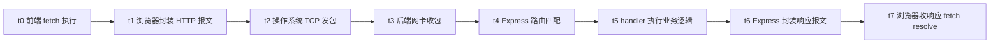
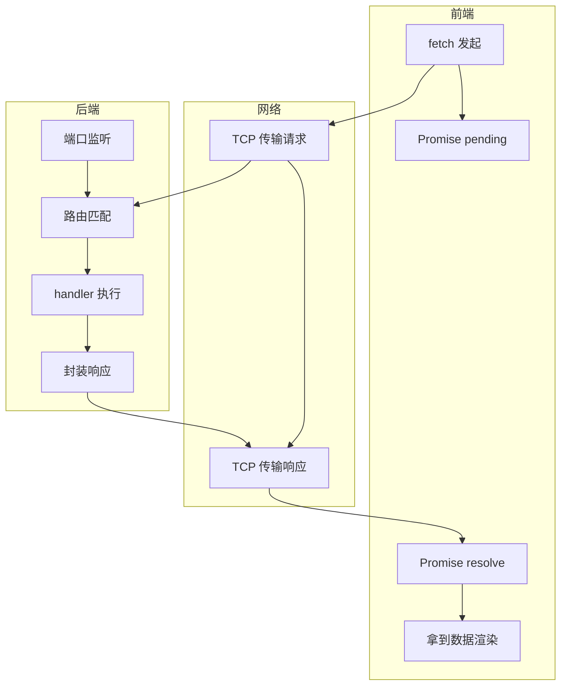
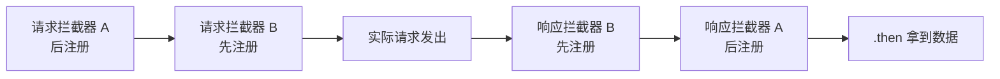
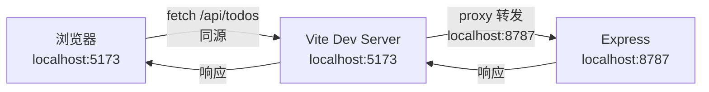

## 前后端联调的本质

前后端联调指前端将开发阶段使用的模拟数据替换为真实后端接口，验证双方数据能够正确对接的过程。联调的核心矛盾在于：前端与后端在开发期各自独立工作，前端对着 mock 数据构建界面，后端对着接口文档编写 API，两边在代码层面没有任何直接绑定。联调就是检验双方是否遵守了同一份接口契约。

联调阶段最常出现的问题包括字段名不一致、数据类型不匹配、接口路径拼写差异、空值未处理，以及跨域拦截。这些问题并非源于技术复杂性，而是源于契约执行偏差。逐项修正后，数据链路即可贯通。

## 一次 HTTP 请求的完整时序

理解联调的前提是理解一次 HTTP 请求从发出到响应的全过程。以下按时间顺序拆解八个阶段。



### 各阶段机制说明

**t0 前端发起调用。** `fetch('/api/todos')` 或 `axios.get('/api/todos')` 在 JavaScript 运行时执行。此时浏览器并未立即发出网络请求，而是将调用转化为一个 Promise 对象，后续代码通过 `.then()` 或 `await` 等待结果。函数调用本身是同步的，但网络传输是异步的，这就是 JavaScript 中所有网络请求均为 Promise 的根本原因。

**t1 浏览器封装报文。** 浏览器将请求参数翻译为符合 HTTP 协议的文本报文，包含请求方法（GET / POST）、路径（/api/todos）、请求头（Content-Type、Authorization 等）和请求体（POST 时携带的数据）。这段文本是一串纯文本字符，遵循 HTTP 协议规范。

**t2 操作系统发包。** 浏览器通过操作系统的 socket API 将报文交给 TCP 协议栈。TCP 将报文切成数据包，加上源端口、目标端口、序列号等信息，通过网卡发出。这一层前端开发者无需关心，但需要知道：TCP 是可靠传输协议，保证数据包按顺序到达且不丢失，但不保证一次发送的数据等于一次接收的数据（这是粘包和拆包的根源）。

**t3 后端收到数据包。** 数据包经过网络到达后端机器的网卡。后端操作系统根据 TCP 头部的目标端口号（如 8787），将数据交给正在监听该端口的进程。这一步是操作系统的端口分发机制，不涉及后端代码主动"获取"请求。

**t4 Express 路由匹配。** Express 进程在启动时通过 `server.listen(8787)` 向操作系统注册了对 8787 端口的监听。此后该进程处于阻塞等待状态，当操作系统将请求数据递交给它时，Express 解析 HTTP 报文，提取方法和路径，与路由表逐一匹配。匹配到 `app.get('/api/todos', handler)` 后，调用对应的 handler 函数。

**t5 handler 执行业务逻辑。** handler 函数内部执行实际业务：查询数据库、调用其他服务、计算结果。这一步耗时取决于业务复杂度，数据库查询通常是最慢的环节。handler 执行完毕后调用 `res.json(data)` 将结果交给 Express。

**t6 Express 封装响应。** Express 将 handler 返回的数据序列化为 JSON 字符串，拼装成 HTTP 响应报文（状态码 + 响应头 + 响应体），通过 TCP 发回前端。

**t7 前端收到响应。** 响应报文经网络返回前端机器，浏览器收到后将其解析为 Response 对象，fetch 的 Promise 进入 fulfilled 状态，`.then()` 回调被推入微任务队列执行。



### 关键认知：后端不主动获取请求

后端进程没有"从某处取请求"的动作。`server.listen(port)` 的本质是向操作系统注册一个端口监听，此后进程挂起等待。请求到达端口时，操作系统直接将数据塞入进程内存，触发事件回调。这一机制与浏览器的事件循环类似：都是"注册回调，等待被唤醒"，而非"主动轮询"。

## 接口契约：数据对齐的唯一保证

前端与后端之间不存在实时同步机制，没有缓存层负责保持两边数据一致，也没有常驻监听通道维持状态同步。双方数据对齐完全依赖一份预先约定的接口契约。

### 契约的内容

一份完整的接口契约至少包含以下字段：

| 字段 | 说明 | 示例 |
|------|------|------|
| 请求方法 | GET / POST / PUT / DELETE | GET |
| 请求路径 | URL 路径 | /api/todos |
| 请求参数 | query / body / path 参数 | ?completed=true |
| 请求头 | 鉴权、内容类型等 | Authorization: Bearer xxx |
| 响应格式 | JSON 结构定义 | { code: 0, data: [...] } |
| 字段类型 | 每个字段的 TS 类型 | id: string, title: string |
| 错误码约定 | 非 200 时的错误结构 | { code: 401, message: "未授权" } |

### 契约失效的典型场景

```text
场景一：字段名偏差
  契约定义: { title: string }
  后端返回: { name: string }
  前端读取 res.data.title → undefined → 页面空白

场景二：类型偏差
  契约定义: completed: boolean
  后端返回: completed: 0
  前端判断 if (todo.completed) → 0 为 falsy → 逻辑反转

场景三：空值未处理
  后端返回: { data: null }
  前端执行: data.map(...) → TypeError: Cannot read property 'map' of null
```

联调的过程就是逐项排查这些偏差，修正至双方完全对齐。

## Axios 封装：联调的前端基础设施

在实际项目中，前端不会在每个组件中直接调用 `fetch` 或 `axios`，而是封装一个统一的请求层（通常放在 `src/services/` 或 `src/api/` 目录下）。这一层的存在意义在联调阶段尤为突出。

### 封装示例

```typescript
// src/services/request.ts
import axios, { type AxiosInstance } from 'axios'

const request: AxiosInstance = axios.create({
  baseURL: '/api',
  timeout: 10000,
})

// 请求拦截器：发出前统一处理
request.interceptors.request.use(
  (config) => {
    const token = localStorage.getItem('token')
    if (token) {
      config.headers.Authorization = `Bearer ${token}`
    }
    return config
  },
  (error) => Promise.reject(error)
)

// 响应拦截器：收到后统一处理
request.interceptors.response.use(
  (response) => response.data,
  (error) => {
    if (error.response?.status === 401) {
      window.location.href = '/login'
    }
    return Promise.reject(error)
  }
)

export default request
```

```typescript
// src/services/todo.ts
import request from './request'
import type { Todo } from '@/types/todo'

export function getTodos() {
  return request.get<Todo[]>('/todos')
}

export function createTodo(data: { title: string }) {
  return request.post('/todos', data)
}
```

### 封装在联调中的价值

联调阶段需要将 mock 地址切换为真实后端地址。如果请求逻辑散落在各组件中，需要逐个文件修改；有了封装层，只需修改 `request.ts` 中的 `baseURL` 一处即可。此外，Token 注入、错误处理、响应解包等横切逻辑集中在拦截器中维护，避免在联调时发现某处忘记加 Token 而逐个排查。

### 拦截器的洋葱模型

Axios 拦截器的执行顺序遵循洋葱模型：请求拦截器按注册顺序的逆序执行（后注册先执行，从外向内包裹），响应拦截器按注册顺序的正序执行（先注册先执行，从内向外剥离）。



这一设计与网络分层模型一致：发送时从应用层逐层向下封装，接收时从底层逐层向上解包。

## 跨域问题与 Vite Proxy

联调阶段最常见的环境问题是跨域。浏览器同源策略要求请求的目标地址与当前页面同源（协议 + 域名 + 端口三者一致），否则触发 CORS（Cross-Origin Resource Sharing）拦截。

### 跨域的产生

```text
前端运行地址：http://localhost:5173
后端运行地址：http://localhost:8787
端口不同 → 不同源 → 浏览器拦截
```

浏览器在收到后端响应时检查响应头中的 `Access-Control-Allow-Origin`，若该头不存在或不包含当前源，则拒绝前端 JavaScript 读取响应。注意：请求实际已经到达后端并被处理，浏览器拦截的是"前端读取响应"这一步。

### Vite Proxy 方案

开发环境中最常用的解决方案是 Vite 的 proxy 配置：

```typescript
// vite.config.ts
export default defineConfig({
  server: {
    proxy: {
      '/api': {
        target: 'http://localhost:8787',
        changeOrigin: true,
      },
    },
  },
})
```

其原理是：前端请求 `/api/todos`，Vite 开发服务器拦截 `/api` 前缀的请求，将其转发到 `http://localhost:8787`，再把后端响应原样返回给浏览器。浏览器看到的请求地址始终是 `localhost:5173`（同源），不会触发跨域。



Vite Proxy 是开发环境的方案，生产环境不会有 Vite Dev Server。生产环境通过 Nginx 反向代理或后端配置 CORS 响应头解决跨域。

## 流式场景：SSE 的联调

传统的增删改查接口遵循"一问一答"模式，前端发一次请求，后端返回一次完整响应。但在 AI 对话等场景中，后端需要持续向前端推送数据（逐字输出），此时使用 SSE（Server-Sent Events）协议。

### SSE 与普通 HTTP 的差异

普通 HTTP 响应一次性返回完整数据，连接随即关闭。SSE 响应保持 TCP 连接不断开，后端通过同一条连接持续推送多个数据帧，每帧以空行（`\n\n`）作为边界标记。

```text
普通 HTTP：
  请求 → [等待] → 完整响应 → 连接关闭

SSE：
  请求 → [连接保持] → 帧1 → 帧2 → 帧3 → ... → [done] → 连接关闭
```

### SSE 帧格式

每一帧由事件行、数据行和空行组成：

```text
event: token
data: {"token":"你"}

event: token
data: {"token":"好"}

event: done
data: {"citations":[],"tools":[]}

```

### 前端解析 SSE 数据流

由于浏览器原生 EventSource API 仅支持 GET 请求且无法自定义请求头，需要使用 fetch + ReadableStream 手动解析 SSE 流：

```typescript
const response = await fetch('/api/chat/stream', {
  method: 'POST',
  headers: { 'Content-Type': 'application/json' },
  body: JSON.stringify({ messages }),
})

const reader = response.body!.getReader()
const decoder = new TextDecoder('utf-8')
let buffer = ''

while (true) {
  const { done, value } = await reader.read()
  if (done) break

  buffer += decoder.decode(value, { stream: true })
  const segments = buffer.split('\n\n')

  // 最后一段可能不完整，留在 buffer 等下次拼接
  buffer = segments.pop()!

  for (const segment of segments) {
    const event = parseSseChunk(segment)
    if (event.type === 'token') {
      content += event.token
    }
  }
}
```

### 粘包与拆包

TCP 是字节流协议，不保证一次 `read()` 读到的数据等于后端一次 `send()` 写入的数据。多条 SSE 帧可能被合并成一个 TCP 包送达（粘包），一条 SSE 帧也可能被拆成多个 TCP 包分次送达（拆包）。

`buffer.split('\n\n')` 按帧边界切分解决粘包，`segments.pop()` 保留最后一段不完整数据等待下次拼接解决拆包。这是流式数据处理的通用范式，不限于 SSE。

## Node.js 后端的最小联调角色

前端开发者在联调阶段接触的后端通常是 Node.js 编写的轻量服务（如 Express），其核心职责包括：监听端口接收请求、路由分发、执行业务逻辑、返回 JSON 响应。以下是一个最小的 Express 服务示例：

```javascript
import express from 'express'
import cors from 'cors'

const app = express()
app.use(cors())
app.use(express.json())

const todos = []

app.get('/api/todos', (req, res) => {
  res.json({ code: 0, data: todos })
})

app.post('/api/todos', (req, res) => {
  const todo = {
    id: crypto.randomUUID(),
    title: req.body.title,
    completed: false,
    createdAt: Date.now(),
  }
  todos.push(todo)
  res.json({ code: 0, data: todo })
})

app.listen(8787, () => {
  console.log('Server running on http://localhost:8787')
})
```

### Express 的三个核心概念

| 概念 | 说明 | 前端类比 |
|------|------|----------|
| 路由 | `app.get(path, handler)` 指定路径由谁处理 | Vue Router 的路由表 |
| 中间件 | `app.use(fn)` 请求到达前先过一道处理 | 路由守卫 beforeEach |
| req / res | 请求对象和响应对象 | fetch 的 Request / Response |

前端开发者理解 Express 不需要深入后端架构，只需看懂"路由匹配到 handler，handler 里查数据，res.json 返回"这一链路即可。联调时 Express 扮演的角色就是：接收前端请求，返回约定格式的 JSON 数据。

## 联调的实践流程

完整的联调流程可归纳为四个步骤。

**第一步：对齐接口契约。** 前后端共同确认每个接口的方法、路径、参数、响应格式。字段名和类型必须逐一对齐，任何一方的偏差都会在后续暴露为运行时错误。

**第二步：替换 mock 为真实接口。** 前端将开发阶段的 mock 数据移除，`baseURL` 指向真实后端地址。如有封装层，此步仅需改一处配置。

**第三步：跑通核心流程。** 逐个验证增删改查等核心功能，观察浏览器 Network 面板中请求与响应的实际内容，对比接口文档检查字段。

**第四步：修正偏差。** 对发现的字段名、类型、空值处理等问题逐项修正。此步骤占据联调大部分时间，核心原则是：前端不应假设后端永远返回非空数据，所有可能为 null 或 undefined 的字段均需防御性处理。

## 小结

前后端联调的本质不是技术挑战，而是契约执行验证。前端与后端之间不存在实时同步机制，数据的对齐完全依赖双方遵守同一份接口契约。HTTP 请求的一次性问答模型决定了前端是主动方（需要时才请求），后端是被动方（监听端口等待被唤醒）。Axios 封装层和 Vite Proxy 是联调阶段的基础设施，前者统一管理请求配置和拦截逻辑，后者解决开发环境的跨域问题。SSE 场景引入了流式数据解析的复杂性，但底层仍是同一条 TCP 连接。理解这些机制后，联调过程中遇到的问题均可归结为契约偏差或环境配置，逐项排查修正即可。
