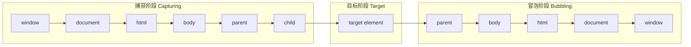

DOM 事件是浏览器与用户交互的核心桥梁。每一次点击、键盘输入、鼠标移动都会产生一个事件对象，并在 DOM 树中经历一套标准的传播流程。理解这套机制对于编写健壮的前端代码、实现事件委托、避免意外行为至关重要。

------

## 事件对象：信息的载体

事件触发时，浏览器创建一个事件对象（`Event` 或其子类），其中封装了与该事件相关的所有数据。该对象在事件传播期间存在，传播结束后被回收。

```js
document.addEventListener('click', function(event) {
  // event 就是事件对象
  console.log(event.type)          // "click"
  console.log(event.target)        // 实际触发事件的元素
  console.log(event.currentTarget) // 当前绑定监听的元素
})
```

事件对象包含两类属性：

- 

  **公共属性**：所有事件共有，如 `type`、`target`、`currentTarget`、`timeStamp`、`bubbles`、`cancelable`。

- 

  **专有属性**：特定事件特有，如鼠标事件的 `clientX/clientY`、键盘事件的 `key`、剪贴板事件的 `clipboardData`。

| 属性                      | 含义                                      |
| ------------------------- | ----------------------------------------- |
| `event.type`              | 事件类型字符串，如 `"click"`、`"keydown"` |
| `event.target`            | 触发事件的原始元素（用户实际交互的元素）  |
| `event.currentTarget`     | 当前正在处理事件的元素（随传播阶段变化）  |
| `event.eventPhase`        | 当前所处阶段：1=捕获，2=目标，3=冒泡      |
| `event.bubbles`           | 布尔值，表示事件是否冒泡                  |
| `event.cancelable`        | 布尔值，表示能否阻止默认行为              |
| `event.timeStamp`         | 事件创建时的时间戳（毫秒）                |
| `event.preventDefault()`  | 阻止默认行为（如表单提交、链接跳转）      |
| `event.stopPropagation()` | 阻止事件继续传播                          |

------

## 事件传播的三阶段

当一个事件发生在嵌套的 DOM 元素上时，它并非只在目标元素上触发一次，而是沿着 DOM 树进行一趟完整的旅行。W3C 标准规定了三个阶段：



### 捕获阶段（Capturing Phase）

事件从最顶层的 `window` 对象开始，逐层向下传递，直到到达目标元素的父节点。在此阶段注册的监听器可以通过 `addEventListener` 的第三个参数 `true` 来启用。

```js
// 在捕获阶段监听点击事件
document.body.addEventListener('click', function(event) {
  console.log('捕获阶段：body')
}, true)
```

捕获阶段常用于全局拦截或预处理，例如在事件到达目标前禁用某些区域。

### 目标阶段（Target Phase）

事件到达用户实际交互的元素（`event.target`）。在此阶段，目标元素上绑定的监听器（无论捕获还是冒泡）都会执行。

```js
document.getElementById('myButton').addEventListener('click', function(event) {
  console.log('目标阶段：按钮本身')
})
```

### 冒泡阶段（Bubbling Phase）

事件从目标元素开始，逐层向上传递，直到 `window`。绝大多数事件都支持冒泡（`focus`、`blur` 等少数事件除外）。冒泡阶段是事件委托的基础。

```js
document.getElementById('parentDiv').addEventListener('click', function(event) {
  console.log('冒泡阶段：父元素')
})
```

### 为何设计三个阶段

历史原因：早期 Netscape 只支持捕获，IE 只支持冒泡。W3C 统一标准时保留了二者，让开发者自行选择监听时机。实际开发中，冒泡阶段使用最广泛，因为它允许父元素统一处理子元素的事件（事件委托），减少监听器数量。

------

## 事件委托：利用冒泡提高效率

事件委托的核心思想：将子元素的事件监听器绑定到共同的祖先元素上，利用事件冒泡在祖先元素处统一处理。

```html
<ul id="todoList">
  <li>任务一</li>
  <li>任务二</li>
  <li>任务三</li>
</ul>
document.getElementById('todoList').addEventListener('click', function(event) {
  const target = event.target
  if (target.tagName === 'LI') {
    console.log('点击了：', target.textContent)
  }
})
```

优点：

- 

  减少内存占用：只需一个监听器代替 N 个。

- 

  动态适应：新增的 `li` 无需额外绑定，自动获得事件处理能力。

注意：需要通过 `event.target` 判断实际触发元素，避免误处理。

------

## 事件对象的坐标体系

鼠标事件提供三套坐标，分别对应不同的参考系：

| 属性                | 参考系           | 说明                                           |
| ------------------- | ---------------- | ---------------------------------------------- |
| `clientX / clientY` | 视口（Viewport） | 相对于浏览器内容区域的左上角，不受滚动影响     |
| `pageX / pageY`     | 页面（Document） | 相对于整个 HTML 文档的左上角，包含滚动偏移     |
| `screenX / screenY` | 屏幕（Monitor）  | 相对于物理显示器的左上角，受浏览器窗口位置影响 |

```js
document.addEventListener('click', function(e) {
  console.log('视口坐标：', e.clientX, e.clientY)
  console.log('页面坐标：', e.pageX, e.pageY)
  console.log('屏幕坐标：', e.screenX, e.screenY)
})
```

三者关系：`pageX = clientX + window.scrollX`，`pageY = clientY + window.scrollY`。

------

## 阻止默认行为与停止传播

### `preventDefault()`

阻止浏览器对事件的默认行为。例如点击链接跳转、提交表单、右键菜单等。

```js
document.querySelector('a').addEventListener('click', function(e) {
  e.preventDefault()
  console.log('链接跳转被阻止')
})
```

### `stopPropagation()`

阻止事件继续在 DOM 树中传播。可用于隔离父子元素的事件响应。

```js
document.getElementById('child').addEventListener('click', function(e) {
  e.stopPropagation()
  console.log('只触发子元素，不会冒泡到父元素')
})
```

注意：`stopPropagation()` 只阻止后续传播，不影响同一元素上的其他监听器。如需阻止同一元素的其他监听器，可使用 `stopImmediatePropagation()`。

------

## 事件生命周期小结

1. 

   **创建**：用户交互或程序触发时，浏览器创建事件对象。

2. 

   **传播**：事件依次经历捕获、目标、冒泡三个阶段。同一事件对象在整个传播过程中保持不变。

3. 

   **销毁**：传播结束后，事件对象被回收。异步代码中若需使用事件数据，应在同步阶段保存副本。

```js
element.addEventListener('click', function(e) {
  const savedX = e.clientX  // 同步保存
  setTimeout(() => {
    console.log(savedX)     // 安全使用
  }, 100)
})
```

------

## 总结

DOM 事件机制是前端开发的基石。理解事件对象的结构、三阶段传播模型以及事件委托的原理，能够帮助开发者写出更高效、更可控的交互代码。捕获阶段用于全局拦截，目标阶段处理具体元素，冒泡阶段实现统一管理。事件对象是信息的载体，其生命周期与传播过程紧密相连，在异步场景中需格外注意数据保存。