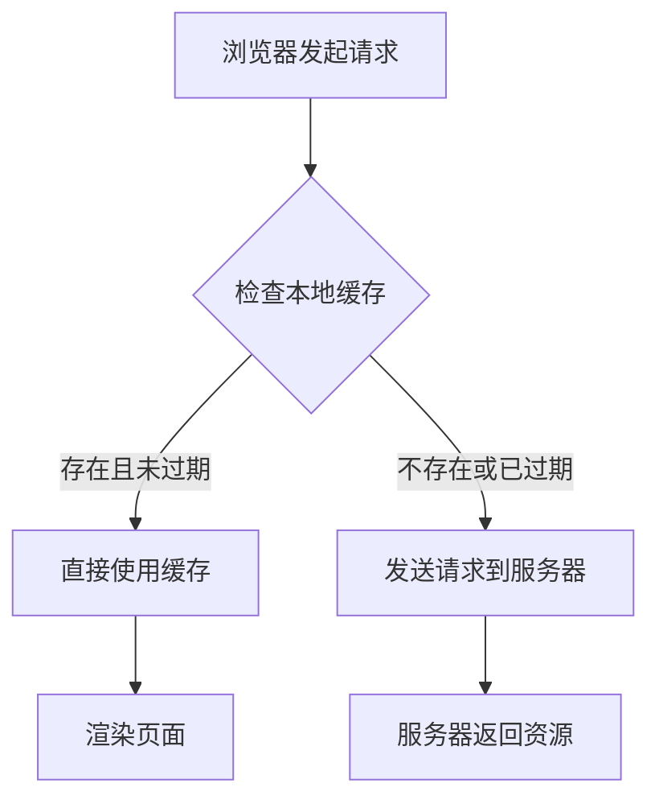
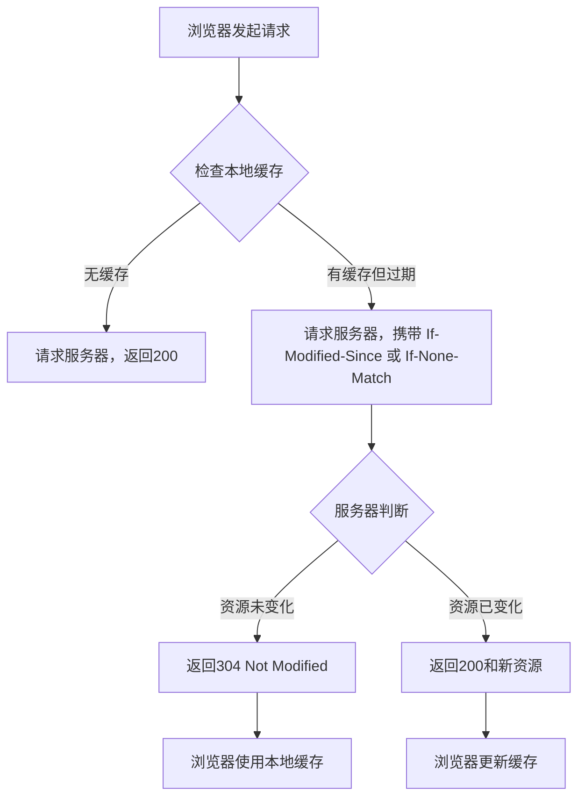

> 本文是对浏览器 HTTP 缓存机制的完整梳理，涵盖强缓存、协商缓存、缓存位置、前端 hash 打包策略以及常见面试问题。所有结论均基于 HTTP/1.1 规范及 Chromium 实现。

## 一、为什么需要 HTTP 缓存

设想一个场景：用户首次访问一个新闻网站，页面加载了 2MB 的图片、CSS 和 JavaScript 文件。如果每次访问都需要重新下载这 2MB 数据，不仅浪费带宽，还会让页面加载变得缓慢。HTTP 缓存的核心目标正是**减少重复的网络请求，加快页面加载速度，降低服务器负载**。

浏览器通过缓存机制，将已获取的资源副本保存在本地，在后续请求中直接复用，从而避免不必要的网络传输。

---

## 二、两种缓存策略

HTTP 缓存分为两大类，区分依据是**是否需要向服务器发送请求来验证资源是否有效**。

### 2.1 强缓存（Strong Cache）

**定义**：浏览器直接从本地缓存读取资源，不发送任何请求到服务器。

**控制字段**：

- `Expires`（HTTP/1.0）：指定一个绝对的过期时间，例如 `Expires: Wed, 21 Oct 2026 07:28:00 GMT`。缺点在于依赖客户端本地时间，若用户修改系统时间，缓存可能提前失效或延迟失效。
- `Cache-Control`（HTTP/1.1）：优先级高于 `Expires`，常用指令包括：
  - `max-age=3600`：资源在 3600 秒内有效，浏览器直接使用缓存。
  - `public`：任何中间节点（如 CDN、代理服务器）均可缓存。
  - `private`：仅浏览器可以缓存，中间节点不得缓存。
  - `no-cache`：不使用强缓存，但可使用协商缓存（名称具有迷惑性）。
  - `no-store`：完全不缓存，每次均需从服务器获取完整资源。

**强缓存命中时**，浏览器返回状态码 `200`（from disk cache 或 from memory cache），Network 面板显示 `200 (from memory cache)` 或 `200 (from disk cache)`。

**流程图**：




###  Expires 的执行机制与 max-age 的改进

**Expires 的比对过程**

当浏览器缓存了某个资源并记录了其 `Expires` 时间后，**每次请求该资源时**，浏览器都会在本地执行一次简单的比较：

1. 从缓存中读取该资源的 `Expires` 字段（一个绝对时间点，如 `Wed, 21 Oct 2026 07:28:00 GMT`）。
2. 获取当前系统时间。
3. 如果当前时间 **小于** `Expires` 时间，则强缓存命中，直接使用本地缓存（不发送网络请求）；否则视为过期，发起新的请求。

这个过程完全在浏览器内存中完成，没有网络开销，因此对性能的影响可以忽略不计。

**Expires 的致命缺陷**

`Expires` 是一个**绝对时间**，其有效性依赖于客户端系统时间的准确性。如果用户修改了系统时间（例如将电脑时间调回到过去），那么所有资源的 `Expires` 时间都可能被误判为“未过期”，导致浏览器永远无法获取更新后的资源。反之，如果系统时间过快，资源会过早失效，增加不必要的网络请求。

**max-age 的改进**

`Cache-Control: max-age=3600` 采用**相对时间**，表示资源从服务器生成时刻起 3600 秒内有效。浏览器计算过期时间时，使用的是“响应时间 + max-age”，而不是依赖客户端时钟的绝对值。这种方式从根本上消除了系统时间不准带来的缓存混乱问题。因此，**当 `Cache-Control: max-age` 与 `Expires` 同时存在时，`max-age` 的优先级更高**，浏览器会忽略 `Expires`。

> **关于 `max-age` 的计时机制**：
>
> `max-age` 使用的是浏览器接收到响应时的本地时间作为基准，加上指定的秒数计算出过期时间。虽然它也依赖本地时间，但与 `Expires` 不同的是，`max-age` 只依赖本地时间的**流逝间隔**（即时钟的 tick 速度），而不依赖本地时间的**绝对数值**。
>
> 因此，即使本地时间与服务器时间存在系统性偏差（比如慢了几分钟），只要偏差是恒定的，`max-age` 的计时仍然是准确的。而 `Expires` 要求本地时间与服务器时间在绝对数值上一致，否则就会出现缓存提前失效或延迟失效的问题。这就是 `max-age` 取代 `Expires` 的根本原因。

### 2.2 协商缓存（Conditional Cache / Negotiation Cache）

**定义**：浏览器向服务器发送请求，由服务器判断资源是否发生变化。若未变化，返回 `304 Not Modified`，浏览器继续使用本地缓存；若已变化，返回 `200 OK` 和新资源。

**控制字段**（两对配合使用）：

1. **`Last-Modified` / `If-Modified-Since`**
   - 服务器首次响应时返回 `Last-Modified: Wed, 21 Oct 2026 07:28:00 GMT`，表示资源最后修改时间。
   - 浏览器后续请求携带 `If-Modified-Since: Wed, 21 Oct 2026 07:28:00 GMT`。
   - 服务器比对时间，若资源未修改则返回 `304`；否则返回新资源和新的 `Last-Modified`。

2. **`ETag` / `If-None-Match`**
   - 服务器首次响应时返回 `ETag: "abc123"`，这是资源的唯一标识（通常为文件内容的哈希值）。
   - 浏览器后续请求携带 `If-None-Match: "abc123"`。
   - 服务器比对 ETag，若一致则返回 `304`；否则返回新资源和新的 `ETag`。

**为何需要 ETag**？`Last-Modified` 存在两个缺陷：
- 精度仅为秒级，若资源在 1 秒内被多次修改，无法准确判断。
- 若资源被修改后又恢复原状，时间戳变化但内容未变，`Last-Modified` 会误判为有变化。
ETag 基于内容哈希，可精确反映资源是否真正变化。

**协商缓存流程图**：




### 2.2.1 Last-Modified 与 ETag 的对比

两者并非替代关系，而是互补关系，实际部署中通常同时启用。

| 对比维度             | Last-Modified                  | ETag                                   |
| -------------------- | ------------------------------ | -------------------------------------- |
| **计算成本**         | 几乎为零（读取文件系统元数据） | 较高（需要计算内容哈希，如 MD5、SHA1） |
| **精度**             | 秒级                           | 字节级                                 |
| **适用场景**         | 静态文件（图片、CSS、JS）      | 动态内容（API 响应、个性化页面）       |
| **是否依赖文件系统** | 是                             | 否                                     |
| **负载均衡兼容性**   | 好（时间戳在各服务器间一致）   | 可能有问题（需统一哈希算法）           |

**服务器处理优先级**：当请求同时携带 `If-None-Match` 和 `If-Modified-Since` 时，服务器**优先检查 ETag**。若 ETag 匹配，直接返回 304，不再检查 Last-Modified。只有在 ETag 不匹配时，才会回退到 Last-Modified 的判断。

**为何需要两者共存**：
- Last-Modified 是零成本的“粗筛”，适合绝大多数静态资源。
- ETag 是精确的“细验”，弥补 Last-Modified 在秒级精度和内容复原场景下的不足。
- 两者配合，兼顾性能与精度。

## 三、两种缓存的配合机制

在实际部署中，强缓存和协商缓存总是协同工作，而非二选一。完整的决策流程如下：

第一次请求：

浏览器 → 服务器 → 服务器返回资源 + Cache-Control: max-age=3600 + ETag: "abc123"

浏览器将资源存入本地，记录 max-age 和 ETag

第二次请求（3600 秒内）：

浏览器检查 → 强缓存命中 → 直接使用本地缓存（不发送请求）

第三次请求（3600 秒后）：

浏览器检查 → 强缓存过期 → 发起请求，携带 If-None-Match: "abc123"

服务器检查 → ETag 匹配 → 返回 304 Not Modified

浏览器继续使用本地缓存，并重置过期时间

**关键结论**：强缓存是“免检通道”，协商缓存是“复查通道”。先走强缓存，强缓存过期后再走协商缓存。

> 协商缓存的真实价值：请求压力与传输压力
>
> 一个常见的误解是：协商缓存可以减少服务器的请求压力。这个理解需要修正。
>
> **协商缓存不能减少请求数量**。当强缓存过期后，浏览器必须向服务器发送请求（携带 `If-Modified-Since` 或 `If-None-Match`），服务器必须处理这个请求并作出响应。从请求次数上看，协商缓存命中（返回 304）与直接返回新资源（返回 200）是完全相同的——都是一次完整的 HTTP 请求-响应往返。
>
> 缓存设定的时间都差不多，导致服务器在一个时间段内同步收到大量请求的现象，在业界被称为 **缓存雪崩（Cache Avalanche）**。它的成因是多个资源的强缓存过期时间过于集中，导致在同一时刻大量请求同时穿透到服务器。
>
> **解决缓存雪崩的方法**，通常是在设置 `max-age` 时加入一个随机偏移量（比如 `max-age=3600 + random(0, 600)`），让过期时间分散开。或者使用分布式锁、限流等措施。**这与协商缓存没有直接关系**。
>
> **协商缓存真正减少的是传输压力**。当服务器判定资源未变化时，返回 `304 Not Modified`，响应体为空，只传输几百字节的响应头。相比返回完整的资源体（可能几十 KB 甚至几 MB），带宽消耗大幅降低。
>
> 用一组数据量化这个差异：
>
> | 场景                       | 请求次数 | 响应体大小 | 总传输量 |
> | -------------------------- | -------- | ---------- | -------- |
> | 无缓存（每次返回 200）     | 1 次     | 1 MB       | 1 MB     |
> | 强缓存命中                 | 0 次     | 0          | 0        |
> | 协商缓存命中（返回 304）   | 1 次     | 几百字节   | 几百字节 |
> | 协商缓存未命中（返回 200） | 1 次     | 1 MB       | 1 MB     |
>
> **核心结论**：强缓存的价值在于“零请求”，协商缓存的价值在于“零传输”。两者配合使用，在资源未变化时实现最快的加载速度（强缓存），在资源变化时只传输必要的增量信息（协商缓存），共同构成了 HTTP 缓存的完整优化体系。

---

## 四、缓存存储位置

浏览器缓存按优先级分为三个层级：

1. **Memory Cache**：存储在内存中，读取速度极快，但进程关闭后释放。通常用于当前页面正在使用的小文件（如内联脚本、样式）。
2. **Disk Cache**：存储在硬盘中，读取速度较慢，但持久性强。适用于大文件或不常用的资源。
3. **Service Worker Cache**：由 Service Worker 控制的独立缓存，可自定义缓存策略，优先级高于 Memory Cache 和 Disk Cache。

Chrome 开发者工具 Network 面板中，资源来源标识：

| 标识                      | 含义         |
| ------------------------- | ------------ |
| `200 (from memory cache)` | 来自内存缓存 |
| `200 (from disk cache)`   | 来自磁盘缓存 |
| `304 Not Modified`        | 协商缓存命中 |
| `200 OK`                  | 来自服务器   |

---

## 五、前端工程中的缓存失效策略：Hash 打包

**问题**：假设 `style.css` 设置了 `Cache-Control: max-age=31536000`（一年）。若在这一年内修改了 CSS 内容，用户如何看到更新？

**答案**：通过文件名中的哈希值强制更新缓存。

现代打包工具（Webpack、Vite）在构建时，根据文件内容生成唯一哈希。内容变化，哈希随之变化：

构建前：style.css

构建后：style.a3b4c5.css （哈希 = a3b4c5）

修改 CSS 后再次构建：style.d6e7f8.css （哈希变化）

HTML 中引用：

```text
html
\<link rel="stylesheet" href="style.a3b4c5.css">
\<link rel="stylesheet" href="style.d6e7f8.css">
```

**原理**：浏览器以 URL 为缓存键。`style.a3b4c5.css` 与 `style.d6e7f8.css` 被视为两个完全不同的资源，旧缓存自动失效，浏览器重新请求新文件。这种方法被称为**缓存失效（Cache Busting）**。

### 5.1 ETag 与 Hash 打包的对比

两者都利用了“内容变化 → 标识变化”的原理，但属于不同层级，解决不同问题。

| 对比维度          | ETag                                    | Hash 打包                              |
| ----------------- | --------------------------------------- | -------------------------------------- |
| **所属层级**      | HTTP 协议层                             | 前端构建层                             |
| **生成时机**      | 服务器处理请求时动态计算                | 构建时（Webpack/Vite）静态生成         |
| **表现形式**      | 响应头中的字符串（如 `ETag: "abc123"`） | 文件名中的哈希值（如 `app.a3b4c5.js`） |
| **是否依赖 HTML** | 否                                      | 是（需要修改 HTML 中的引用 URL）       |
| **核心目的**      | 验证资源是否变化，减少传输（返回 304）  | 强制缓存失效，让浏览器请求新资源       |
| **生命周期**      | 每次请求都可能重新计算                  | 每次构建重新生成                       |

**协作关系**：
- Hash 打包负责“长期强缓存”：设置 `Cache-Control: max-age=31536000`，让浏览器一年内都不需要请求资源。
- ETag 负责“过期后的精确验证”：一年后强缓存过期，浏览器携带 `If-None-Match` 请求，服务器返回 304 或 200。
- 两者互补：Hash 打包确保内容变化时 URL 变更，ETag 确保即使 URL 未变（如忘记重新构建），也能精确判断内容是否变化。

**一句话总结**：ETag 是“这个资源变了吗？”，Hash 打包是“这个资源已经不是原来那个了，请重新请求”。

---

## 六、常见面试问题精讲

### Q1：强缓存和协商缓存的区别？

强缓存不需要发送请求，浏览器直接使用本地缓存，由 `Cache-Control: max-age` 或 `Expires` 控制。协商缓存需要发送请求，由服务器判断资源是否变化，通过 `Last-Modified/If-Modified-Since` 或 `ETag/If-None-Match` 控制。若资源未变，服务器返回 `304`，浏览器继续使用本地缓存。

### Q2：`Cache-Control: no-cache` 和 `no-store` 的区别？

`no-cache` 表示不使用强缓存，但可以使用协商缓存。浏览器每次都会发送请求到服务器，由服务器判断资源是否变化。`no-store` 表示完全不缓存，浏览器不会存储任何副本，每次都必须从服务器下载完整资源。

### Q3：什么是缓存击穿？如何在前端静态资源部署中避免？

缓存击穿指一个热点资源在强缓存过期的瞬间，大量请求同时涌入服务器，导致服务器压力骤增。在前端静态资源部署中，通过哈希打包可以避免此问题——每个版本的资源 URL 都不同，不存在“集体过期”的情况。此外，服务器端可采用缓存预热、设置合理的过期时间等策略。

### Q4：前端打包为什么要加哈希？

为了让浏览器在资源内容变化时能够获取到新版本。不加哈希时，浏览器会一直使用旧缓存，用户看不到更新。加入哈希后，内容变化 → 哈希变化 → URL 变化 → 浏览器重新请求新资源。同时，未变化的资源哈希不变，浏览器继续使用缓存，实现“内容变化时更新，内容不变时复用”的效果。

---

## 七、总结

| 缓存类型 | 是否需要请求服务器            | 控制字段                                                | 典型场景                  |
| -------- | ----------------------------- | ------------------------------------------------------- | ------------------------- |
| 强缓存   | 否                            | `Cache-Control: max-age`、`Expires`                     | 静态资源（图片、CSS、JS） |
| 协商缓存 | 是（返回 304 则不传输资源体） | `Last-Modified/If-Modified-Since`、`ETag/If-None-Match` | HTML 文件、API 响应       |

**核心原则**：强缓存让浏览器“不用问直接用”，协商缓存让浏览器“问一下，没变就用旧的”。两者配合使用，加上哈希打包实现缓存失效，构成了前端静态资源缓存的完整方案。

---

> 参考资料：HTTP/1.1 规范（RFC 7234）、Chrome DevTools 文档、Webpack 官方指南。