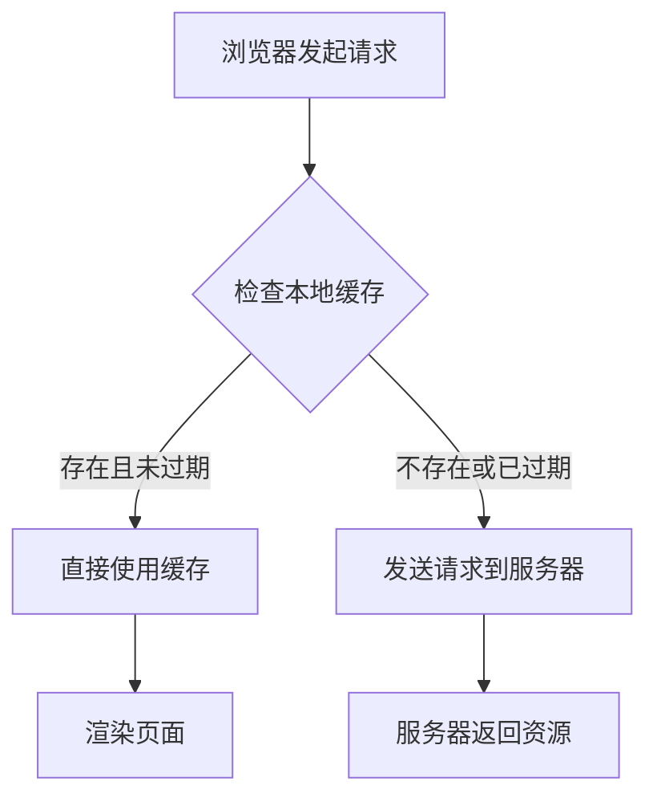
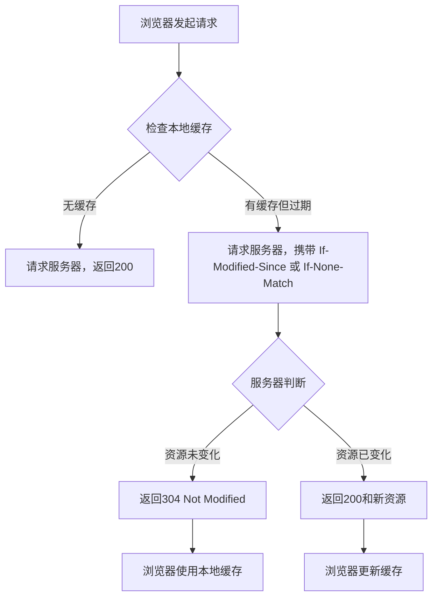

> 本文是对浏览器 HTTP 缓存机制的完整梳理，涵盖强缓存、协商缓存、缓存位置、前端 hash 打包策略以及常见面试问题。所有结论均基于 HTTP/1.1 规范及 Chromium 实现。

## 一、为什么需要 HTTP 缓存

设想一个场景：用户首次访问一个新闻网站，页面加载了 2MB 的图片、CSS 和 JavaScript 文件。如果每次访问都需要重新下载这 2MB 数据，不仅浪费带宽，还会让页面加载变得缓慢。HTTP 缓存的核心目标正是**减少重复的网络请求，加快页面加载速度，降低服务器负载**。

浏览器通过缓存机制，将已获取的资源副本保存在本地，在后续请求中直接复用，从而避免不必要的网络传输。

---

## 二、两种缓存策略

HTTP 缓存分为两大类，区分依据是**是否需要向服务器发送请求来验证资源是否有效**。

### 2.1 强缓存（Strong Cache）

**定义**：浏览器直接从本地缓存读取资源，不发送任何请求到服务器。

**控制字段**：

- `Expires`（HTTP/1.0）：指定一个绝对的过期时间，例如 `Expires: Wed, 21 Oct 2026 07:28:00 GMT`。缺点在于依赖客户端本地时间，若用户修改系统时间，缓存可能提前失效或延迟失效。
- `Cache-Control`（HTTP/1.1）：优先级高于 `Expires`，常用指令包括：
  - `max-age=3600`：资源在 3600 秒内有效，浏览器直接使用缓存。
  - `public`：任何中间节点（如 CDN、代理服务器）均可缓存。
  - `private`：仅浏览器可以缓存，中间节点不得缓存。
  - `no-cache`：不使用强缓存，但可使用协商缓存（名称具有迷惑性）。
  - `no-store`：完全不缓存，每次均需从服务器获取完整资源。

**强缓存命中时**，浏览器返回状态码 `200`（from disk cache 或 from memory cache），Network 面板显示 `200 (from memory cache)` 或 `200 (from disk cache)`。

**流程图**：




### 2.2 协商缓存（Conditional Cache / Negotiation Cache）

**定义**：浏览器向服务器发送请求，由服务器判断资源是否发生变化。若未变化，返回 `304 Not Modified`，浏览器继续使用本地缓存；若已变化，返回 `200 OK` 和新资源。

**控制字段**（两对配合使用）：

1. **`Last-Modified` / `If-Modified-Since`**
   - 服务器首次响应时返回 `Last-Modified: Wed, 21 Oct 2026 07:28:00 GMT`，表示资源最后修改时间。
   - 浏览器后续请求携带 `If-Modified-Since: Wed, 21 Oct 2026 07:28:00 GMT`。
   - 服务器比对时间，若资源未修改则返回 `304`；否则返回新资源和新的 `Last-Modified`。

2. **`ETag` / `If-None-Match`**
   - 服务器首次响应时返回 `ETag: "abc123"`，这是资源的唯一标识（通常为文件内容的哈希值）。
   - 浏览器后续请求携带 `If-None-Match: "abc123"`。
   - 服务器比对 ETag，若一致则返回 `304`；否则返回新资源和新的 `ETag`。

**为何需要 ETag**？`Last-Modified` 存在两个缺陷：
- 精度仅为秒级，若资源在 1 秒内被多次修改，无法准确判断。
- 若资源被修改后又恢复原状，时间戳变化但内容未变，`Last-Modified` 会误判为有变化。
ETag 基于内容哈希，可精确反映资源是否真正变化。

**协商缓存流程图**：




## 三、两种缓存的配合机制

在实际部署中，强缓存和协商缓存总是协同工作，而非二选一。完整的决策流程如下：

第一次请求：

浏览器 → 服务器 → 服务器返回资源 + Cache-Control: max-age=3600 + ETag: "abc123"

浏览器将资源存入本地，记录 max-age 和 ETag

第二次请求（3600 秒内）：

浏览器检查 → 强缓存命中 → 直接使用本地缓存（不发送请求）

第三次请求（3600 秒后）：

浏览器检查 → 强缓存过期 → 发起请求，携带 If-None-Match: "abc123"

服务器检查 → ETag 匹配 → 返回 304 Not Modified

浏览器继续使用本地缓存，并重置过期时间

**关键结论**：强缓存是“免检通道”，协商缓存是“复查通道”。先走强缓存，强缓存过期后再走协商缓存。

---

## 四、缓存存储位置

浏览器缓存按优先级分为三个层级：

1. **Memory Cache**：存储在内存中，读取速度极快，但进程关闭后释放。通常用于当前页面正在使用的小文件（如内联脚本、样式）。
2. **Disk Cache**：存储在硬盘中，读取速度较慢，但持久性强。适用于大文件或不常用的资源。
3. **Service Worker Cache**：由 Service Worker 控制的独立缓存，可自定义缓存策略，优先级高于 Memory Cache 和 Disk Cache。

Chrome 开发者工具 Network 面板中，资源来源标识：

| 标识                      | 含义         |
| ------------------------- | ------------ |
| `200 (from memory cache)` | 来自内存缓存 |
| `200 (from disk cache)`   | 来自磁盘缓存 |
| `304 Not Modified`        | 协商缓存命中 |
| `200 OK`                  | 来自服务器   |

---

## 五、前端工程中的缓存失效策略：Hash 打包

**问题**：假设 `style.css` 设置了 `Cache-Control: max-age=31536000`（一年）。若在这一年内修改了 CSS 内容，用户如何看到更新？

**答案**：通过文件名中的哈希值强制更新缓存。

现代打包工具（Webpack、Vite）在构建时，根据文件内容生成唯一哈希。内容变化，哈希随之变化：

构建前：style.css

构建后：style.a3b4c5.css （哈希 = a3b4c5）

修改 CSS 后再次构建：style.d6e7f8.css （哈希变化）

HTML 中引用：

```text
html
\<link rel="stylesheet" href="style.a3b4c5.css">
\<link rel="stylesheet" href="style.d6e7f8.css">
```

**原理**：浏览器以 URL 为缓存键。`style.a3b4c5.css` 与 `style.d6e7f8.css` 被视为两个完全不同的资源，旧缓存自动失效，浏览器重新请求新文件。这种方法被称为**缓存失效（Cache Busting）**。

---

## 六、常见面试问题精讲

### Q1：强缓存和协商缓存的区别？

强缓存不需要发送请求，浏览器直接使用本地缓存，由 `Cache-Control: max-age` 或 `Expires` 控制。协商缓存需要发送请求，由服务器判断资源是否变化，通过 `Last-Modified/If-Modified-Since` 或 `ETag/If-None-Match` 控制。若资源未变，服务器返回 `304`，浏览器继续使用本地缓存。

### Q2：`Cache-Control: no-cache` 和 `no-store` 的区别？

`no-cache` 表示不使用强缓存，但可以使用协商缓存。浏览器每次都会发送请求到服务器，由服务器判断资源是否变化。`no-store` 表示完全不缓存，浏览器不会存储任何副本，每次都必须从服务器下载完整资源。

### Q3：什么是缓存击穿？如何在前端静态资源部署中避免？

缓存击穿指一个热点资源在强缓存过期的瞬间，大量请求同时涌入服务器，导致服务器压力骤增。在前端静态资源部署中，通过哈希打包可以避免此问题——每个版本的资源 URL 都不同，不存在“集体过期”的情况。此外，服务器端可采用缓存预热、设置合理的过期时间等策略。

### Q4：前端打包为什么要加哈希？

为了让浏览器在资源内容变化时能够获取到新版本。不加哈希时，浏览器会一直使用旧缓存，用户看不到更新。加入哈希后，内容变化 → 哈希变化 → URL 变化 → 浏览器重新请求新资源。同时，未变化的资源哈希不变，浏览器继续使用缓存，实现“内容变化时更新，内容不变时复用”的效果。

---

## 七、总结

| 缓存类型 | 是否需要请求服务器            | 控制字段                                                | 典型场景                  |
| -------- | ----------------------------- | ------------------------------------------------------- | ------------------------- |
| 强缓存   | 否                            | `Cache-Control: max-age`、`Expires`                     | 静态资源（图片、CSS、JS） |
| 协商缓存 | 是（返回 304 则不传输资源体） | `Last-Modified/If-Modified-Since`、`ETag/If-None-Match` | HTML 文件、API 响应       |

**核心原则**：强缓存让浏览器“不用问直接用”，协商缓存让浏览器“问一下，没变就用旧的”。两者配合使用，加上哈希打包实现缓存失效，构成了前端静态资源缓存的完整方案。

---

> 参考资料：HTTP/1.1 规范（RFC 7234）、Chrome DevTools 文档、Webpack 官方指南。