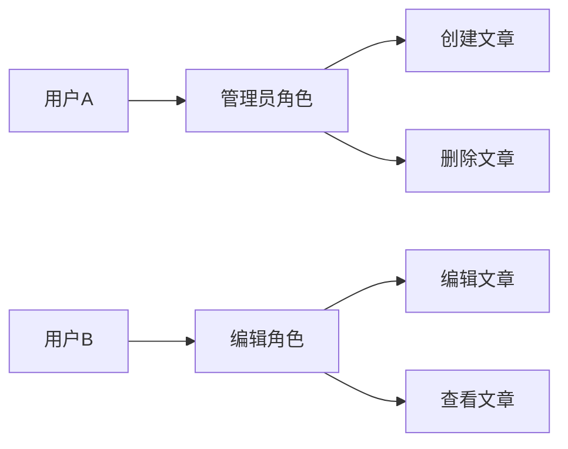
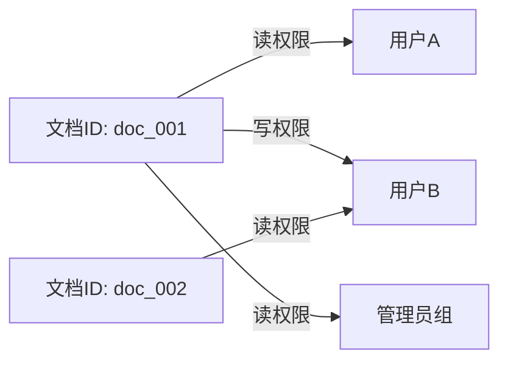

## 权限管理的本质

权限管理解决的是“谁能做什么”的问题。前端权限管理并非安全防线，而是用户体验的约束层。真正的安全校验始终在后端执行，前端只负责根据后端返回的权限数据，决定哪些界面元素可见、哪些操作可点击、哪些路由可访问。理解这一前提，才能避免将前端权限视为安全屏障的错误认知。

权限管理包含两个正交维度：**认证**（Authentication，你是谁）和**授权**（Authorization，你能做什么）。认证在前端通常表现为登录态维护（Token / Session），授权则是本文讨论的主体。

## 三种主流权限模型

### RBAC：基于角色的访问控制

RBAC 是目前应用最广泛的模型。其核心思想是将权限赋予角色，再将角色赋予用户。用户不直接持有权限，而是通过角色间接获得。



**典型数据结构**：

```
用户表: { id, username, roleIds: ['role_admin', 'role_editor'] }
角色表: { id: 'role_admin', name: '管理员', permissionIds: [...] }
权限表: { id: 'perm_article_create', name: 'article:create', desc: '创建文章' }
```

**优点**：管理简洁，角色数量远少于用户数，适合大多数企业级应用（CRM、CMS、ERP）。

**缺点**：粒度较粗，无法针对单个资源实例控制权限。例如“张三只能编辑自己创建的订单”无法用纯 RBAC 表达，需要引入数据范围（Data Scope）概念。

### ACL：访问控制列表

ACL 将权限直接绑定到资源对象上。每个资源维护一个列表，记录哪些主体对该资源拥有何种操作权限。



**典型场景**：文件系统、云存储桶（S3 Bucket Policy）、数据库行级权限。

**优点**：粒度极细，可以精确控制到每条数据。

**缺点**：管理成本随资源数量线性增长。当用户数和资源数达到万级时，ACL 条目数会膨胀到难以维护。

### ABAC：基于属性的访问控制

ABAC 不依赖固定的角色或列表，而是根据一组属性动态计算权限。属性分为三类：

- **用户属性**：部门、职级、地域
- **资源属性**：创建者、所属项目、机密等级
- **环境属性**：当前时间、IP 地址、设备类型

**示例策略**：“允许深圳分公司员工在工作日 9:00–18:00 修改本分公司订单”。该策略在 ABAC 中表示为一条规则：

```
IF user.department == "深圳分公司" 
   AND resource.type == "订单" 
   AND resource.ownerDepartment == user.department 
   AND environment.time BETWEEN "09:00" AND "18:00" 
   AND environment.dayOfWeek IN [1,2,3,4,5]
THEN allow action "edit"
```

**优点**：灵活度最高，适合金融、医疗、合规等复杂场景。

**缺点**：策略引擎复杂度高，前端通常只接收后端计算后的最终结果（允许/拒绝），不参与规则评估。

## 前端权限控制的三个层级

无论底层采用哪种模型，前端最终接收的都是一个**权限标识列表**（如 `['article:create', 'order:edit']`）或**布尔值**（如 `canEditOrder`）。在此基础上，前端从三个层面实施控制。

### 路由级控制

通过路由守卫拦截未经授权的页面跳转。以 Vue Router 为例：

```typescript
// router/index.ts
const routes = [
  {
    path: '/admin',
    component: AdminLayout,
    meta: { requiresAuth: true, permissions: ['admin:access'] },
    children: [...]
  }
]

router.beforeEach((to, from, next) => {
  const requiredPerms = to.meta.permissions as string[]
  if (requiredPerms && !hasPermission(requiredPerms)) {
    next('/403')
  } else {
    next()
  }
})
```

### 组件级控制

在组件内部根据权限动态渲染或隐藏元素。常用方案包括条件渲染（v-if / 三元表达式）和自定义指令。

**Vue 自定义指令示例**：

```typescript
// directives/permission.ts
import { usePermissionStore } from '@/stores/permission'

app.directive('permission', {
  mounted(el: HTMLElement, binding) {
    const store = usePermissionStore()
    if (!store.hasPerm(binding.value)) {
      el.parentNode?.removeChild(el)
    }
  }
})

// 使用
<button v-permission="'order:delete'">删除订单</button>
```

**React 高阶组件示例**：

```tsx
function withPermission<P extends object>(
  Component: React.ComponentType<P>,
  requiredPerm: string
) {
  return function Wrapped(props: P) {
    const { permissions } = useAuth()
    if (!permissions.includes(requiredPerm)) return null
    return <Component {...props} />
  }
}
```

### 函数级控制

在调用 API 之前再次校验权限，防止因前端缓存导致的权限过期。这层校验通常与后端配合，后端返回 403 时前端做兜底处理。

```typescript
async function deleteOrder(orderId: string) {
  if (!hasPermission('order:delete')) {
    throw new Error('无删除权限')
  }
  try {
    await api.delete(`/orders/${orderId}`)
  } catch (err) {
    if (err.response?.status === 403) {
      // 权限已变更，刷新权限列表
      await refreshPermissions()
    }
  }
}
```

## 权限数据的状态管理

权限数据通常在用户登录后从后端一次性获取，存入全局状态（Pinia / Zustand / Redux），并在页面刷新时重新拉取。

### 推荐的 Store 设计

```typescript
// stores/permission.ts
import { defineStore } from 'pinia'
import { ref, computed } from 'vue'
import { api } from '@/services/api'

export const usePermissionStore = defineStore('permission', () => {
  // 原始权限标识列表，由后端返回
  const permissions = ref<string[]>([])

  // 是否已加载
  const loaded = ref(false)

  // 获取权限
  const fetchPermissions = async () => {
    const res = await api.get('/user/permissions')
    permissions.value = res.data.permissions
    loaded.value = true
  }

  // 判断是否拥有某个权限
  const hasPerm = (perm: string) => permissions.value.includes(perm)

  // 判断是否拥有全部所需权限（AND 逻辑）
  const hasAllPerms = (perms: string[]) =>
    perms.every(p => permissions.value.includes(p))

  // 判断是否拥有任一所需权限（OR 逻辑）
  const hasAnyPerm = (perms: string[]) =>
    perms.some(p => permissions.value.includes(p))

  return { permissions, loaded, fetchPermissions, hasPerm, hasAllPerms, hasAnyPerm }
})
```

**关键设计原则**：

1. **状态只存原始数据**，判断逻辑抽离为 composable / hook，便于单元测试。
2. **权限标识使用冒号分隔的命名空间**，如 `order:create`、`order:delete`，避免角色名硬编码。
3. **刷新页面时重新获取**，不依赖 localStorage 持久化（敏感数据应每次从后端获取）。

## 模型选择与工程权衡

| 模型 | 粒度 | 管理成本 | 适用场景             |
| ---- | ---- | -------- | -------------------- |
| RBAC | 中等 | 低       | 大部分后台管理系统   |
| ACL  | 细   | 高       | 文件共享、协作平台   |
| ABAC | 极细 | 极高     | 金融、医疗、合规系统 |

**推荐策略**：80% 的项目使用 RBAC 即可满足需求。若需要数据范围控制（如“只能查看本部门订单”），可在 RBAC 基础上增加数据权限字段（如 `dataScope: 'self' | 'department' | 'all'`），由后端在 SQL 层面过滤。ABAC 通常只在策略频繁变动的大型系统中引入，且前端只需消费后端计算的最终结果。

## 常见陷阱与最佳实践

**陷阱一：前端硬编码角色名**

```typescript
// ❌ 错误做法
if (user.role === 'admin') { /* 显示删除按钮 */ }
```

角色名称可能变更，且同一角色在不同环境中含义不同。应始终使用权限标识：

```typescript
// ✅ 正确做法
if (hasPerm('order:delete')) { /* 显示删除按钮 */ }
```

**陷阱二：前端单独维护权限列表**

部分项目将权限定义写在前端常量中，与后端接口文档同步。这种做法极易导致两端不一致。权限列表应由后端统一管理，前端只接收当前用户拥有的标识集合。

**陷阱三：忽略权限缓存的时效性**

用户权限可能在会话期间发生变化（如管理员在后台调整角色）。前端应在关键操作前重新校验权限，或定期刷新权限列表（如每隔 30 分钟请求一次）。

## 小结

前端权限管理的核心任务是将后端的授权结果映射为 UI 表现。RBAC、ACL、ABAC 三种模型各有适用场景，前端无需关心底层实现细节，只需消费后端返回的权限标识。控制层级分为路由、组件、函数三层，逐层加固。状态管理应采用“原始数据 + 判断逻辑分离”的模式，避免硬编码和前端自行维护权限定义。理解这些原则后，权限管理不再是一个令人头疼的领域，而是可预测、可测试、可维护的工程模块。