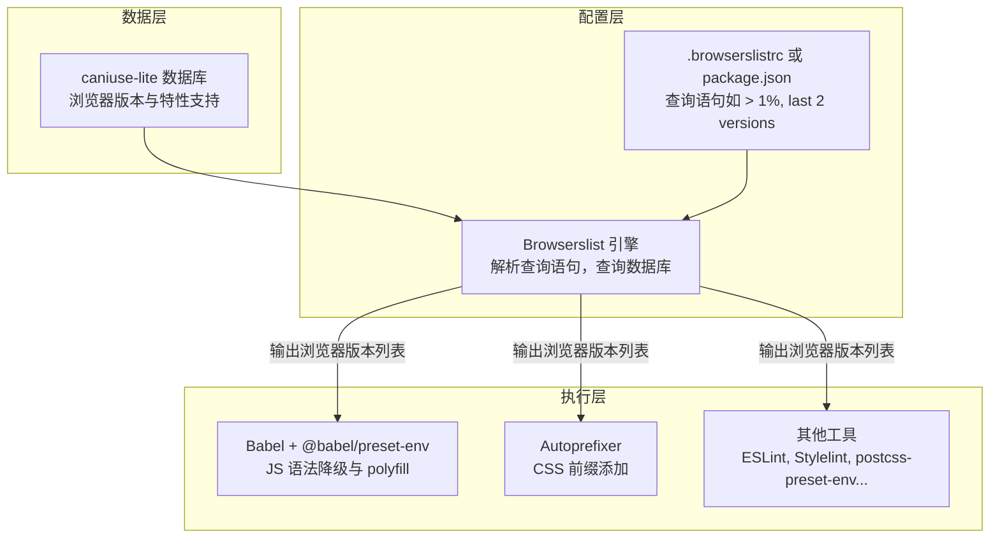
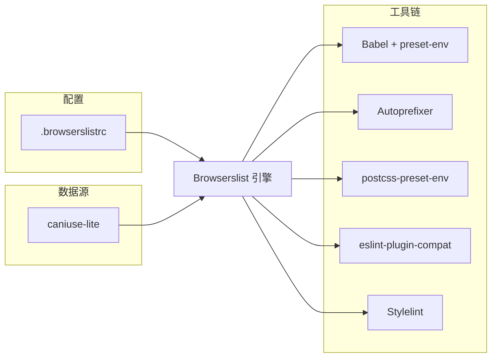

## 兼容性工程的分散困境

在前端工程化实践中，浏览器兼容性是一个贯穿始终的约束条件。一个典型的项目需要同时处理 JavaScript 语法降级、CSS 厂商前缀添加、polyfill 按需引入等多个维度的兼容性问题。在没有统一协调的情况下，每个工具各自维护一份目标浏览器列表，容易出现不一致：Babel 降级到 IE 11，而 Autoprefixer 却只考虑了最新 Chrome，导致某些 CSS 属性在 IE 11 上缺少前缀。这种碎片化的配置不仅增加了维护成本，还可能引发线上兼容事故。

Browserslist 正是为解决这一困境而生的工具。它提供了一套标准化的查询语言，让所有兼容性相关的工具共享同一份目标浏览器定义，成为整个工具链的“单一事实源头”。

## 核心架构：从数据到配置再到执行

Browserslist 本身并不直接处理代码转换，它扮演的是**配置中枢**的角色。其工作流程可分为三个层次：



**数据层**：Browserslist 依赖 `caniuse-lite` 数据库，该数据库是 caniuse.com 的离线精简版，记录了每个浏览器版本的全球/区域市场份额、对各项 Web 特性的支持情况。

**配置层**：开发者通过 `.browserslistrc` 文件或 `package.json` 中的 `browserslist` 字段声明查询语句，例如 `> 1%, last 2 versions, not dead`。Browserslist 引擎解析这条语句，查询数据库，计算出满足条件的浏览器版本集合。

**执行层**：Babel、Autoprefixer、postcss-preset-env、eslint-plugin-compat 等工具通过读取 Browserslist 的输出，精确确定需要降级哪些语法、添加哪些前缀、引入哪些 polyfill。

## 查询语法：人类可读的浏览器范围描述

Browserslist 的查询语句由一系列条件组合而成，条件之间用逗号分隔表示“或”关系，也可以用 `and`、`not` 进行逻辑组合。以下是常用查询及其含义：

| 查询示例              | 含义                                   |
| --------------------- | -------------------------------------- |
| `> 1%`                | 全球市场份额超过 1% 的浏览器版本       |
| `> 5% in CN`          | 在中国市场份额超过 5% 的版本           |
| `last 2 versions`     | 每个浏览器最新的两个主版本             |
| `not dead`            | 排除官方已停止维护超过 24 个月的浏览器 |
| `ie >= 11`            | Internet Explorer 版本 11 及以上       |
| `supports es6-module` | 支持 ES6 模块语法的浏览器              |
| `cover 99.5%`         | 覆盖全球 99.5% 用户的最少浏览器集合    |

多个条件组合的示例：

```ini
> 0.5%
last 2 versions
not dead
```

该配置的含义是：选取全球份额超过 0.5% 的版本，同时每个浏览器的最新两个版本也纳入，但排除已停止维护的版本。这种组合方式在业界最为常见，被称为“默认配置”。

## 配置位置与优先级

Browserslist 按以下优先级查找配置（从高到低）：

1. `BROWSERSLIST` 环境变量
2. 项目根目录下的 `.browserslistrc` 文件
3. `package.json` 中的 `browserslist` 字段
4. 父目录中的上述文件（向上递归直到根目录）
5. 默认值：`> 0.5%, last 2 versions, Firefox ESR, not dead`

推荐将配置放在 `package.json` 中，以减少项目根目录的文件数量：

```json
{
  "browserslist": [
    "> 1%",
    "last 2 versions",
    "not dead"
  ]
}
```

## 不同环境的差异化配置

实际项目中，开发环境和生产环境往往需要不同的兼容范围。开发环境为了构建速度，可以只兼容最新版浏览器；生产环境则需要覆盖更广的用户群。Browserslist 支持通过分段配置实现这一需求：

**`.browserslistrc` 分段配置：**

```ini
[production]
> 1%
not dead
ie 11

[development]
last 1 chrome version
last 1 firefox version
```

**`package.json` 分段配置：**

```json
{
  "browserslist": {
    "production": ["> 1%", "ie 11"],
    "development": ["last 1 chrome version", "last 1 firefox version"]
  }
}
```

工具在运行时通过 `NODE_ENV` 或 `BROWSERSLIST_ENV` 环境变量决定使用哪一段配置。例如，`NODE_ENV=production` 时，Babel 会按生产配置进行降级。

## 对构建产物的直接影响

Browserslist 的配置直接决定了代码降级程度和产物体积。以下通过两个极端案例说明：

**案例 A：仅支持最新浏览器**

```ini
last 1 chrome version
last 1 firefox version
```

- Babel 几乎不需要降级，`const`、箭头函数、`async/await` 保持原样。
- Autoprefixer 几乎不加前缀。
- 产物体积最小，运行效率最高。

**案例 B：需要兼容 IE 11**

```ini
> 0.5%
ie 11
```

- Babel 将大量语法降级到 ES5，引入 `core-js` 的 polyfill（如 `Promise`、`Array.from`、`Object.assign`）。
- Autoprefixer 为所有需要前缀的属性添加 `-ms-`、`-webkit-` 等前缀。
- 产物体积显著增大，可能比案例 A 大 30%~50%。

开发者可以通过命令行预览当前配置解析出的浏览器列表：

```bash
npx browserslist
```

输出示例：

```
and_chr 126
and_ff 127
and_qq 13.1
and_uc 15.5
android 125
chrome 128
chrome 127
edge 128
firefox 129
firefox 128
ie 11
...
```

## 数据更新：一个容易被忽视的关键操作

Browserslist 依赖的 `caniuse-lite` 数据库是一个静态快照，不会随项目依赖更新而自动刷新。如果项目创建一年后仍未更新该数据库，`last 2 versions` 解析出的将是去年的“最新两个版本”，而非当前的。这会导致：

- 实际兼容范围偏离预期（可能漏掉新版本的原生能力）。
- polyfill 过度引入，产物体积偏大。

解决方案是定期运行更新命令：

```bash
npx update-browserslist-db@latest
```

建议将该命令加入 CI 流程，或每月手动执行一次，确保数据库始终反映最新的浏览器市场份额。

## 与其他工具的关系总览



- **Babel + @babel/preset-env**：根据目标浏览器决定语法降级范围和 core-js polyfill 的按需引入。
- **Autoprefixer**：根据目标浏览器添加 CSS 厂商前缀。
- **postcss-preset-env**：将未来的 CSS 特性转换为当前浏览器支持的等效代码。
- **eslint-plugin-compat**：检查代码中使用的 API 是否在目标浏览器中得到支持，若不支持则报错。
- **Stylelint**：配合 `stylelint-no-unsupported-browser-features` 插件，检查 CSS 特性兼容性。

## 小结

Browserslist 通过提供统一的配置接口和标准化的查询语言，将分散在各工具中的兼容性配置集中管理，消除了不一致的风险。其背后的 caniuse-lite 数据库确保了决策基于真实的用户数据，而非主观臆断。理解 Browserslist 的工作机制，有助于开发者精准控制兼容性范围，在覆盖用户群体与产物体积之间找到最佳平衡点。定期更新数据库是保持配置有效性的必要操作，这一点常被忽视却至关重要。