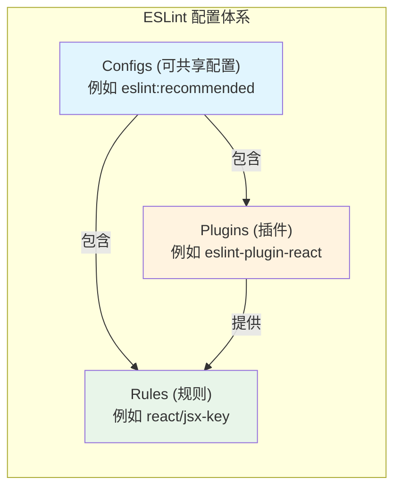

## 问题的本质

ESLint 的配置体系由三个相互关联但又截然不同的概念构成：**Rules**（规则）、**Plugins**（插件）和 **Configs**（可共享配置）。初学者常常混淆它们的关系，导致配置文件中出现冗余或错误的声明。理解三者的分层结构，是正确使用 ESLint 的前提。

## 三个层次的定义

### Rules：最底层的检测单元

Rule 是一条具体的代码检查规则，定义了什么代码模式是允许的，什么是禁止的。每条 rule 有一个名称（如 `no-unused-vars`）和一个严重级别（off / warn / error）。ESLint 内置了大量核心规则，可直接在配置文件中启用。

```json
{
  "rules": {
    "no-console": "warn",
    "eqeqeq": "error"
  }
}
```

**特点**：Rule 是原子化的，不依赖外部包。所有规则均由 ESLint 核心或插件提供。

### Plugins：规则的容器

Plugin 是一个 npm 包，提供了一组自定义规则（有时还包含处理器和环境）。当内置规则不能满足项目需求时（例如需要检查 Vue 模板、React Hooks 规范），就需要安装插件。插件命名的惯例是 `eslint-plugin-*`。

```bash
npm install eslint-plugin-react --save-dev
```

在配置文件中，插件通过 `plugins` 字段注册，之后就可以使用该插件提供的规则，规则名称需要加上插件名前缀：

```json
{
  "plugins": ["react"],
  "rules": {
    "react/jsx-key": "error"
  }
}
```

**特点**：Plugin 本身不启用任何规则，它只是将规则“注册”到 ESLint 中。规则是否生效，仍需在 `rules` 中显式配置。

### Configs：预设的规则集合

Config（可共享配置）是一个预定义的配置包，通常包含一组规则配置、插件引用和其他设置（如 `env`、`parserOptions`）。Config 的目的是让用户一键继承一套完整的 lint 规范，而不必逐个配置规则。常见的 config 有 `eslint:recommended`、`plugin:react/recommended`、`standard` 等。

```json
{
  "extends": ["eslint:recommended", "plugin:react/recommended"]
}
```

**特点**：Config 是更高层次的抽象，它将“哪些插件需要加载”以及“这些插件的哪些规则应该开启”打包在一起。用户只需 `extends` 即可。

## 三者的关系



- **Plugin 提供 Rule**：一个插件可以导出多个规则，但插件本身不决定哪些规则被启用。
- **Config 聚合 Plugin + Rule**：一个 config 可以声明需要加载哪些插件，并预设这些插件中的哪些规则以什么级别开启。
- **用户可以直接配置 Rule**：即使在使用了 config 之后，用户仍然可以在 `rules` 中覆盖或补充规则。

## 典型配置示例

假设一个 Vue 3 + TypeScript 项目，完整的 ESLint 配置可能如下：

```json
{
  "root": true,
  "env": { "browser": true, "es2021": true },
  "parser": "@typescript-eslint/parser",
  "parserOptions": { "ecmaVersion": "latest", "sourceType": "module" },
  "plugins": ["@typescript-eslint", "vue"],
  "extends": [
    "eslint:recommended",
    "plugin:@typescript-eslint/recommended",
    "plugin:vue/vue3-recommended"
  ],
  "rules": {
    "vue/multi-word-component-names": "off",
    "@typescript-eslint/no-explicit-any": "warn"
  }
}
```

在这个配置中：

- **`plugins`** 声明了两个插件：`@typescript-eslint` 和 `vue`。它们提供了 `@typescript-eslint/*` 和 `vue/*` 系列的规则。
- **`extends`** 引用了三个 config：`eslint:recommended`（ESLint 内置推荐规则）、`plugin:@typescript-eslint/recommended`（TypeScript 插件推荐的规则集合）、`plugin:vue/vue3-recommended`（Vue 3 推荐的规则集合）。这些 config 内部已经包含了对应的插件引用和规则开启。
- **`rules`** 中对个别规则进行了覆盖：关闭了 `vue/multi-word-component-names`，并将 `@typescript-eslint/no-explicit-any` 降级为 warn。

## 常见误解

**误解一：认为 plugins 会自动启用规则**

许多人以为在 `plugins` 中添加了插件后，该插件的规则就会自动生效。实际上，`plugins` 仅仅是将插件注册到 ESLint 的名称空间中，使规则名称可以被识别。要真正启用规则，必须在 `rules` 中配置，或者通过 `extends` 继承一个已经配置好规则的 config。

**误解二：认为 config 和 plugin 是互斥的**

Config 通常会依赖于一个或多个 plugin，但它们不是互斥关系。`extends` 中的 `plugin:xxx/recommended` 实际上是一个 config，它内部已经做了 `plugins: ['xxx']` 的声明，用户不需要再手动添加 `plugins`。但为了显式性，很多项目仍然会在 `plugins` 中列出所有用到的插件。

**误解三：混淆 config 的命名空间**

Config 的命名规则是 `eslint-config-*`（可省略 `eslint-config-` 前缀），而 Plugin 的命名规则是 `eslint-plugin-*`（可省略 `eslint-plugin-` 前缀）。在 `extends` 中引用 config 时，可以直接写名字（如 `standard` 对应 `eslint-config-standard`）；在 `plugins` 中引用插件时，也可以直接写名字（如 `react` 对应 `eslint-plugin-react`）。

## 对比总结

| 概念   | 本质           | 是否包含规则配置     | 是否需要安装 npm 包    | 配置方式                            |
| ------ | -------------- | -------------------- | ---------------------- | ----------------------------------- |
| Rule   | 单条检查规则   | 是（自身）           | 否（内置或由插件提供） | `"rules": { "rule-name": "error" }` |
| Plugin | 一组规则的集合 | 否（仅注册）         | 是                     | `"plugins": ["plugin-name"]`        |
| Config | 预设的配置集合 | 是（包含规则和插件） | 是                     | `"extends": ["config-name"]`        |

## 最佳实践

1. **优先使用成熟的 config**：对于常见技术栈（React、Vue、TypeScript），社区维护的 config 已经覆盖了绝大多数场景，避免从零配置规则。
2. **显式声明 plugins**：即使 config 内部已经引用了插件，在 `plugins` 中显式列出所有用到的插件可以提高可读性和可维护性。
3. **个性化规则放在 `rules` 中覆盖**：不要修改 config 源文件，而是在项目配置的 `rules` 中覆盖。
4. **理解继承顺序**：`extends` 数组中后面的 config 优先级更高，可以覆盖前面的规则。`rules` 中的配置优先级最高。

## 小结

ESLint 的 Rules、Plugins 和 Configs 构成了一个清晰的层次结构：Rules 是最小的检测单元，Plugins 负责提供 Rules，Configs 负责将 Rules 和 Plugins 打包成可复用的规范集合。正确区分这三者，可以写出简洁、可维护的 ESLint 配置文件，避免冗余和混乱。