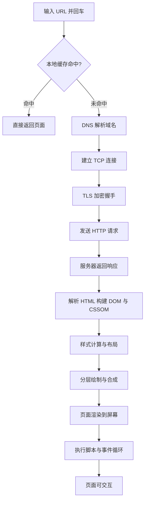
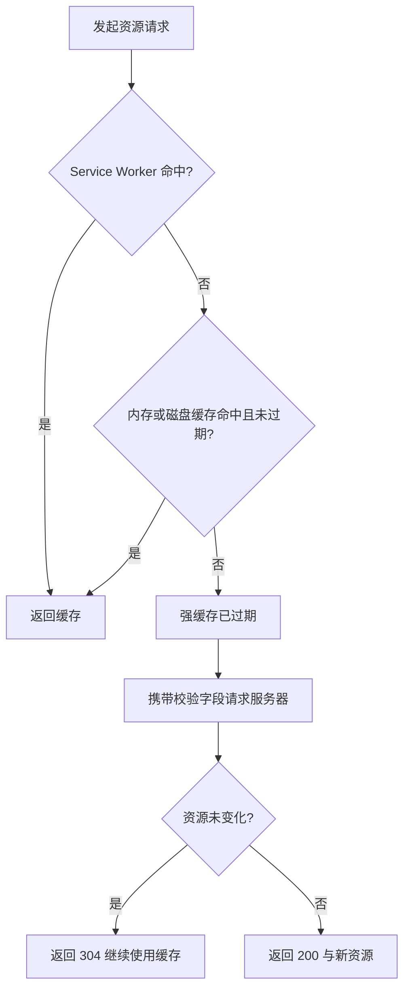
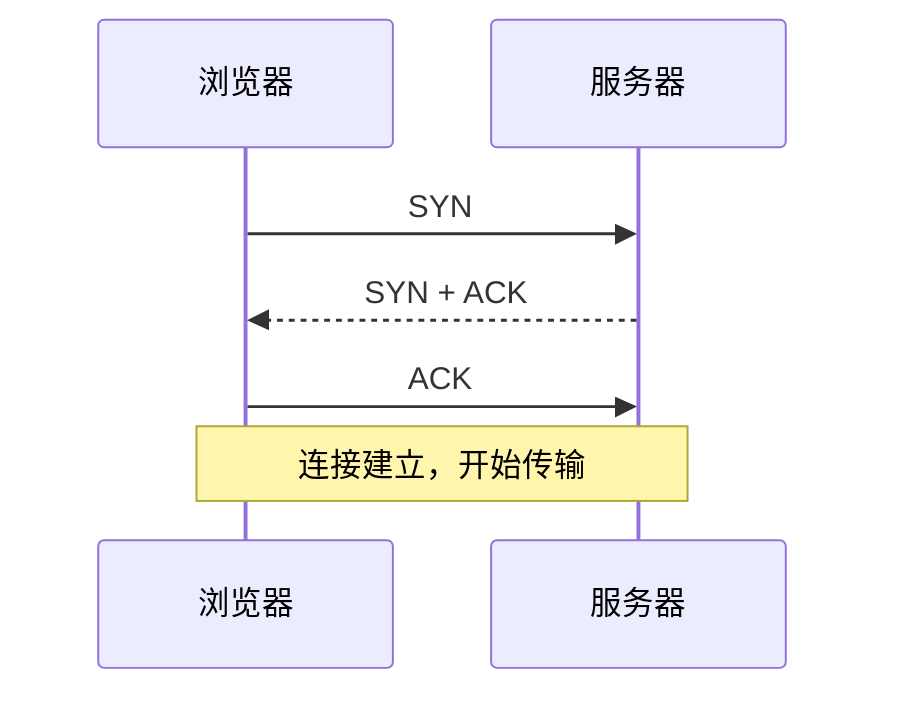
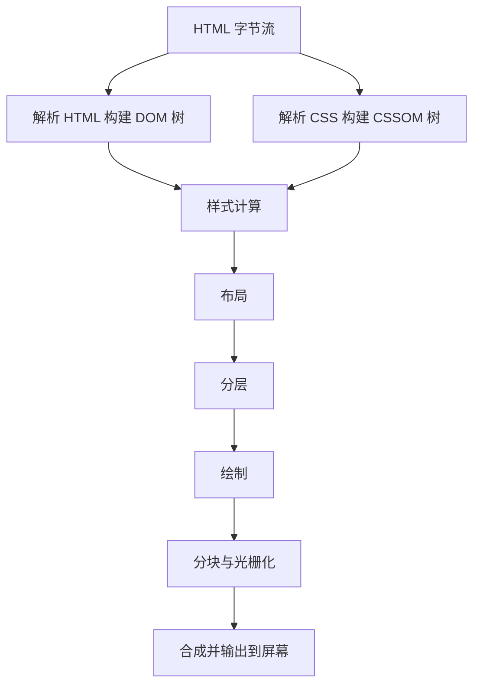
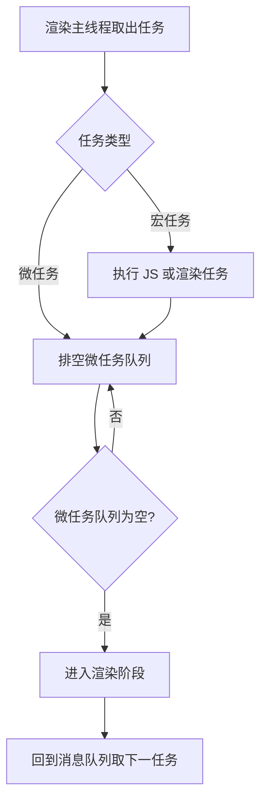

> 本文从浏览器地址栏的一次回车出发，串讲一条 URL 如何历经缓存检查、网络传输、渲染流水线与事件循环，最终成为屏幕上可交互的页面。内容面向前端面试中的经典题「从输入 URL 到页面展示发生了什么」，所有结论均依据 HTTP 规范与 Chromium 的进程与线程实现。

## 一、总体流程概览

「从输入 URL 到页面展示」这一过程，本质上是一条数据从网络流向像素的流水线。整个过程可以划分为四个相互衔接的阶段，每个阶段都有明确的输入与输出，前一阶段的产物成为后一阶段的原料。

四个阶段与各自的核心产物如下表所示。

| 阶段 | 负责环节 | 核心产物 |
| --- | --- | --- |
| 缓存检查 | 判断资源是否已在本地 | 缓存命中结果 |
| 网络传输 | DNS、TCP、TLS、HTTP | HTML 字节流 |
| 渲染流水线 | 解析、样式、布局、绘制 | 屏幕像素 |
| 事件循环 | 脚本执行与任务调度 | 可交互页面 |

## 二、缓存检查：请求发出前的第一道闸门

浏览器在真正联网之前，会先检查本地是否存在可复用的资源副本。这一检查从内到外依次经过 Service Worker 缓存、内存缓存（memory cache）与磁盘缓存（disk cache）。内存缓存读取最快但进程结束即释放，磁盘缓存读取较慢但可持久保留。

缓存判定分为两类，区分的标准是是否需要向服务器发送请求。

强缓存由 `Cache-Control: max-age` 与 `Expires` 控制。`max-age` 表示资源自生成起在若干秒内有效，浏览器直接使用本地副本而不发出任何请求；`Expires` 是绝对过期时间，依赖客户端时钟，精度较低，因此在两者同时存在时 `max-age` 优先。

协商缓存由 `ETag` 与 `If-None-Match`、`Last-Modified` 与 `If-Modified-Since` 两对字段控制。当强缓存过期后，浏览器携带校验字段向服务器请求，服务器判断资源是否变化。若未变化则返回 `304 Not Modified`，响应体为空，浏览器继续使用本地副本；若已变化则返回 `200` 与新资源。

一个值得强调的结论是，强缓存的价值在于「零请求」，协商缓存的价值在于「零传输」。强缓存命中时没有网络开销，协商缓存命中时虽然有一次请求往返，但响应体仅为若干字节，省去了资源主体的传输。

缓存命中时，浏览器直接返回结果，整条流程到此结束；缓存未命中时，流程进入网络传输阶段。

## 三、网络传输：从域名到字节

缓存未命中后，浏览器需要从服务器获取 HTML 文档。这一阶段解决的核心问题是「如何把一段域名变成一段字节流」。

### 3.1 DNS 解析

域名是给人记忆的，而网络传输依赖 IP 地址。DNS（域名系统）的作用是将 `example.com` 这样的域名解析为 `93.184.216.34` 这样的 IP 地址。

解析过程带有明显的缓存层级：浏览器缓存、操作系统缓存、路由器缓存、运营商本地域名服务器，逐级向上，最后查询根域名服务器、顶级域名服务器与权威域名服务器。查询方式分为递归查询与迭代查询，浏览器通常发出递归查询请求，由各级服务器代为完成后续解析。

### 3.2 TCP 连接

拿到 IP 地址后，浏览器与服务器之间需要建立一条可靠的传输通道，这就是 TCP 三次握手。

三次握手的目的在于双方确认彼此的收发能力，同时交换初始序号。可以类比为打电话前的三次确认：先拨通、对方应答、再确认身份，随后才进入正式对话。

### 3.3 TLS 握手

若地址以 `https://` 开头，TCP 连接建立后还需要一次 TLS 握手，协商加密算法并交换密钥，保证后续数据加密传输。TLS 1.3 将这一过程压缩为 1 个往返（1-RTT），相比旧版本减少了握手延迟。

### 3.4 HTTP 请求与响应

连接就绪后，浏览器发送 HTTP 请求。请求由请求行、请求头与请求体组成，携带方法、目标路径、`Host`、`Cookie`、`User-Agent` 等信息。服务器处理后返回响应，响应同样由状态行、响应头与响应体组成，响应体即所需的 HTML 文档。

至此，浏览器获得了 HTML 字节流，流程进入渲染阶段。

## 四、渲染流水线：从字节到像素

渲染（render）指将 HTML 与 CSS 转换为屏幕像素的完整流水线。浏览器网络进程的线程拿到 HTML 字符串后，生成一个渲染任务交给渲染进程，渲染主线程通过事件循环取出任务，依次完成解析、样式计算、布局、分层、绘制、分块、光栅化与合成。

### 4.1 解析 HTML

解析阶段将字节流转换为两棵树：DOM 树描述页面结构，CSSOM 树描述样式规则。为提高效率，浏览器会启动预解析线程提前下载外部资源。

解析过程有两条重要规则。其一，CSS 不阻塞 HTML 的解析，但会阻塞渲染，因为渲染树的构建依赖完整的 CSSOM。其二，JS 会阻塞 HTML 解析，因为脚本可能修改尚未完成的 DOM 树，主线程必须暂停解析，等待脚本下载并执行完毕后继续。

### 4.2 样式计算

样式计算（Recalculate Style）遍历 DOM 树，为每个节点计算最终样式，称为计算后样式（Computed Style）。相对单位在此阶段换算为绝对值，预设值换算为具体值。

### 4.3 布局

布局（Layout）根据每个节点的样式计算其尺寸与位置，生成布局树。布局树与 DOM 树并非一一对应，`display: none` 的节点没有几何信息，不会出现在布局树中。

### 4.4 分层与绘制

分层（Layerization）将布局树拆分为多个图层，使更新只发生在变化的图层上。绘制（Paint）为每个图层生成绘制指令集，描述该图层的内容如何画出。

### 4.5 分块、光栅化与合成

分块（Tiling）将每个图层划分为小块，优先处理靠近视口的区域。光栅化（Raster）将块转换为位图，由 GPU 进程完成。合成（Composite）将各位图提交到屏幕，形成最终画面。

合成阶段由合成线程负责，与渲染主线程相互独立，因此 `transform` 这类只改变合成属性的操作，即使主线程繁忙也能保持流畅。

## 五、脚本执行与事件循环：让页面响应起来

页面渲染出画面后，还需要执行脚本并响应用户交互，这一职责由事件循环承担。

事件循环维护消息队列，任务分为宏任务与微任务。宏任务包括脚本执行、定时器回调与网络事件；微任务包括 `Promise.then` 与 `MutationObserver` 回调。每执行完一个宏任务，主线程会排空微任务队列，之后才进入渲染阶段。

这一机制解释了一个关键现象：脚本对 DOM 的修改在内存中完成，并不会立刻触发渲染。一段循环内修改一百次 DOM，浏览器只在脚本执行完毕、微任务清空后的渲染阶段统一绘制一次。

## 六、完整回答范式

面试中的标准回答可以组织为一条时间线，从近到远、从网络到像素依次展开。

1. 输入 URL 后，浏览器先解析地址结构，得到协议、主机、端口与路径。
2. 检查缓存：依次查找 Service Worker 缓存、内存缓存与磁盘缓存，命中则直接返回，未命中则继续。
3. 通过 DNS 解析将域名转换为 IP 地址。
4. 与服务器建立 TCP 连接，若为 HTTPS 再完成 TLS 握手。
5. 发送 HTTP 请求，服务器处理并返回响应，响应体为 HTML 文档。
6. 解析 HTML 与 CSS，构建 DOM 树与 CSSOM 树。
7. 完成样式计算与布局，得到每个元素的样式与几何信息。
8. 分层、绘制、分块、光栅化与合成，将像素输出到屏幕。
9. 执行脚本，通过事件循环调度任务，页面进入可交互状态。

常见的追问包括：缓存的层级与命中顺序、重排与重绘的区别、`transform` 动画为何流畅、JS 为何阻塞解析而 CSS 不阻塞等。这些细节均可在上述四个阶段中找到对应的原理。

## 七、总结

| 阶段 | 核心动作 | 关键概念 |
| --- | --- | --- |
| 缓存检查 | 复用本地资源 | 强缓存、协商缓存、缓存层级 |
| 网络传输 | 获取字节流 | DNS、TCP、TLS、HTTP |
| 渲染流水线 | 生成像素 | DOM/CSSOM、布局、分层、合成 |
| 事件循环 | 调度脚本 | 宏任务、微任务、渲染时机 |

整个过程可以用一句话概括：浏览器先尝试在本地复用资源，复用失败则通过网络取回字节流，再由渲染流水线把字节流转成像素，最后通过事件循环让页面持续响应。四个阶段环环相扣，构成了从一次回车到一屏画面的完整链路。

---

> 参考资料：HTTP 语义与内容规范（RFC 9110）、域名系统概念（RFC 1034）、传输控制协议（RFC 793）、MDN Web 文档（DNS、事件循环、关键渲染路径）。
