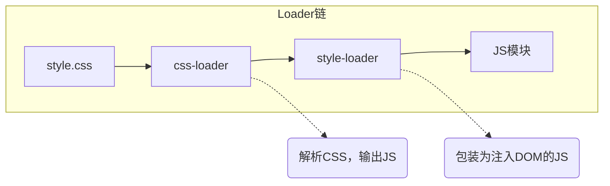

## 问题的本质

Webpack 本质上是一个模块打包工具，其核心能力是处理 JavaScript 模块之间的依赖关系。然而，现代前端项目不仅包含 JavaScript，还涉及 TypeScript、CSS、图片、字体等多种资源类型。Webpack 原生只能理解 JavaScript 和 JSON 文件，对于其他类型的资源，就需要借助 **Loader** 来完成转换。

Loader 是 Webpack 中用于**将非 JavaScript 资源转换为 Webpack 能够处理的模块**的转换器。理解 Loader 的工作机制，是掌握 Webpack 工程化能力的关键一步。

## Loader 的角色与定位

### 什么是 Loader

Loader 是一个导出为函数的 Node.js 模块。它接收源文件的内容作为输入，经过处理后返回新的内容（通常是 JavaScript 代码字符串）。Webpack 在构建过程中，会根据配置中的 `module.rules` 匹配文件路径，然后将匹配到的文件交给对应的 Loader 链进行处理。


### 常见 Loader 及其职责

| Loader         | 处理资源        | 核心作用                                                     |
| -------------- | --------------- | ------------------------------------------------------------ |
| `css-loader`   | CSS 文件        | 解析 CSS 中的 `@import` 和 `url()`，将其转换为 Webpack 模块依赖 |
| `style-loader` | CSS 文件        | 将 CSS 以 `<style>` 标签形式注入 HTML 页面                   |
| `babel-loader` | JS/TS/JSX       | 使用 Babel 将 ES6+ 语法转换为 ES5，支持 Polyfill             |
| `ts-loader`    | TypeScript      | 将 TypeScript 编译为 JavaScript                              |
| `file-loader`  | 图片/字体       | 将文件输出到构建目录，并返回文件的公开 URL                   |
| `url-loader`   | 小体积图片/字体 | 将小于阈值的文件转为 Base64 DataURL，减少请求数              |
| `sass-loader`  | SCSS/SASS       | 将 Sass/SCSS 编译为 CSS                                      |
| `vue-loader`   | Vue 单文件组件  | 解析 `.vue` 文件，拆分 template/script/style 分别处理        |

## Loader 的使用方式

### 基本配置

在 `webpack.config.js` 中，通过 `module.rules` 数组定义 Loader 规则。每个规则包含两个核心字段：`test`（匹配文件的正则表达式）和 `use`（应用的 Loader 列表）。

```js
module.exports = {
  module: {
    rules: [
      {
        test: /\.css$/,
        use: ['style-loader', 'css-loader']
      },
      {
        test: /\.ts$/,
        use: 'ts-loader'
      }
    ]
  }
};
```

### 链式调用与执行顺序

当 `use` 数组包含多个 Loader 时，它们会形成一个**链式管道**。Webpack 的处理顺序是**从右向左**（从下向上）执行。以 `['style-loader', 'css-loader']` 为例：

1. 源文件 `style.css` 首先被最右边的 `css-loader` 接收。
2. `css-loader` 解析 CSS 内容，处理 `@import` 和 `url()`，输出一段 JavaScript 代码（通常是一个包含 CSS 字符串的数组模块）。
3. 该 JavaScript 代码作为输入传递给左边的 `style-loader`。
4. `style-loader` 接收这段代码，并进一步包装，生成一段新的 JavaScript 代码。这段代码在浏览器运行时，会动态创建 `<style>` 标签并将 CSS 字符串插入其中。
5. 最终，Webpack 将 `style-loader` 的输出作为模块打包进 bundle。



### 为什么顺序是从右向左

这个设计源于 Unix 管道的理念：**先处理底层转换，再进行上层包装**。`css-loader` 负责将 CSS 转化为 Webpack 能识别的模块（底层），`style-loader` 在此基础上添加运行时注入逻辑（上层）。如果反过来，`style-loader` 将无法理解 CSS 语法，也就无法正确处理。

## Loader 的基本原理

### Loader 的函数签名

每个 Loader 本质上是一个函数，接收以下参数：

- `content`：源文件的内容（字符串或 Buffer）
- `map`：可选的 Source Map 对象
- `meta`：可选的元数据（由上一个 Loader 传递）

Loader 必须返回处理后的内容（可以是字符串或 Buffer），也可以返回一个包含 `code` 和 `map` 的对象。

```js
// 一个最简单的 Loader
module.exports = function(content) {
  // 对 content 进行某种转换
  const transformed = content.replace(/console\.log/g, '// console.log');
  return transformed;
};
```

### Loader 的分类

Webpack 将 Loader 分为四种类型，通过 `enforce` 字段控制：

- **pre Loader**：在所有普通 Loader 之前执行（`enforce: 'pre'`）
- **normal Loader**：默认类型
- **post Loader**：在所有普通 Loader 之后执行（`enforce: 'post'`）
- **inline Loader**：在 import 语句中直接指定的 Loader（较少使用）

执行顺序为：**pre → normal → inline → post**。这种分层设计使得某些预处理（如代码检查）可以在早期介入，而后期处理（如压缩）则在最后执行。

### 同步与异步 Loader

大多数 Loader 是同步执行的，直接返回转换结果。但当 Loader 需要执行异步操作（如网络请求、文件读取）时，可以使用 `this.async()` 获取回调函数：

```js
module.exports = function(content) {
  const callback = this.async();
  someAsyncOperation(content, (err, result) => {
    if (err) return callback(err);
    callback(null, result);
  });
};
```

### 获取 Loader 选项

Loader 可以通过 `this.getOptions()` 获取用户在配置中传入的选项：

```js
// webpack.config.js
{
  loader: 'my-loader',
  options: { prefix: '/* auto-generated */\n' }
}

// my-loader.js
module.exports = function(content) {
  const options = this.getOptions();
  return options.prefix + content;
};
```

## 编写一个自定义 Loader

假设需要编写一个 Loader，将所有 JavaScript 文件中的 `TODO` 注释替换为警告信息。代码如下：

```js
// todo-warning-loader.js
module.exports = function(content) {
  const options = this.getOptions();
  const warning = options.warning || 'WARNING: TODO item found';
  const result = content.replace(/\/\/\s*TODO.*$/gm, `// ${warning}`);
  return result;
};
```

在 Webpack 配置中注册：

```js
{
  test: /\.js$/,
  use: {
    loader: path.resolve(__dirname, 'todo-warning-loader.js'),
    options: { warning: '此项待办尚未处理' }
  }
}
```

## Loader 与 Plugin 的界限

初学者常混淆 Loader 和 Plugin。两者的根本区别在于：

- **Loader**：作用于单个文件级别，负责文件内容的转换。在模块打包之前执行。
- **Plugin**：作用于整个构建过程，可以监听 Webpack 的生命周期钩子，执行更广泛的任务（如资源优化、环境变量注入、HTML 生成等）。Plugin 可以访问 Webpack 的完整编译对象。

一个简单的记忆方式：**Loader 负责“怎么翻译”，Plugin 负责“做什么事”**。

## 常见误区

**误区一：Loader 可以访问 Webpack 配置中的所有资源**

Loader 只能处理当前匹配的文件内容，无法直接访问其他文件或 Webpack 的模块图。如果需要跨文件操作，应该考虑使用 Plugin。

**误区二：Loader 的执行顺序是数组从左到右**

如前所述，实际顺序是从右到左。这个反直觉的设计源于 Unix 管道思想，理解这一点可以避免配置错误。

**误区三：Loader 必须返回 JavaScript 代码**

Loader 可以返回任意字符串或 Buffer，但最终必须被 Webpack 理解为一个有效的模块。通常返回的是 JavaScript 代码，但也可以通过 `raw` 属性处理二进制文件（如图片）。

## 最佳实践

1. **保持 Loader 职责单一**：每个 Loader 只做一件事，并通过链式组合完成复杂转换。例如将 Sass 编译和 CSS 注入分开为两个 Loader。
2. **使用 `include` 和 `exclude` 缩小处理范围**：避免不必要的文件被 Loader 处理，提升构建性能。
3. **优先使用社区成熟的 Loader**：除非有特殊需求，否则不要重复造轮子。社区维护的 Loader 经过了大量项目的验证。
4. **理解 `resolveLoader` 配置**：当自定义 Loader 不在 `node_modules` 中时，可以通过 `resolveLoader.modules` 指定查找路径。

## 小结

Loader 是 Webpack 生态中实现资源模块化的核心机制。它通过链式函数调用的方式，将任意类型的文件转换为 JavaScript 模块，从而融入 Webpack 的依赖图。理解 Loader 的配置语法、执行顺序和函数签名，是进行前端工程化配置的基础。从使用社区 Loader 到编写自定义 Loader，每一步都深化了对模块打包原理的认识。