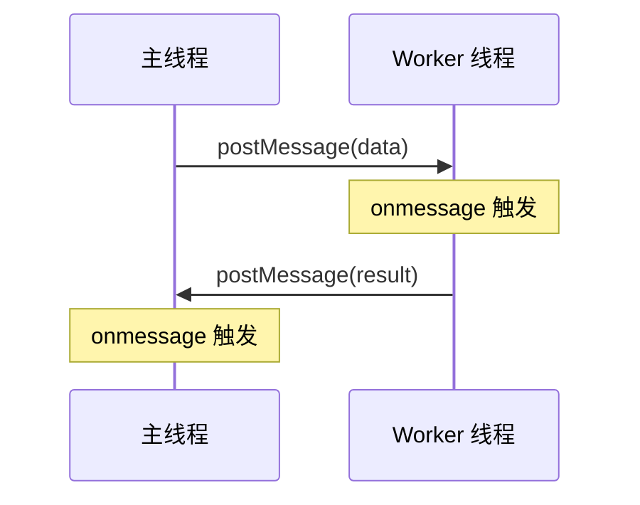

## 问题的本质

JavaScript 语言自诞生之日起便采用单线程模型，主线程同时负责 UI 渲染、事件处理和业务逻辑。这种设计避免了多线程带来的竞态条件和死锁问题，但也导致一个现实困境：当主线程陷入密集计算时，用户界面会失去响应，表现为页面卡顿甚至浏览器弹出“脚本无响应”对话框。

Web Worker 的出现打破了这一僵局。它允许在独立的后台线程中执行 JavaScript 代码，且不阻塞主线程。理解 Web Worker 的设计哲学、通信机制和适用边界，是前端工程师走向高级阶段的必修课。

## 核心概念：独立线程与消息传递

### 线程模型

Web Worker 是浏览器在操作系统层面创建的真正线程，拥有独立的 V8 引擎实例。它与主线程共享同一份 JavaScript 运行时环境（包括全局对象、原型链等），但彼此的内存空间完全隔离。这意味着：

- Worker 无法访问 DOM、BOM、window、document 等主线程独有对象。
- Worker 内部可以使用 `setTimeout`、`fetch`、`XMLHttpRequest`、`IndexedDB` 等 API（部分受限制）。
- Worker 之间以及 Worker 与主线程之间通过 `postMessage` 方法传递消息，数据采用结构化克隆算法（Structured Clone Algorithm）进行深拷贝。

### 消息通信机制



主线程通过 `worker.postMessage(data)` 发送数据，Worker 通过监听 `self.onmessage` 接收；Worker 同样通过 `self.postMessage(result)` 返回结果，主线程监听 `worker.onmessage`。整个通信过程是异步的，不会阻塞任何一方。

## 典型应用场景

### 1. 大规模数据处理

当需要对数十万条记录进行排序、过滤或聚合时，将这些操作交给 Worker 执行，主线程可以继续响应用户滚动、点击等操作。例如一个在线电子表格应用，用户输入公式后，计算逻辑在 Worker 中完成，界面始终保持流畅。

### 2. 图像与视频处理

Canvas 的 `getImageData` 可以获得像素数组，将像素级滤镜（模糊、锐化、颜色变换）的计算移入 Worker，处理后通过 `putImageData` 更新画面。现代浏览器还支持 `OffscreenCanvas`，允许 Worker 直接操作 Canvas 上下文，减少数据传输开销。

### 3. 加密与编解码

文件上传前的客户端加密（如 AES）、大文件的 Base64 编码、音视频流的实时转码等计算密集型任务，天然适合 Worker。例如一个在线文档编辑器，在 Worker 中进行 Markdown 到 HTML 的渲染，避免输入时出现卡顿。

### 4. 实时数据流处理

WebSocket 接收到的海量数据（如股票行情、传感器数据）可以在 Worker 中解析、清洗、聚合，再将精简后的结果传递给主线程用于可视化。这样可以避免主线程被频繁的消息回调淹没。

## 限制与权衡

### 无法访问 DOM

这是最根本的限制。所有需要操作 DOM 的工作都必须通过消息传递结果，由主线程负责最终的渲染更新。这迫使开发者将 UI 逻辑与计算逻辑彻底分离，反而促进了更清晰的架构。

### 创建与销毁的开销

每次 `new Worker(url)` 都需要启动一个新的 V8 实例，这个过程大约消耗几十毫秒和若干 MB 内存。对于执行时间极短（小于 100ms）的任务，创建 Worker 的开销可能超过计算本身，此时更适合在主线程中用异步分解（chunking）来处理。

### 数据传输的成本

结构化克隆算法会将数据完整复制一份。对于大型 ArrayBuffer 或 TypedArray，可以使用 `Transferable Objects` 实现零拷贝传输——转移后原线程中的引用将失效。例如：

```js
// 主线程
const buffer = new ArrayBuffer(1024 * 1024 * 50); // 50MB
worker.postMessage(buffer, [buffer]); // 转移所有权
console.log(buffer.byteLength); // 0，已失效
```

### 跨域限制

Worker 脚本必须与页面同源，或者通过 `Access-Control-Allow-Origin` 头允许跨域加载。此外，`importScripts` 加载的第三方库也必须遵循同源策略。

## 性能基准与选择依据

| 任务类型               | 主线程处理       | Worker 处理 | 推荐方案           |
| ---------------------- | ---------------- | ----------- | ------------------ |
| 短小计算（< 50ms）     | 可接受           | 创建开销大  | 主线程             |
| 中等计算（50~500ms）   | 可能引起轻微卡顿 | 良好        | Worker             |
| 长时计算（> 500ms）    | 严重卡顿         | 最优        | Worker             |
| I/O 密集型（网络请求） | 异步非阻塞即可   | 不必要      | 主线程 async/await |

## 实战示例：素数计算

以下代码展示如何使用 Worker 计算指定范围内的素数个数，主线程保持响应。

**worker.js**

```js
self.onmessage = function(e) {
  const limit = e.data;
  let count = 0;
  for (let i = 2; i <= limit; i++) {
    if (isPrime(i)) count++;
  }
  self.postMessage(count);
};

function isPrime(n) {
  if (n < 2) return false;
  for (let i = 2; i * i <= n; i++) {
    if (n % i === 0) return false;
  }
  return true;
}
```

**main.js**

```js
const worker = new Worker('worker.js');
worker.postMessage(1000000);

worker.onmessage = function(e) {
  document.getElementById('result').textContent = `素数个数：${e.data}`;
};

// 主线程可以继续执行其他任务
console.log('计算已经开始，界面未被阻塞');
```

## 与其他并行方案的对比

| 方案              | 线程模型                       | 数据共享    | 适用场景                          |
| ----------------- | ------------------------------ | ----------- | --------------------------------- |
| Web Worker        | 独立线程，消息传递             | 深拷贝/转移 | CPU 密集型计算                    |
| SharedArrayBuffer | 共享内存，原子操作             | 零拷贝      | 高性能并行计算（需 COOP/COEP 头） |
| Service Worker    | 独立线程，网络代理             | 消息传递    | 离线缓存、请求拦截                |
| WebAssembly       | 二进制指令，可运行在 Worker 内 | 线性内存    | 接近原生性能的计算                |

## 最佳实践

1. **合理划分任务粒度**：将计算任务拆分成若干小块，分批发送给 Worker，并在主线程中逐步更新进度条，避免一次性传输过大数据。
2. **复用 Worker 实例**：对于频繁的同类计算，应创建一个长期存活的工作 Worker，通过消息驱动任务，而不是每次新建。
3. **使用 Transferable Objects**：当传递大型二进制数据时，优先使用 `ArrayBuffer` 转移所有权，减少内存拷贝。
4. **错误处理**：监听 `worker.onerror` 事件捕获 Worker 内部的未捕获异常，并在 Worker 内部使用 `try/catch` 将错误通过 `postMessage` 返回给主线程。
5. **优雅终止**：不再需要 Worker 时调用 `worker.terminate()` 释放资源，避免僵尸线程。