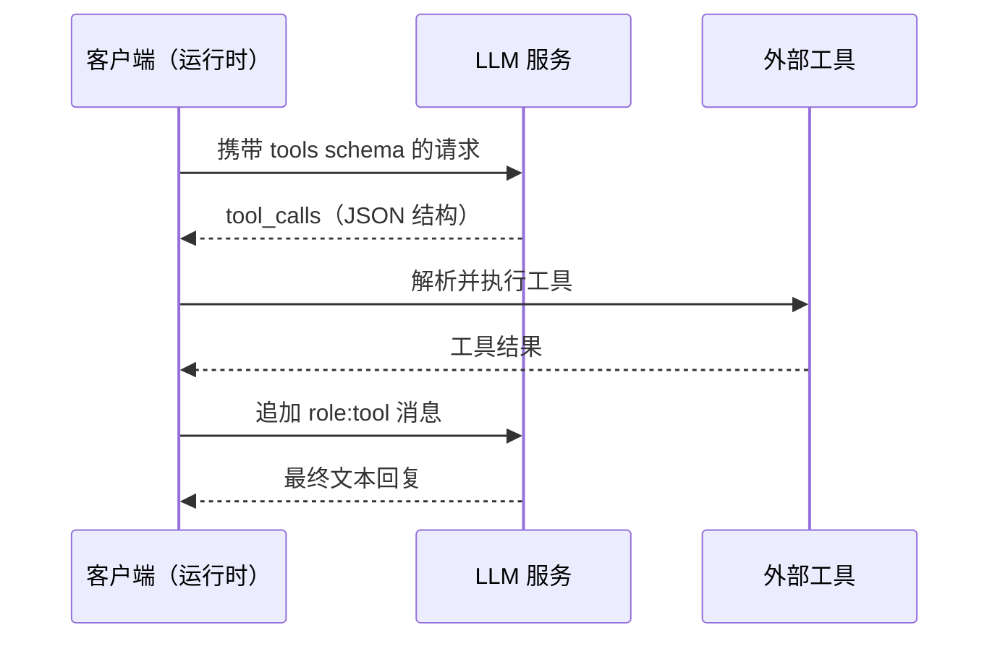
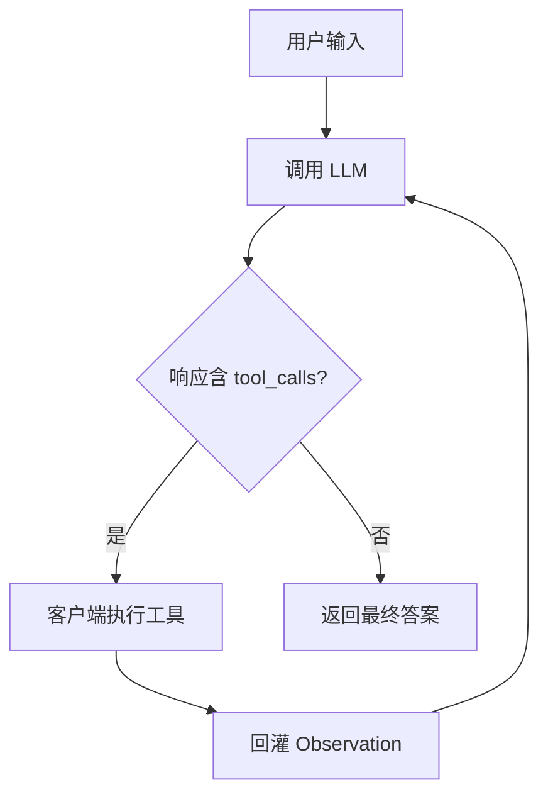
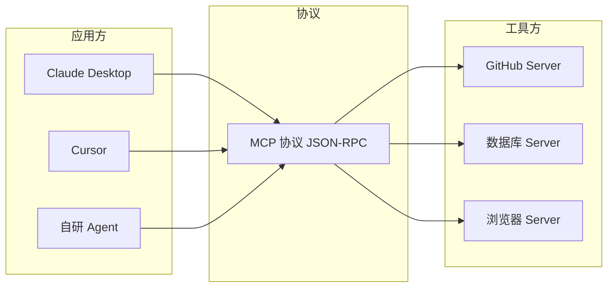
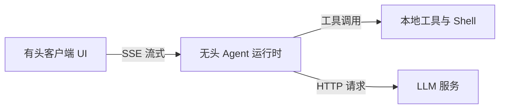

> 本文串讲一条与「从输入 URL 到页面展示」并行的前端工程链路：程序如何与大型语言模型对话，并借助工具调用与协议编排，把自然语言请求转化为确定的外部动作。内容面向前端工程师在 Agent 工程化面试中的核心知识，结论依据 OpenAI Function Calling 规范、Anthropic MCP 规范与 ReAct 研究论文。

## 一、两条分野：内容层与控制层

与大型语言模型交互时，存在两层性质不同的信息。其一为**内容层**，即发送给模型的提示词，天然以自然语言书写。其二为**控制层**，即选择模型、限定轮数、读取文件、调度工具等编排动作，应当由精确的程序接口表达。

命令行界面并不取代自然语言，而是用精确外壳将其包裹。提示词仍说人话，控制交由 flag 与管道。理解这一分野，是厘清后续所有概念的前提。

## 二、Function Calling：模型只负责说，不负责做

Function Calling 是模型对外表达「要调用某个工具」的输出协议。模型本身不执行任何工具，真正的执行始终发生在客户端代码中。

最小可运行循环如下（TypeScript）：

```typescript
import OpenAI from "openai";

const client = new OpenAI({ apiKey: process.env.API_KEY, baseURL: process.env.BASE_URL });

const tools = [{
  type: "function" as const,
  function: {
    name: "get_weather",
    description: "查询某城市当前天气",
    parameters: {
      type: "object",
      properties: { city: { type: "string" } },
      required: ["city"],
    },
  },
}];

async function run(userInput: string) {
  const messages: OpenAI.Chat.ChatCompletionMessageParam[] = [
    { role: "user", content: userInput },
  ];

  for (let step = 0; step < 5; step++) {
    const resp = await client.chat.completions.create({
      model: "gpt-4o-mini",
      messages,
      tools,
    });
    const msg = resp.choices[0].message;

    if (msg.tool_calls?.length) {
      messages.push(msg);
      for (const call of msg.tool_calls) {
        const args = JSON.parse(call.function.arguments);
        const result = get_weather(args.city); // 执行在外部代码
        messages.push({
          role: "tool",
          tool_call_id: call.id,
          content: result,
        });
      }
      continue;
    }
    return msg.content;
  }
  return "已达到最大步数";
}
```

上述代码揭示了三层分工：模型输出 `tool_calls` 结构化 JSON，客户端解析并真正执行工具，再将结果以 `role: tool` 消息回灌。调用时序如下。



## 三、Agent 循环：Thought-Action-Observation

当模型被允许在循环里自主决定下一步动作时，系统便从单次调用升级为 Agent。经典形态是 ReAct 范式，每一轮包含三段：思考（Thought）、动作（Action）、观察（Observation）。



工程实现上，Agent 循环存在两种风格，差异仅在「模型如何表达动作」这一契约。

| 维度 | 提示词解析版（ReAct 论文） | 原生 Function Calling 版 |
| --- | --- | --- |
| 动作表达 | 文本格式 `Action: tool(args)` | API 返回结构化 `tool_calls` |
| 解析方 | 客户端正则 | LLM 提供方 SDK |
| 格式约定 | 由 system prompt 规定 | 由 `tools` schema 规定 |
| 稳健性 | 较弱，依赖模型守格式 | 较强，模型被微调为必出合法调用 |

提示词解析版教学直观、改起来灵活，但靠模型遵守约定格式，易碎。原生 Function Calling 版更稳，是生产环境主流。无论哪种，执行与观察永远在 LLM 之外，这与第二节的结论一致。

## 四、MCP：把 M×N 工具集成降为 M+N

当多个应用需要对接多个工具时，若各自手写胶水代码，复杂度呈 M×N 增长。模型输出格式这一层早已被 OpenAI 的事实标准统一，各家模型兼容同一套 `tool_calls` schema。MCP（Model Context Protocol）统一的是另一层：工具的分发与接入。

MCP 将复杂度重构为「协议统一一份，客户端各实现一次，服务端各实现一次」。应用方实现一次 MCP client 即可发现并调用任意 server；工具方实现一次 MCP server 即可被任意应用复用。



MCP 是生态协议而非必需品。工具数量少、仅单应用调用时，裸写函数注册与调用循环更简单。工具需多方共享时，MCP 免去重复封装。值得注意，MCP 统一的是接入方式，不统一能力本身，每个 server 内部的业务逻辑仍由提供方实现。

## 五、有头与无头：前端开发者的双重世界

前端工程师的日常工作天然跨越两类环境。有头客户端是本职，涵盖界面、交互、渲染与状态。无头运行时是日常，涵盖构建脚本、测试、版本控制与持续集成，这些均以进程与管道形式存在，没有界面。

Agent 工程化将无头侧从辅助工具链推到核心逻辑层：Agent 循环本身就是一个无头运行时。有头侧则负责把无头侧的输出接住并呈现，二者依靠 SSE 流式接口桥接。这正是多模态 Agent 项目中「ReadableStream 解析 SSE」所处的关键位置。



只懂有头，容易退化为「仅做界面外壳」，无法解释循环原理与密钥边界。只懂无头，则放弃前端本职优势，去与后端竞争不擅长的领域。打通接缝，即用无头运行时驱动智能，用有头客户端呈现体验，是 AI 原生公司前端岗的稀缺能力画像。

## 六、命令行与聊天界面：控制层与内容层的分工

命令行界面与聊天界面对开发者而言并非能力高下之分，而是适配场景不同。

| 维度 | 自然语言聊天界面 | 命令行界面 |
| --- | --- | --- |
| 输入 | 纯自然语言 | 自然语言提示词加精确 flag |
| 适用者 | 探索性提问、非开发者 | 开发者、自动化流水线 |
| 组合性 | 难嵌入脚本 | 可管道、可脚本、可接入 CI |
| 运行环境 | 依赖图形界面 | 无头，可远程与容器运行 |
| 可观测性 | 输出不易重定向 | 输出可重定向、可日志化、可比对 |

单发交互任务中二者效率处于同一量级。进入重复、组合、自动化场景后，命令行的可组合性带来结构性优势。开发者偏向无头操作，本质是其思维本就由管道、脚本与版本化配置构成，命令行是母语，聊天界面是需刻意切换的翻译层。

## 七、总结范式

面试中复述 Agent 工程化，可沿以下顺序展开：

1. 与 LLM 对话分为内容层（自然语言）与控制层（程序调度），二者由命令行外壳衔接。
2. Function Calling 让模型输出工具调用的结构化意图，执行由客户端完成。
3. Agent 循环在 Thought-Action-Observation 中反复迭代，自主决策下一步动作。
4. MCP 将工具接入从 M×N 降为 M+N，是生态协议而非必选项。
5. 前端工程师的价值在接缝：无头运行时经 SSE 驱动智能，有头客户端负责呈现。

## 参考资料

- OpenAI. Function calling and other tool use. OpenAI Platform Documentation.
- Anthropic. Model Context Protocol Specification. 2024.
- Yao et al. ReAct: Synergizing Reasoning and Acting in Language Models. 2022.
- Fielding et al. RFC 9110: HTTP Semantics. 2022.
