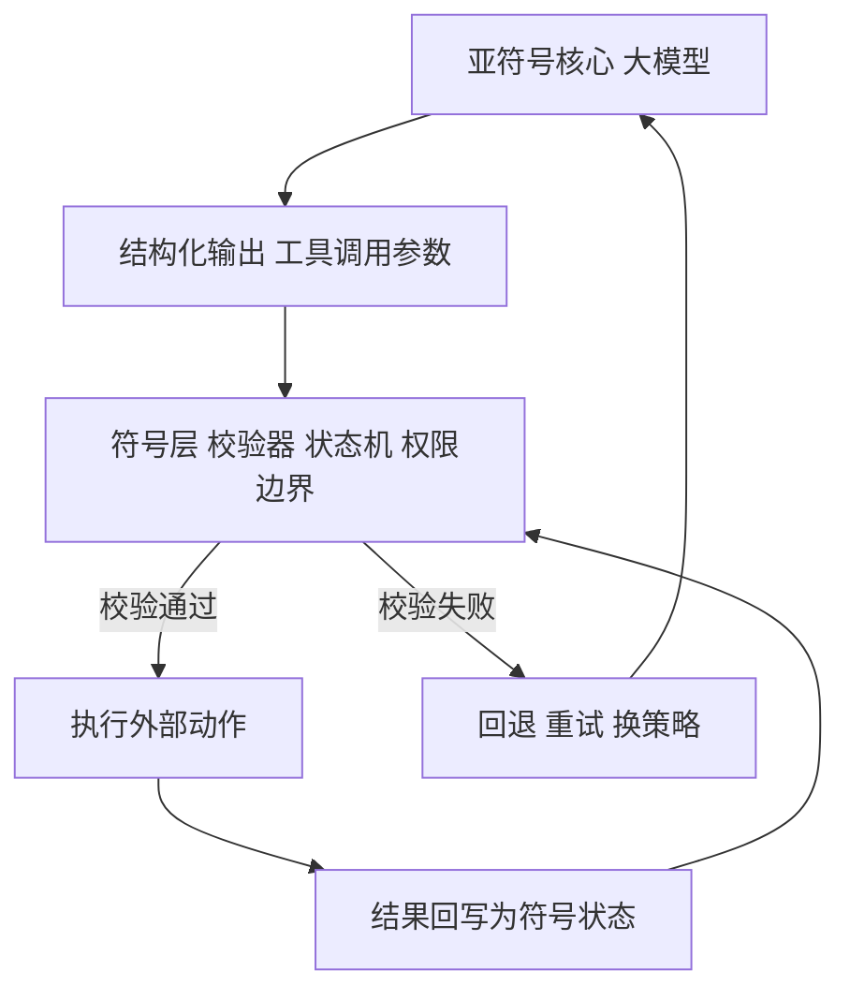
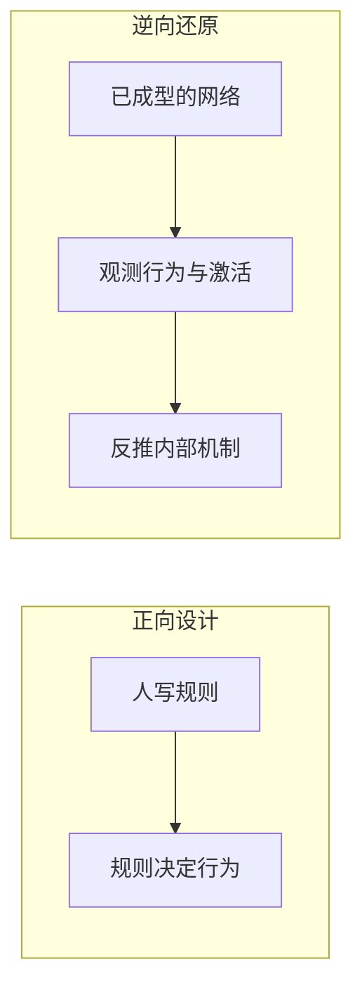

1980 年代，DEC 公司配置的专家系统 XCON 已经积累了上万条规则。每一条规则单独抽出来，工程师都能读懂，也都能修改。但没有一个人能预测，这些规则组合起来在某个具体配置任务上会做出什么决定，也没有人敢在没有回归测试的情况下删掉其中一条。

四十年后，一个千亿参数的语言模型拒绝回答某句话。每一个权重都是一个可读的实数，但没有人能说清，究竟是哪一部分参数促成了这次拒绝。

两个系统的失败方式并不相同。这个差别，正是本文的主题。

前两篇分别给出了[物理符号系统假说](/posts/physical-symbol-system/)的边界判断与[心智社会](/posts/society-of-mind/)的内部结构。本文处理那条线上剩下的一个问题：当符号层被一层层剥掉，换来的是什么，丢掉的又是什么。

全文回答四个问题：三次范式跃迁中真正迁移的是什么、符号到底在哪一层消失又在哪一层留下、可解释性的困难究竟出在方法论还是出在结构、以及工程上为什么可以不解释一个系统却仍然信任它。

## 一、三次跃迁：真正迁移的是瓶颈

把符号系统、监督学习、自监督学习排成一列，最容易看到的表象是「符号越来越少」。但更锋利的表述在别处：**每一阶段真正变化的，是约束能力边界的那个瓶颈。**

| 阶段 | 输入 | 内部机制 | 监督信号 | 约束边界的瓶颈 |
| --- | --- | --- | --- | --- |
| 符号系统 | 符号 | 手写的符号规则 | 无，规则即程序 | 专家书写规则的速度 |
| 监督学习 | 原始信号 | 可学习的参数化函数 | 人工标签，离散符号 | 标注的规模与成本 |
| 自监督学习 | 原始信号 | 可学习的参数化函数 | 由数据自身生成 | 数据与算力 |

三个瓶颈的量级相差若干个数量级。手写一条高质量规则需要一位领域专家工作若干分钟，标注一张图片需要几秒到几分钟，而产生一个自监督训练样本只需要从原始语料里切一段，成本趋近于零。

**能力边界的扩张，其实是瓶颈迁移的副产品，不是系统「变聪明」的直接结果。**

第一个瓶颈有一个正式的名字。费根鲍姆（Edward Feigenbaum）在 1980 年代初把它命名为**知识获取瓶颈**：专家系统的推理机本身是通用的，卡住它的是知识写不进去。规则的数量增长到一定规模后，新增一条规则的边际收益开始下降，而维护成本加速上升。XCON 后期的困境正是这条曲线的样子。

这条线索后来被萨顿（Rich Sutton）在 2019 年的短文《苦涩的教训》里总结成一句话：长期来看，依赖人工知识的路径终将被依赖算力与学习的通用方法超过。用本文的框架重述，就是：**每一次跃迁，都是把瓶颈从一个昂贵的人类环节，迁移到一个便宜的机器环节。**

```text
符号系统阶段的瓶颈
  专家时间  → 每分钟产出以条计  → 知识总量被人力锁死

监督学习阶段的瓶颈
  标注成本  → 每分钟产出以样本计 → 知识总量被标注预算锁死

自监督阶段的瓶颈
  数据+算力 → 互联网规模的语料  → 约束转移到工程与能源上
```

## 二、第一处精确化：符号退到了标签上

一个流传很广的说法是「监督学习输入的仍然是符号」。这个判断对传统机器学习成立，对深度监督学习不成立。

传统机器学习的输入是人工设计的特征向量：房屋面积、房间数量、词频。这些确实是人造符号。但从 AlexNet（2012）开始，深度视觉模型的输入就是原始像素，一个 `224 × 224 × 3` 的实数张量，中间没有任何人工特征工程。语音模型吃原始波形，文本模型吃词嵌入或直接吃子词序列。

那么深度监督学习里什么是符号？**是那个外部人工标签。**

交叉熵损失对准的目标是「这张图属于第 284 类」这个离散符号。整个系统的符号性被压缩到了监督信号这一个点上。

这个修正之所以重要，是因为它把三阶段的分界线挪了位置。分界线不落在「输入是不是符号」，而落在**「监督信号来自哪里」**：

```text
符号系统     监督信号 = 人写的规则本身
监督学习     监督信号 = 人给的离散标签
自监督学习   监督信号 = 数据自身的一部分
```

而那个被压缩到极点的符号点，恰恰就是监督学习的瓶颈所在。标签必须由人来给，人的产能就是天花板。

## 三、第二处精确化：自监督换了一个锚点

更值得补的一刀在自监督这里。常见的理解是「自监督把符号彻底去掉了，只在训练时可选地引入一些符号锚定」。这个理解漏掉了一件事：**自监督的学习目标本身，必须建立在某种离散结构之上。**

自监督不是无监督地学连续表示。它的标准做法是把数据的一部分抠掉，让模型去预测被抠掉的部分。而这个「抠掉一部分」的动作，要求数据先被切成可枚举的单元。

```text
自回归语言模型     在词表上预测下一个 token      离散分类
掩码语言模型       在词表上预测被掩码的 token    离散分类
视觉掩码建模       预测被遮挡的 patch           位置离散，目标连续
VQ-VAE / BEiT     先学离散码本，再预测码本索引  离散分类
对比学习           把样本身份当作类别做判别     离散分类
```

在语言上，这一点最清楚。词表就是那个锚点，是一个由数万到数十万个离散符号构成的有限集合。模型每做一次预测，都是在这个集合上做一次选择。

**选择天然携带语义。** 要判断下一个位置该是「银行」还是「河岸」，模型必须把上下文压缩成一次二选一的决断，这个过程被迫丢弃无关细节、保留区分性信息。而连续回归没有这个约束。

不过这里需要收窄一档，否则会过度概括。在视觉上情况更微妙：MAE 直接回归被遮挡 patch 的像素值，在检测与分割这类需要低层细节的任务上表现极好；BEiT 先学一个离散码本再预测码本索引，在语义分类上更强。

所以准确的表述不是「离散目标一定优于连续目标」，而是：

> **离散锚点决定了模型把容量花在哪一层信息上。回归连续值让模型偏向纹理与高频细节，预测离散单元让模型偏向结构与语义。**

这也解释了为什么多模态模型的第一件事永远是把连续信号离散化。图像切成 patch、音频过矢量量化码本、视频抽帧，全都是为了造出可供预测与选择的离散单元。**自监督没有消灭符号，它把符号从输入端搬到了目标端。**

## 四、三层拆解：去符号只发生在两层

到这里可以给当代模型画一张分层图。笼统地说「神经网络是非符号的」会掩盖一个关键事实。

| 层次 | 性质 | 直接后果 |
| --- | --- | --- |
| **接口层** | 符号，token 是离散的 | 可以精确接回代码、工具、API |
| **表示层** | 亚符号，连续向量，分布式 | 获得泛化、类比与组合能力 |
| **计算层** | 亚符号，矩阵运算与注意力 | 可微，可端到端训练 |

去符号化发生在表示层与计算层，接口层始终是离散的。

这个分层解释了一个表面矛盾：**为什么能力边界最宽的系统，反而最容易接回符号系统。**

正因为接口层是离散的 token，约束解码才能把输出锁进一个合法的 JSON 结构里，工具名与参数名才可能被精确指定，这正是[物理符号系统假说](/posts/physical-symbol-system/)那篇里讲的 function calling 得以成立的前提。一个彻底去符号、输入输出都是连续向量的系统，反而接不回任何工具。

```text
接口层 离散 token      ← 符号性保留，这是接回外部世界的插头
表示层 连续向量        ← 符号性消失，换来泛化
计算层 可微运算        ← 符号性消失，换来可训练
```

能力来自下面两层，可控性来自上面一层。后面会看到，这个三层结构是整篇文章的枢纽。

## 五、边界为什么更宽，代价是什么

自监督系统的能力边界明显宽于监督学习，机制上有两条，都可以说清楚。

**其一，建模对象不同。** 监督学习建模条件分布 `p(y|x)`，学到的是一个任务特定的决策边界，它只携带「区分这几类所必需的信息」。自监督建模数据自身的结构 `p(x)`，被迫携带「生成这个数据所需的全部信息」。下游任务于是变成对这个生成模型做条件查询，天然可迁移。

**其二，监督信号的来源不同。** 一旦标签由数据自身产生，训练就不再受标注产能约束，可以直接吃互联网规模的语料。而规模本身会带来质变：上下文学习、思维链推理等能力并非平滑出现，而是在特定规模上突然可用。

代价同样清楚，而且与收益同源。

```text
符号系统     查规则即可知边界      可证明
监督学习     查训练分布可知边界    可估计
自监督学习   只能运行系统去撞边界  经验性
```

注意一个区分：**探测的手段可以是符号的**，MMLU、GSM8K 这类基准本身就是符号化的测试集；但**边界的获得方式是经验的**，不存在一条从「模型规格」到「能力清单」的推导路径。

这是一次真实的交换：用可解释性、可预测性与可证明性，换来了边界的宽度。接下来几节处理的就是这笔账到底有多贵。

## 六、去符号化不是单向的：控制层的复归

如果只画到自监督，这条线会误导。当代 agent 阶段出现了一次明确的反向运动。

```text
第一步  全符号
        符号系统：输入、内部、输出全部符号

第二步  输入去符号
        深度监督学习：输入变原始信号，标签仍是符号

第三步  监督去符号
        自监督：标签也由数据自身生成

第四步  控制层再符号
        agent 时代：内部保持亚符号，
        但工具定义、调用参数、状态机、校验器重新符号化
```

第四步恰恰是为了把第二步和第三步丢掉的东西换回来：可验证性、可控性、可组合性。内部继续亚符号以保证能力边界够宽，控制层重新符号化以保证边界之内可以被信任。

这正是[心智社会](/posts/society-of-mind/)那篇结尾的判断落点。让系统变可靠的，很少是多加一个能干活的单元，而是多加一个能判断事情做错没有的批评家。而批评家要能判断，它就必须有一个明确可判的标准，这个标准必然是符号化的。



这张图里，亚符号核心只负责产生候选，真正的可靠性由外圈那条符号化的回路提供。

## 七、可解释性：可读不等于可解释

现在进入可解释性。这里必须先修正一个前提：**「符号系统显然是可解释的」这一点并不成立。**

符号系统保证的从来不是可解释性，而是**可追溯性**。两者差别很大。

| | 定义 | 符号系统是否兑现 |
| --- | --- | --- |
| **可追溯** | 每个输出都能找到一条明确的规则与之对应 | 兑现 |
| **可解释** | 系统整体行为能被人在有限时间内理解 | 不兑现 |

一个装了一万条产生式规则的系统，每一条都能读懂，但这些规则组合起来会产生什么行为，没有任何人能预测。这就是**规则交互问题**：规则之间以非显式的方式互相影响，新增一条规则可能改变若干条既有规则的效果。它和面条式代码是同一个问题，只是发生在规则层而不是语句层。

今天的反例更直白。大语言模型生成的代码是纯粹符号的，一行一行都能读，但它同样以难以理解为著称。

**复杂度堆积在哪里，不可解释性就出现在哪里。符号只是把不可解释性从权重里搬到了规则的组合爆炸里，并没有消除它。**

所以准确的说法是：去符号化让系统失去了可追溯性，但可解释性的丧失发生得更早，它发生在系统复杂到超出人类工作记忆的那一刻。符号系统在这一步上没有豁免权。

## 八、可解释性是逆向工程，不是重写规则

第二处需要调整的，是把可解释性理解成「试图从网络里提取出规则」。这个描述只对上了其中一个流派，而且方向是反的。



符号系统是正向设计：先有规则，后有行为，写什么就是什么。可解释性是逆向还原：先有权重与行为，机制是待求的未知量。

方向差异决定了方法完全不同。符号系统那一套是规范性的，规则由人规定；可解释性是经验性的，机制只能从观测中反推。恰当的参照不是「重写一套符号系统」，而是**神经科学**或者**逆向编译**：面对一个已成型的、无人设计的对象，去推断它内部到底在干什么。

它确实借用了符号的词汇：电路、特征、概念、注意力头。但那只是**描述语言**，不是**目标**。目标是得到一个关于机制的因果说明，这个说明写成电路图还是微分方程，是次要的。

而「提取规则」只对应其中一路。可解释性研究大致分成这些方向：

```text
机制可解释性   还原实现某个行为的具体回路
              最接近「找规则」，当下主流
              典型成果：归纳头与上下文学习

特征可视化     某个神经元或某个方向表征了什么

归因方法       这次预测主要由输入的哪些部分决定

探针方法       某一层表示里是否编码了某种属性

概念级方法     用人类可命名的概念解释判断依据
```

即便是第一路，它找的也是**局部机制**，比如实现上下文学习的归纳头，从来不是一套覆盖全系统的规则。

## 九、叠加：困难的结构性根源

那么真正的困难在哪？不在于方法论上残留了符号主义的期望，而在于一个更硬的事实：**让网络变强的那个机制，恰好就是让它变不可解释的那个机制。**

这个机制叫**叠加**（superposition）。

网络的表征空间只有 `d` 个维度，但它需要表征的特征数量远超 `d`。解决办法是让特征之间不再正交，用近乎正交的方向把大量特征挤进同一个低维空间。

```text
正交表示：一个维度一个特征
  特征 A → [ 1.00,  0.00,  0.00,  0.00]
  特征 B → [ 0.00,  1.00,  0.00,  0.00]
  可读，但 d 个维度只能放 d 个特征

叠加表示：大量特征共用维度，彼此接近正交
  特征 A → [ 0.62,  0.31, -0.11,  0.71]
  特征 B → [-0.28,  0.66,  0.59,  0.38]
  不可读，但 d 个维度可以塞进远多于 d 个特征
```

高维空间里近乎正交的方向数量随维度指数增长，这为叠加提供了空间。但叠加有一个前提：**特征必须是稀疏的**，即同一时刻只有少数特征被激活。稀疏性保证了虽然任意两个特征都不完全正交，但同时激活的少数几个之间干扰足够小，网络仍能把它们读出来。

这个机制来自 2022 年的《Toy Models of Superposition》，它给出了一个关键结论：叠加不是训练失误，而是**稀疏特征与参数压力共同作用下的最优解**。

代价是**多义性**（polysemanticity）：同一个神经元会同时对若干毫不相关的概念响应。已有的观测里，视觉模型中有神经元同时对猫脸、汽车正面与动物腿部响应。这不是没训好，这是网络为了塞进更多特征而主动选择的结果。

于是存在一次结构性的交换：

> **参数效率与可解释性直接竞争。** 要求一个网络既可解释又保持现有能力，等价于要求它放弃叠加，也就是放弃相当一部分能力密度。

## 十、五条独立的障碍

除了叠加，还有几条彼此独立的障碍，它们叠加起来才构成了今天的局面。

```text
一  叠加与多义性
    特征挤在近乎正交的方向上，无法单独读出

二  规模
    参数以千亿计，激活以万维计，
    完整枚举在任何时间尺度上都不可行

三  无 ground truth
    程序有源码可以对照，网络的源码就是权重本身，
    没有独立标准判断某个解释对不对

四  多重实现
    许多不同的内部机制可以产生完全相同的外部行为，
    找到一个说得通的机制不等于找到了实际那个

五  没有设计意图
    系统是被优化出来的，不是被设计出来的。
    逆向一台机器可以追问设计意图，
    逆向一个被优化出来的解，没有意图可问
```

第三条和第五条尤其致命，因为它们意味着可解释性研究缺少验证手段。即便还原出一个自洽的机制说明，也没有办法证明模型真的是这么干的。这是可解释性与普通经验科学的关键差别：后者可以通过干预实验验证因果主张，前者在多数情况下只能给出一致性证据。

## 十一、稀疏自编码器：在网络内部重新造一层符号

目前最接近「从叠加中恢复可读性」的路线是稀疏自编码器（Sparse Autoencoder, SAE）。

思路很直接。既然叠加是把大量特征挤进低维空间，那就反过来：用一个带稀疏约束的自编码器，把某一层的激活**重建**成一个维度远高于原层的稀疏向量，再要求这个高维向量的每个维度尽量单义。

```text
原激活向量  d 维，密集，多义
     ↓ 编码器
稀疏特征    D 维，D 远大于 d，绝大多数维度为 0
     ↓ 解码器
重建的激活  逼近原激活向量
```

2023 年的两项工作验证了这条路可行：在一个单层 transformer 上，SAE 分解出了大量可命名的单义特征，涉及编程语言、科学学科、地名等具体概念。后续工作把它扩展到了生产级模型上，规模达到数百万个特征。

这里值得停下来看一眼它的性质。**SAE 做的事情，本质上是在一个亚符号系统的内部，重新插入了一层离散的、可命名的符号层。**

它与第三节讲的 VQ-VAE、与第四节讲的接口层，是同构的操作：先造一个离散集合，再强迫信息流经这个集合。差别只在于，VQ 码本是为了让自监督有可预测的目标，而 SAE 字典是为了让表示变得可读。

局限也一样清楚。SAE 解释的是**重建后的特征分解**，不等于原网络真的用这些特征做计算；而且学到的字典并不唯一，第四节列出的第四、第五条障碍在这里原样再现。所以 SAE 是强有力的观测工具，不是可解释性问题的终结。

## 十二、可解释性不是可靠性的前提

最后是一条工程上最常被混为一谈的分岔。

```text
可解释性   科学目标：理解机制为何有效
可验证性   工程目标：确保系统行为可靠
```

如果真正想要的是后者，并不需要走通前者。**在控制层重新符号化就能拿到可验证性，而不必解释网络的内部。**

这正是第六节那第四步。工具定义、结构化参数、状态机、校验器、权限边界，这些都是符号的、可追溯的、可测试的。把亚符号核心关在这些栅栏里面运行，系统的可靠性由栅栏保证，网络内部是否可解释变得无关紧要。

这个分岔解释了一个长期存在的现象：产业界投入在评测体系、回归测试与 guardrail 上的资源，远多于投入在可解释性研究上的资源。原因不是前者更重要，而是两者兑换的东西不同。后者直接兑换可靠性，前者兑换的是知识。两条路都正当，但只有一条是工程必需的。

一个实用的判据由此产生：

> **概率性生成越过符号边界、直接触碰外部世界的那一点，就是可靠性最先崩溃的地方。** 需要加固的正是这一点，而加固的材料必然是符号的。

这也给出了可解释性研究的准确定位。它的价值不在于让系统变得可信，而在于让系统的失败变得可预期、可归因、可修复。前者靠栅栏，后者靠理解。

## 小结

去符号化与再符号化构成了一个完整的循环。

**其一，能力边界的扩张是瓶颈迁移的副产品。** 符号系统卡在专家书写规则的速度上，监督学习卡在标注规模上，自监督卡在数据与算力上。三次跃迁，本质上是把瓶颈从昂贵的人类环节迁移到便宜的机器环节。

**其二，符号从未消失，只是换了位置。** 深度监督学习里符号退到人工标签上；自监督里符号退到词表与码本这些离散目标上；当代模型的接口层始终是离散 token。去符号化只发生在表示层与计算层。

**其三，可解释性的困难是结构性的，不只是方法论的。** 符号系统兑现的是可追溯性而非可解释性，规则交互问题同样让它不可理解。而对神经网络而言，让网络变强的叠加机制与可解释性直接竞争，要求可解释性在相当程度上是在要求放弃一部分能力密度。

**其四，可靠性的解法不在网络内部，而在控制层。** 可解释性兑换知识，可验证性兑换可靠。后者不需要走通前者，只需要在亚符号核心外面建起符号化的栅栏。而今天最有力的可解释性工具，稀疏自编码器，恰恰又是在网络内部重新造了一层离散符号。

这条线索于是闭合得相当整齐。[物理符号系统假说](/posts/physical-symbol-system/)断言智能等价于符号操作；去符号化用亚符号表示换来了能力边界的极大扩张；而当系统需要被信任时，符号又从控制层回来了。**符号只是从计算的核心退到了系统的边界。**
