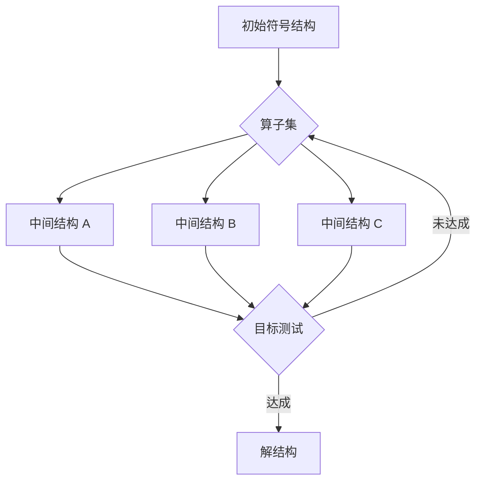
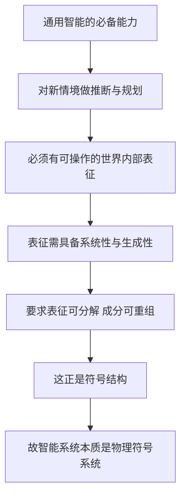

每隔几年，业界都会重新宣布一次智能的范式转移。符号主义退潮之后是联结主义，联结主义之后是大语言模型，大语言模型之后是具备工具调用能力的 Agent。然而有一条 1976 年写下的假说始终横在这些范式之间，没有被任何一次转移真正绕开。它要回答的问题极为朴素：智能到底是不是符号操作。

这条假说就是**物理符号系统假说**（Physical Symbol System Hypothesis，下文简称 PSSH），由艾伦·纽厄尔（Allen Newell）与赫伯特·西蒙（Herbert Simon）在 1976 年的图灵奖演讲论文《Computer Science as Empirical Inquiry: Symbols and Search》中正式提出。原文只有一句话：

> A physical symbol system has the necessary and sufficient means for general intelligent action.
> 一个物理符号系统具有产生通用智能行为的必要且充分的手段。

这句话里藏着两个方向相反的论断，而整个符号主义 AI 的合法性、以及后来所有针对它的批评，都是围绕这两个论断展开的。理解它们，等于拿到一张判断工具：面对任何一个被称为 Agent 的系统，都能定位它的智能来自哪一层，以及这一层能撑到哪一步。

本文先给出严格定义，再分别拆开两条论断各自的论证，说明为什么不能只写一条，最后把它们放回 2026 年的 Agent 架构中做一次检验。

## 一、物理符号系统：一个精确定义

「物理符号系统」这五个字容易被望文生义。它既不要求系统长得像计算机，也不要求符号长得像文字。纽厄尔与西蒙给出的是一个结构定义，由两组要素构成。

**第一组是符号与符号结构。** 符号（symbol）是一类物理模式，可以是纸上的墨迹、电路中的电平、磁畴的取向、神经元群体的放电模式。关键在于它能被系统区分出来，并作为**成分**参与构成更复杂的实体。后者被称为符号结构（symbol structure）或表达式（expression）。

**第二组是操作过程。** 系统必须拥有一组能作用于符号结构的过程，包含四类：创建（creation）、修改（modification）、复制（reproduction）、销毁（destruction）。

合起来，一个物理符号系统就是一台随时间运转、持续产出一族不断演化的符号结构的机器。


定义里还有两个容易被忽略、却决定了整条假说命运的词。

**第一个词是「物理」。** 纽厄尔与西蒙刻意强调，这是物理世界中真实运行的一台机器，而不是抽象的形式系统。纯形式系统（例如一阶逻辑的推演规则）只有句法，没有在时间与能量约束下实际运行的能力，因此它永远只能证明，不能行动。加上「物理」二字，就把假说锚定在了可以与环境发生因果作用的真实装置上。由此还推出一个副产品：由于限定的是「物理实现」而非某种特定物质，该假说天然蕴含**载体无关性**（substrate independence）。同一套符号组织方式可以落在神经组织、硅电路或机械装置上，智能不由载体决定，由符号的组织方式决定。

**第二个词是「指称与解释」。** 符号可以指称（designate）系统中的对象与过程；系统能够解释（interpret）符号结构，也就是依据被指称之物去行动。指称与解释正是「语义」进入系统的入口，而后来塞尔的中文房间论证，攻击的恰恰是这个入口。

### 一个可触摸的例子：算盘

算盘是一个合格的物理符号系统。算珠的位置是符号，一档算珠构成符号结构，拨珠是操作过程，口诀是解释规则。它确实能完成计算。

但算盘远不智能。这个反例极具价值，因为它澄清了一个几乎所有人都会踩的误读。

> **充分性论断常被误读成「只要是物理符号系统就具有智能」。这不对。**
> 原话是「具备产生通用智能行为的**充分手段**」，强调的是这一类系统的表达与操作能力足以支撑智能，而不是断言任何一个具体实例都已经是智能的。算盘是物理符号系统，却受限于符号结构空间的贫瘠与算子的固定，无法通用。

因此，充分性论断真正的主张是：在物理符号系统这个框架内，**存在**一种符号组织方式，足以产生通用智能行为。它是一个可构造性主张，不是一个全称判断。

### 第二个例子：会推理的符号结构

把符号结构能够承载推理这件事看得更清楚，可以借用经典的「猴子与香蕉」问题，它也是通用问题求解器 GPS 的原型任务之一。

```text
初始符号结构
  (at monkey A)   (at box B)   (at bananas C)   (on-floor monkey)

目标符号结构
  (has monkey bananas)

可用算子（每条都带前置条件）
  move(x, y)       猴子从 x 处走到 y 处
  push(box, y)     把箱子推到 y 处，要求猴子与箱子同处一处
  climb(box)       爬上箱子，要求猴子与箱子同处一处
  grab(bananas)    摘香蕉，要求猴子站在位于 C 处的箱子上
```

求解过程是把初始结构反复改写，直到出现目标结构：

```text
(move A B)      猴子与箱子同处 B
(push box C)    箱子到 C，猴子随之到 C
(climb box)     猴子站上箱子
(grab bananas)  目标结构成立
```

值得注意的是这里没有任何一步涉及真实的猴子。系统操作的全部对象都是括号里的那些符号结构。这正说明了符号系统的工作方式：**先在世界内部建立一个可操作的表征，再把对这个表征的操作结果映射回世界。**

## 二、「通用智能行为」限定了什么

两个论断都谈「通用智能行为」（general intelligent action），这个限定词必须先钉死，否则论断的强弱无从判断。

纽厄尔与西蒙的界定是：在真实情境中，产生与系统目的相符、且适应环境要求的行为，其唯一限制是速度与复杂度。拆开看有三层含义。

| 限定 | 含义 | 排除的对象 |
|---|---|---|
| **通用** | 不局限于某个固定任务，能力可迁移到新目标 | 专用程序、单一任务的专家脚本 |
| **智能** | 行为对达成目的而言是恰当的，体现对情境的适应 | 随机行为、穷举式的暴力搜索 |
| **行为** | 必须是在物理世界中实际发生的动作 | 只做证明、不产生行动的形式系统 |

第三层尤其重要。「智能」在这里不是指拥有主观体验或感受质，而是指在开放环境中为达成目标而恰当行动的能力。这是一个行为主义式的、可观测的界定，也是整条假说能被当作经验科学命题来讨论的前提。

这套界定与今天对 Agent 的期待几乎完全对齐：给定目标与工具，在信息不完备的环境中自主选择行动序列。半个世纪前的定义，恰好是对 Agent 的定义。

## 三、充分性论断：符号系统凭什么「够用」

充分性论断回答的是：凭什么认为符号操作这条路能走通。它的论证核心不是符号本身，而是一条配套假说。

### 启发式搜索假说

纽厄尔与西蒙在同一篇论文中给出了第二条假说，用来解释智能行为是如何从符号系统中产生的。

> 问题的解被表示为符号结构。一个物理符号系统通过在问题空间中搜索来行使其智能，也就是不断生成并渐进修改符号结构，直到产出一个解结构。

搜索需要一个**问题空间**，它由四样东西构成：状态的符号结构表示、把状态变换到另一状态的算子、判断目标是否达成的测试、以及衡量路径代价的方式。



而物理符号系统恰好提供了执行这种搜索所需的全部四件东西。

| 搜索所需 | 物理符号系统提供的对应物 |
|---|---|
| 记住走到哪一步 | 符号结构作为记忆载体 |
| 产生后继状态 | 创建与修改过程作为算子 |
| 决定先走哪条路 | 控制过程作为搜索策略（启发式） |
| 把结果变成行动 | 解释过程把结构映射为外部动作 |

这就是充分性的论证骨架：**通用智能行为 = 在问题空间中做启发式搜索；物理符号系统恰好是执行启发式搜索的完备装置；因此物理符号系统具备产生通用智能行为的充分手段。**

### 手段目的分析：一个具体的启发式

光有搜索还不足以保证效率。无知搜索在稍大的问题空间上会立刻爆炸。纽厄尔与西蒙给出的核心启发式是**手段目的分析**（means-ends analysis），GPS 就是以它驱动的。

它的规则很朴素：

```text
① 比较当前结构与目标结构，找出最主要的差异
② 在算子集中挑出能缩小该差异的算子
③ 若该算子的前置条件不满足，把它当作新的子目标
④ 递归求解子目标，直到所有前置条件成立
⑤ 应用算子，回到 ①
```

回到猴子与香蕉的例子。要应用 `grab`，前置条件是「站在 C 处的箱子上」，当前不成立。系统于是把「站上 C 处的箱子」变成子目标；要站上箱子，又需要「与箱子同处 C」；于是 `push` 之前必须先 `move`。每一步都只是在缩小一个被明确定义出来的差异。

这个机制的真正价值在于它的**通用性**。算子、差异、目标测试都是数据（符号结构），而不是写死在程序里的逻辑。换一组算子与差异定义，同一台机器就去解传教士与野人、汉诺塔、定理证明。这正是「通用」二字的落点。

### 历史上的实证

充分性论断不是纯思辨，它在 1970 年代拿到过一批实证支持。

```text
Logic Theorist (1956)  在《数学原理》的定理中证明了其中一部分，
                       有一条证明比书中的更优雅
GPS (1959)             同一套机制求解多种结构不同的人工问题
DENDRAL (1965)         从质谱数据推断分子结构，生成 测试式搜索，
                       达到专家化学家水平
MYCIN (1972)           约 600 条产生式规则表示血液感染诊疗知识，
                       诊断准确率超过部分非专科医生
```

这批系统的共同点在于，它们的知识是**显式表示**的符号结构，推理是对这些结构做匹配、链式推导与回溯搜索。它们证明了一件事：把知识写成符号结构、把推理写成对结构的搜索，至少在多个封闭领域中是走得通的。

同时它们也暴露了充分性论断的边界。知识获取瓶颈、组合爆炸、对常识的匮乏，让这条路线在开放环境中举步维艰。这直接引出了后来的批评。

## 四、必要性论断：智能为什么必须是符号系统

必要性论断是更强、也更难辩护的一条：任何展现通用智能行为的系统，本质上必然是一个物理符号系统。

纽厄尔与西蒙的辩护主要有两层。

**第一层是经验性的。** 人类是唯一被确证的通用智能实例，而人类认知在多个可观测层次上表现出符号处理特征。口语报告分析（protocol analysis）显示，被试在解题时会把问题表述为明确的状态与目标，并采用类似手段目的分析的策略。这条论证是归纳的，强度有限。

**第二层是结构性的，也是后来被 Fodor 与 Pylyshyn 系统化的核心论证。** 通用智能要求表征具有**系统性**（systematicity）与**生成性**（productivity）。系统性指的是：能理解「John loves Mary」的系统，必然也能理解「Mary loves John」；生成性指的是：能理解有限句子的系统，必然能理解无限多的新句子。这两种能力都要求表征是可分解的、其成分可按规则重组的。而「可分解成分 + 组合规则」正是符号结构的定义。



这条论证的关键在于「推断与规划」这个中间环节。一个只做刺激反应映射的系统不需要表征，世界本身就是现成的答案；但一旦系统需要对**尚未被感知**的状态做推断（例如规划明天的路线、评估一个还不存在的方案），就必须在内部持有一个可被操作的世界替身。而这个替身若要支撑通用而无限的推断，就必须具备组合结构。

不过，这条论断有一个必须说清的限定。必要性说的是「本质上必然是」，不等于「必须显式地写着符号」。一个系统可以内部用分布式向量实现，只要它的行为等价于在某个层面上操作符号结构，就仍然落在这条论断之内。这个限定非常重要，因为它是当代神经符号式系统能够与 PSSH 共存的接口。

## 五、为什么必须写成两条论断

只写一条，整条假说的理论功能就残废了。原因在于两条论断的逻辑类型完全不同。

**只写充分性，封不住唯一性。** 充分性只说符号系统能造出智能，却没有禁止别的路径。若存在非符号的智能实现方式，符号主义就只是多条路线中的一条，而不能自称是关于智能的科学。因此必须有**必要性**来封口：智能必然是符号系统，其他路径本质上也是在操作符号。

**只写必要性，保不住可建造性。** 必要性只说凡是智能都得是符号系统，却没有保证这种系统实际造得出来。万一它在原理上成立、在工程上永不可行，假说就失去对 AI 实践的指导力。因此必须有**充分性**来兜底：符号系统确实掌握着产生智能的全部手段。

两条合起来，才把两个不同性质的问题一次性讲死：一个回答**智能是什么**（符号操作），一个回答**智能造不造得出**（造得出）。

| 维度 | 充分性论断 | 必要性论断 |
|---|---|---|
| 逻辑方向 | 物理符号系统 → 通用智能 | 通用智能 → 物理符号系统 |
| 命题类型 | 存在性主张（存在一种符号组织可达智能） | 全称主张（一切智能系统皆如此） |
| 论证层面 | 构造层面：搜索机制是否完备 | 表征层面：智能是否需要符号结构 |
| 检验方式 | 造出一个来即被支持 | 找出一个非符号的智能系统即被推翻 |
| 可证伪性 | 较强，可被工程进展检验 | 较弱，需遍历一切可能系统 |

最后一行值得单独强调。两条论断的**可证伪性高度不对称**。充分性靠「造出来」就能被支持，是经验科学命题；必要性要求对一切可能的智能系统做全称判断，几乎无法被正面证实，只需要一个反例就能被推翻。这个不对称解释了半个世纪以来的攻防格局：几乎所有有分量的批评，都冲着必要性论断去；而充分性论断则随着深度学习在工程上的成功，被以另一种方式重新激活。

## 六、半个世纪的检验

把主要批评按攻击对象分类，可以得到一张相当清晰的地图。

| 批评 | 提出者与时间 | 攻击对象 | 核心论点 |
|---|---|---|---|
| 中文房间论证 | Searle, 1980 | 充分性 | 句法操作不等于语义理解，纯符号 manipulation 无法产生意向性 |
| 符号接地问题 | Harnad, 1990 | 充分性 | 符号的意义若来自其他符号的定义，会陷入字典式循环，必须接地到感知与行动 |
| 联结主义 | Rumelhart, McClelland, 1986 | 必要性 | 分布式亚符号表征即可产生智能行为，无需显式符号 |
| 无表征的智能 | Brooks, 1991 | 必要性 | 世界是自身最好的模型，行为可由感知动作的直接耦合产生 |
| 技能化应对 | Dreyfus, 1972 / 1992 | 必要性 | 专家的熟练应对不遵循规则，规则化表征是新手与失败时的产物 |

这些批评中，对充分性的两条攻击并不否定「符号操作能产生智能行为」，而是否定「符号操作能产生真正的理解」。由于 PSSH 对智能的界定是行为主义的，这两条批评实际上是在质疑界定本身，属于范式之外的争论。

真正动摇 PSSH 地位的是对必要性的两条攻击。深度学习的成功是一个近乎决定性的反例候选：一个由矩阵乘法与非线性变换构成的系统，内部没有可识别的显式符号结构，却在开放任务上展现出前所未有的通用性。若承认它是通用智能，必要性论断即被推翻。

严格地说，这个反例至今仍未被完全坐实。理由有二。

其一，关于大语言模型内部是否涌现出符号结构，实证结论尚在争论中。已有研究显示，模型内部确实会出现可定位的「绑定」机制与近似变量绑定的回路，但是否构成经典意义上的符号结构，学界尚无定论。

其二，大模型的通用性存在明确的能力边界，尤其在需要精确、可验证、多步一致推理的任务上。而这恰恰是符号层被重新引入的动因。

## 七、把假说放回当代 Agent 架构

这正是 PSSH 与今天的工程实践发生关系的地方。

一个当代 Agent 系统大致由两层构成。下层是神经层，一个亚符号的大语言模型，负责从模糊的自然语言与环境中生成意义、意图与计划。上层是符号层，包含工具定义、结构化调用参数、执行结果、状态机与编排逻辑，负责精确执行与可验证。


关键在于中间那条边界。神经层输出的是概率性的 token 流，无法直接被程序可靠使用；必须通过约束解码等方式，把它**强制落进一个符号结构**（结构化的工具调用）里，程序才能捕捉并执行。而执行的真实性与结果的可靠性，全部由符号层保证。

于是可以给出一个诚实的位置判定。

**充分性论断，在当代以另一种形式被重新确认。** 把知识显式化为符号结构、把推理组织为对结构的搜索，这条路在封闭领域早已被证实有效；当代工程的做法是把「把模糊世界翻译成符号结构」这一最难的前半段交给神经层，后半段仍然用符号层完成。符号操作作为产生可靠智能行为的充分手段，这一点不仅没有过时，反而因为有了更强的翻译器而变得前所未有地可用。

**必要性论断，应当被弱化为一种层次主张。** 端到端的智能行为可以由亚符号系统产生，这一点深度学习已经证明。但要达到可验证、可控、可组合、可追责的通用智能行为，系统必须在某个层次上存在可被程序捕捉与操作的符号结构。不是「智能必然是符号系统」，而是「**可靠的智能系统必然包含符号层**」。

这个弱化版本保留了原论断的工程内核，又容纳了亚符号范式的经验事实。它也是当前 Agent 工程实践的默认共识：没有人会试图让一个纯神经网络直接去操作数据库。

## 小结

物理符号系统假说包含两个方向相反的论断。充分性论断主张任何物理符号系统都具备产生通用智能行为的充分手段，其论证依托启发式搜索假说，即智能行为产生于对符号结构的生成与修改；必要性论断主张任何展现通用智能行为的系统本质上必然是物理符号系统，其论证依托智能对内部表征的系统性与生成性要求。

两条论断缺一不可。充分性保证智能造得出，必要性保证智能只能这样造；前者是存在性主张，后者是全称主张。二者可证伪性高度不对称，这解释了为什么半个世纪以来的批评几乎全部指向必要性。

放到今天，这两条论断的处境已经分化。充分性在神经符号结合的工程范式中被重新激活，并成为当代 Agent 可靠性的来源；必要性则被深度学习挑战，需要弱化为「可靠的智能系统必然包含符号层」这一层次主张。

对任何从事 Agent 工程的人来说，这条假说的实用价值在于提供一把标尺：面对一个系统，先问它的符号层在哪里，哪些环节由可验证的符号结构驱动，哪些环节依赖概率性生成。凡是概率性生成越过符号边界、直接触碰外部世界的地方，就是可靠性会最先崩溃的地方。

1976 年提出的那个问题，至今仍在等待答案。而每设计一次工具调用、每定义一次状态机，都是在用工程的方式回答它。
