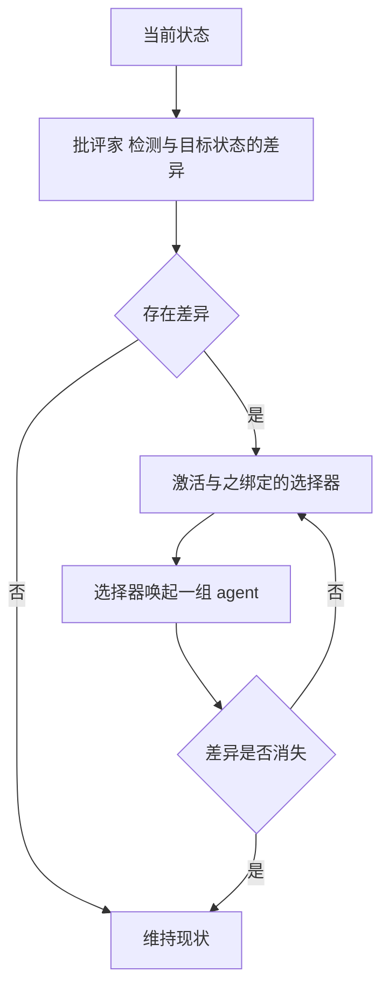
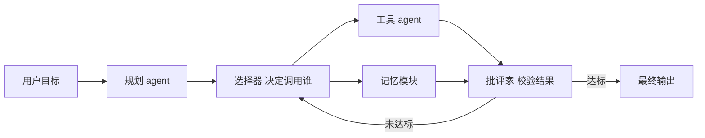

1986 年，人工智能的奠基者之一马文·明斯基（Marvin Minsky）出版了一本结构上相当反常的书。全书没有公式，没有算法，没有实验数据，由数百篇短章拼成。它要论证的命题在当时近乎离经叛道：**心智不是一样东西，而是一个社会。**

更尖锐的是它的推论。组成这个社会的每一个成员，本身都完全不智能。智能不位于其中任何一处，而是从成员之间的组织方式中涌现出来。

这个命题冲击的，是[物理符号系统假说](/posts/physical-symbol-system/)默认的一个前提：存在一台统一的、中央集权的符号操作机器。明斯基并不否认符号操作。他否认的是那台机器只有一个。

本文回答四个问题：agent 这个单元到底能小到什么程度、没有指挥官时控制如何发生、记忆与理解如何被同一套机制解释，以及这套 1986 年的架构为什么在今天的 agent 工程里几乎原样复活。

## 一、一个颠倒：智能不在任何一处

理解心智社会，需要先接受一个颠倒。通常的思路是先假定存在一样叫「智能」的东西，再去定位它位于系统的哪个部分。明斯基认为这条路从一开始就错了。智能不是一个可被定位的部件，它是大量非智能部件以特定方式组织起来之后呈现的整体性质。

### 蚁群：一个足够贴切的类比

```text
单只蚂蚁
  能做的事极少：循信息素走、遇障碍随机转向、碰到食物搬起来
  没有规划能力，没有全局视野

整个蚁群
  能找到通往食物的近似最短路径
  能随环境变化改道
  能按需求调整工种配比
  能建造结构复杂的巢穴
```

没有任何一只蚂蚁持有巢穴的蓝图。蚁群的「智能」不位于任何一只蚂蚁体内，它分布在信息素的浓度梯度里、个体之间的接触频率里、以及数以万计的微小决策累积出的统计效果里。

明斯基的主张是：心智与智能的关系，正如同蚁群与蚂蚁的关系。差别只在于，前者内部的单元数量与交互复杂度高出若干个数量级。

### 一段值得引用的原文

明斯基在开篇写下：

> 是什么魔法使人类变得智能？这个魔法就是：根本没有魔法。智能的力量来自心智极度丰富的多样性，而不是来自某一条单一、完美的原则。

这句话把「不存在统一原则」直接写成了正面主张。它不是在说智能尚未被解释，而是在说**智能本来就没有统一的解释，只有大量的局部解释**。

### 一个术语的溯源

明斯基用 **agent** 称呼这些极简单元。这个词值得单独停留，因为它构成了两篇文章之间最直接的桥梁。

今天人工智能领域高频使用的 agent 一词，在主流话语中的一次关键定型，正来自这本 1986 年的著作。不过明斯基的用法要朴素得多。agent 指的**不是**今天那种能自主完成复杂任务的对话系统，而是心智内部一个近乎机械的最小功能单元。

从「心智里的小过程」到「工程上的自主程序」，这个词的语义在四十年里被放大了许多倍。底层的组织直觉却始终一致：**复杂行为由多个相对独立的单元协作产生，而不是由一个中央机构统一指挥产生。**

## 二、极简单元：agent 到底能有多小

在明斯基的用法里，agent 是一个极其简单的过程。它只做一件小事，本身什么都不知道，也谈不上智能。

### 用例一：搭积木

明斯基反复使用一个积木世界的场景：地上有若干积木，目标是搭成一座塔或一道拱门。在这个场景里，至少可以识别出这样一组 agent：

```text
BUILD    持有「把某物建成某个形状」这一目标
FIND     在视野中定位一个满足条件的积木
GET      把某个积木弄到手边
PUT      把一个积木放到某个位置
SEE      识别当前视觉场景中有什么
GRASP    控制手指闭合
MOVE     控制手臂位移
BALANCE  对重心偏移做出反应
```

每一个都极其简单，有的只对应一条反应规则。`SEE` 不思考，它只在视野里找到符合某类特征的东西。`GRASP` 不知道自己在搭塔，它只负责闭合手指。`BALANCE` 不理解力学，它只在检测到倾斜时唤起纠正动作。

**没有任何一个 agent 知道「当前正在搭一座塔」。**

那么搭塔这件事存在于哪里？存在于这些 agent 的激活序列与调用关系里。`BUILD` 想要一座塔，于是调用 `FIND` 找积木、调用 `PUT` 摆位置；`PUT` 又调用 `MOVE` 与 `GRASP`。整个任务被拆成一串彼此传递的激活，没有任何环节持有全局图景。

### 用例二：拿起茶杯，看层次封装

再看一个更日常的例子：从桌上拿起一只茶杯。

```text
意图层    WANT      想喝茶
              ↓
任务层    GET-CUP   把杯子弄到嘴边
              ↓
动作层    REACH 伸手 → GRASP 握住 → LIFT 抬起 → BRING 移近
              ↓
执行层    若干控制肌群收缩的具体过程
```

关键在层与层之间的**封装**。当 `GET-CUP` 运行时，它不会去操心哪块肌肉该收缩多少。当 `REACH` 运行时，它也不会去想这是在喝茶。每一层只看见自己那一层的对象与目标。

封装带来两个直接好处。高层可以用极短的描述操纵极复杂的过程，底层可以被反复复用到完全不同的任务里。同一个 `GRASP` 既服务于喝茶，也服务于开门和写字。

### agent 的六个特征

| 特征      | 说明                      |
| ------- | ----------------------- |
| **极简**  | 只做一件事，常可还原为一条或几条规则      |
| **专用**  | 只处理某一类情况，不做通用推理         |
| **无知**  | 不知道全局目标，也不理解自己正在做什么     |
| **可激活** | 能被其他 agent 或外部刺激唤起      |
| **可组合** | 通过相互调用形成更大的功能单元         |
| **可失败** | 单个 agent 出错是常态，靠冗余与仲裁兜住 |

最后一条是整套架构的前提而非缺陷。在一个由极简单元构成的系统里，失败不是异常，是默认状态。

## 三、没有指挥官：差异引擎与分布式控制

如果每个 agent 都很愚蠢，谁来决定该激活哪一个？明斯基的答案依然不是中央控制器，而是一对极简的组合结构。

### 批评家与选择器



明斯基把这类结构称为「差异引擎」。它由两部分构成：**批评家**（critic）负责发现当前状态与目标状态之间的某类差异，**选择器**（selector）负责在差异出现时启用一组被认为能缩小该差异的 agent。

这个设计的要害在于一处能力不对称。

**批评家不需要知道怎么解决，只需要能识别出问题。** 判断「塔歪了」远比计算「需要多大的支撑力」简单。这种不对称让系统可以用很低的能力成本换取很高的纠错能力。

**选择器不需要理解全局，只需要知道遇到这类差异通常该叫谁。** 它维护的是一张从差异类型到 agent 组的映射，不是一个推理过程。

### 用例：塔歪了

塔搭到一半开始倾斜。这个「倾斜」被某个批评家识别为「重心偏移」类差异。批评家激活对应的选择器，选择器唤起「加宽底座」或「换一块更平的积木」这一类 agent。

若换完之后仍然倾斜，批评家继续报警，系统切换到别的选择器，改用另一组方案。整个过程中没有任何 agent 做过一次力学计算，系统的整体表现却像是在纠正重心。

**智能表现来自批评家与选择器的接力，而不是来自某个单元的理解。**

### 与手段目的分析的血缘

这个结构应当与[物理符号系统假说](/posts/physical-symbol-system/)中讲的手段目的分析放在一起看。两者是同一条原理：差异先被识别，再由能缩小差异的操作去消除。

区别在组织方式。纽厄尔与西蒙把它实现为一个集中的搜索控制结构；明斯基把它拆成大量分布式的批评家与选择器对。**同一条原理，两种工程组织。前者的控制是集中的，后者的控制是弥散的。**

## 四、记忆与理解：K 线

明斯基在 1980 年的论文《K-lines: A theory of memory》中给出了这套理论里最有解释力的一个机制。

### 机制

K 线的定义很朴素：**当一次心智活动成功解决了某件事，大脑会记下当时处于活跃状态的那些 agent 的集合。这个记录就是一条 K 线。日后再次激活这条 K 线，那批 agent 就会被重新唤起，心智于是重现出当时那个有效的心智状态。**

### 用例：学系鞋带

```text
第一次学系鞋带
  大量 agent 被零散激活：观察、试错、纠正手指位置
  成功后，这批活跃 agent 的集合被记录为一条 K 线

一年后系鞋带
  只需激活这条 K 线
  整批 agent 被一次性唤起，动作几乎自动完成
  主观体验上：不用想就会
```

这里有一个关键推论。K 线记录的**不是动作序列，而是当时活跃的 agent 集合**。这解释了为什么回忆是状态重现而不是录像回放，也解释了为什么相似的情境会互相诱发回忆，哪怕细节并不吻合。

### 理解就是挂载

明斯基进一步用 K 线解释「理解」。理解一件新事，本质上是为它找到一条已有的 K 线，把它挂上去。

**所谓懂了，就是新事物成功激活了一条既有 K 线，于是它的各个侧面立刻被那批 agent 的处理能力所覆盖。** 反之，听不懂往往不是因为缺少信息，而是因为找不到可以挂载的 K 线。

这个说法对工程有直接启示。知识的可迁移性取决于 K 线的抽象程度：挂得太具体，换个情境就失效；挂得太抽象，又唤不起足够的细节。好的教学与好的文档做的是同一件事，即为读者提供一条足够抽象、却仍能唤起细节的 K 线。


### 当代对应

把 K 线换成今天的术语，它就是一个从情境到记忆簇的索引。检索增强生成里的向量召回、对话系统里的长期记忆、上下文压缩里的摘要，本质上都在做同一件事：用当前情境去激活一批相关的既有结构。

差别只在于，明斯基的 K 线是二值的唤起关系，今天的实现是连续的相似度检索。**从二值到连续，是这四十年里最重要的一个替换。**

## 五、纵向秩序与「自我」

心智社会不是一锅粥。明斯基用「层次带」（level-bands）描述它的纵向组织。

### 五层分层

```text
自我意识层    对「正在思考」这件事本身进行表征
反思层        观察并评价刚才的思维过程
深思层        为较远的目标做规划与权衡
学习层        后天习得的反应与技能
本能层        与生俱来的反射与倾向
```

越靠上的层次带，处理的时间尺度越长，对象的抽象程度越高，涉及的 agent 数量也越多。底层一个 agent 的一次激活可能只持续极短时间，高层一次决定则可能持续数天。

这个分层解释了心智的一个基本特征：**同一个系统既能瞬间缩手避火，也能用很长的周期规划一次迁移，而两者之间不需要一个统一的调度者。** 时间尺度的差异本身就是一种组织方式。

### 自我不是一个 agent

那么「自我」在这个图景里是什么？明斯基给出的答案相当激进。自我不是某个 agent，而是一组 agent 组成的子系统，职责是观察其余部分正在做什么，并对这些活动施加调控。

这个说法解决了一个古老的困惑。当一个系统声称某个决定是本人做出的，这里的「本人」并不指向某个居于中央的决策者。真实发生的是：若干 agent 联盟相互竞争，某一派占了上风，而「自我」这个子系统负责记录这一过程、给出一个统一的叙述，并在事后把决定归属到自身名下。

**自我的统一性是叙述出来的，不是结构赋予的。** 明斯基的核心表述可以概括成一句：自我不是一样东西，而是一项持续进行的活动。

这个观点为今天讨论大语言模型是否具备「自我」提供了有用的参照系。统一的自我感可以由叙述机制产生，并不需要系统中真的存在一个中央实体。

## 六、被忽略的一半：负面专长

明斯基还有一个常被忽略、却极其深刻的观察：**专家的能力，很大一部分不是「知道怎么做对」，而是「知道哪些做法会失败」。** 他把这类知识称为「负面专长」。

这个观察击中了新手与专家之间真实的差距所在。两者面对同一个问题时，知识总量的差别往往没有想象中大。真正的差别在于：专家脑中预存了大量「此路不通」的标记，因此在动手之前就已经排除了绝大部分选项。新手则要亲自把每条死路走一遍。

```text
下棋   优势不在于算得更深，
       而在于几乎不会去算已被标记为劣势的变化

调试   价值不在于记得更多接口，
       而在于看到某个现象就能排除掉一大类原因

写作   成熟度不取决于词汇量，
       而取决于是否知道哪些结构会让读者卡住
```

这个观点对系统设计有直接含义。**一套系统若要表现得像专家，光堆正向能力是不够的，必须为它配备失败模式的知识：什么情况下不要调用某个工具，什么特征意味着这条路走不通。**

今天 agent 工程里的 guardrail、失败重试策略、以及用历史失败案例做 few-shot，本质上都是在给系统补充负面专长。

## 七、在符号主义内部的位置

把心智社会放回[物理符号系统假说](/posts/physical-symbol-system/)旁边，两者的关系会非常清楚。

| 维度          | 物理符号系统假说         | 心智社会            |
| ----------- | ---------------- | --------------- |
| **关心的层面**   | 外层：智能行为是否等价于符号操作 | 内层：那个符号系统内部如何组织 |
| **基本单元**    | 符号与符号结构          | agent，极简专用过程    |
| **组织形式**    | 集中式：解释器加搜索       | 分布式：竞争、协作、层级封装  |
| **控制来源**    | 集中的搜索策略          | 批评家与选择器的分布式仲裁   |
| **对统一性的态度** | 默认存在一个统一的符号系统    | 明确否认存在中央统一者     |
| **彼此关系**    | 外层框架             | 对框架的内部细化        |

**关键判断是：心智社会不是对物理符号系统假说的否定，而是对它的拆开。**

纽厄尔与西蒙只断言存在这样一个物理符号系统，并没有规定它内部的组织方式。明斯基做的是把这个黑盒打开，指出里面不是一台统一的推理机，而是一座城市。

这一点需要说清楚，因为明斯基常被误读为符号主义的反叛者。事实上他是符号主义的奠基者之一，与麦卡锡共同创立了麻省理工学院人工智能实验室。这本书的锋芒所向从来不是「符号操作」本身，而是「存在一个统一的、中央集权的推理系统」这个未曾言明的假设。**他拆的是组织方式，不是基底。**

这个区分意味着，上一篇讨论的两个论断在这里并没有被推翻。只是「物理符号系统」这个概念的内涵被大幅重写了：它不再是一台机器，而是一座城市。

## 八、四十年后的回响与边界

这套 1986 年的架构，在今天的 agent 工程里几乎可以逐条找到对应。

| 心智社会概念       | 当代 agent 工程对应        |
| ------------ | -------------------- |
| agent，极简专用过程 | 工具、子智能体、独立函数         |
| 批评家与选择器      | 反思循环、结果校验器、重试策略      |
| K 线          | 长期记忆、向量检索、上下文摘要      |
| 层次带          | 规划层、执行层、校验层的分层编排     |
| agent 联盟竞争   | 多智能体投票、路由与仲裁         |
| 负面专长         | guardrail、失败模式库、拒答条件 |

一个当代 agent 系统的典型结构如下：



把这张图与明斯基的结构叠在一起看，几乎是同一张图。差别只在于：明斯基的 agent 是手写规则，今天的 agent 由模型承担；明斯基的 K 线是二值唤起，今天的记忆检索是连续相似度；明斯基的批评家是专用检测器，今天的校验器往往又是一次模型调用。

### 局限

对心智社会需要保持清醒的评价。它的贡献是实在的，但作为科学理论，缺陷同样明显：

```text
一  缺乏形式化
    全书几乎没有可计算的模型，也没有可运行的实现，
    更像一份研究纲领，而不是一个可检验的理论

二  难以证伪
    「智能现象由大量 agent 协作产生」这一断言过于宽泛，
    几乎无法被任何观察推翻

三  循环论证风险
    agent 之间的协作规则从何而来？
    若答案仍是设计者写入，那么智能只是被转移了位置，
    而没有被真正解释

四  术语精度不足
    agent、K 线等核心概念缺少严格定义，
    难以支撑定量预测
```

第三点最为致命，也是所有涌现式解释共同面对的难题。把智能拆成大量简单单元，只是把「智能从哪来」向后推了一层，推到了「这些单元的协作规则从哪来」。

不过，若把它当作架构直觉而非科学理论来使用，价值依然很高。**它提供的不是可证伪的预测，而是一套提问方式：面对任何一个智能系统，先问它的 agent 在哪里、谁在批评、谁在选择、记忆如何被唤起。** 这套提问方式在工程上比在科学上更有用。

## 小结

心智社会的核心主张可以压缩成一句：不存在智能这样一件可被单独定位的东西，只有大量各自愚蠢的小过程，以及它们之间的组织方式。

**其一，agent 是极简的专用单元，本身无智能。** 智能不位于任何一个单元内部，而位于单元的激活序列、调用关系与层级封装之中。搭塔这件事不存在于 `BUILD` 里，也不存在于 `GRASP` 里，它存在于两者的协作结构里。

**其二，控制是分布式的，靠批评家与选择器接力。** 批评家只需要识别差异，不需要知道解法；选择器只需要知道该叫谁，不需要理解全局。这种能力上的不对称，是低成本换取高纠错能力的关键。

**其三，智能的很大一部分是负面专长。** 专家与新手的真正差距，在于预存了多少「此路不通」的标记。

把两篇放在一起看，一条线索就完整了。[物理符号系统假说](/posts/physical-symbol-system/)从外部断言智能等价于符号操作；心智社会从内部断言，那个执行符号操作的东西不是一台统一的机器，而是一座由极简 agent 组成的城市。**前者给出边界，后者给出内部结构。**

而对工程实践最有价值的部分，可能是「批评家」这个概念。一个系统的可靠性，很少取决于它能做多少事，更多取决于它有没有一个稳定的机制来判断这件事做错了没有。


