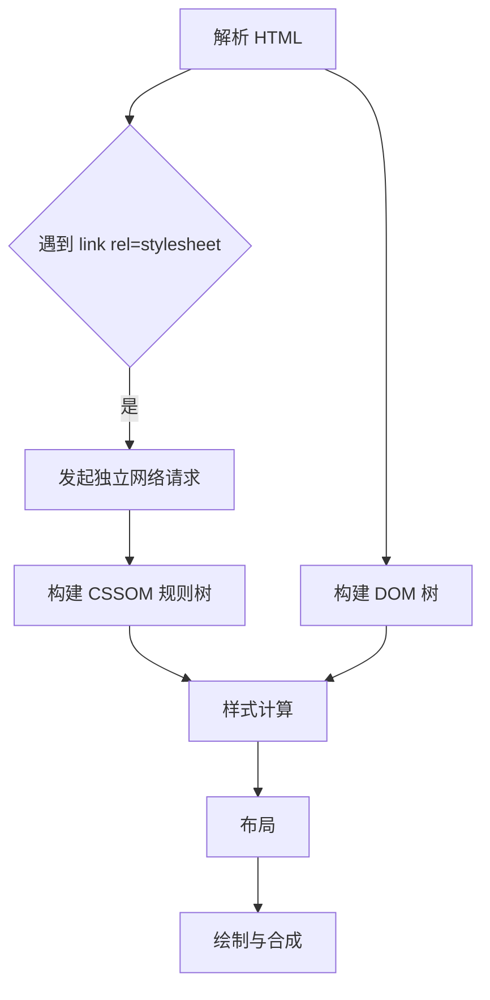
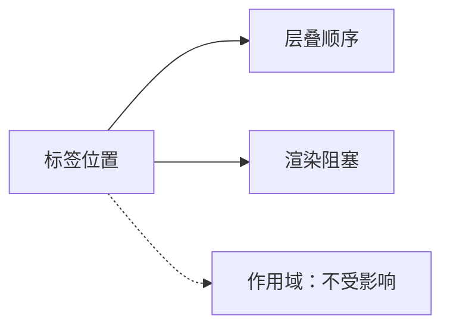
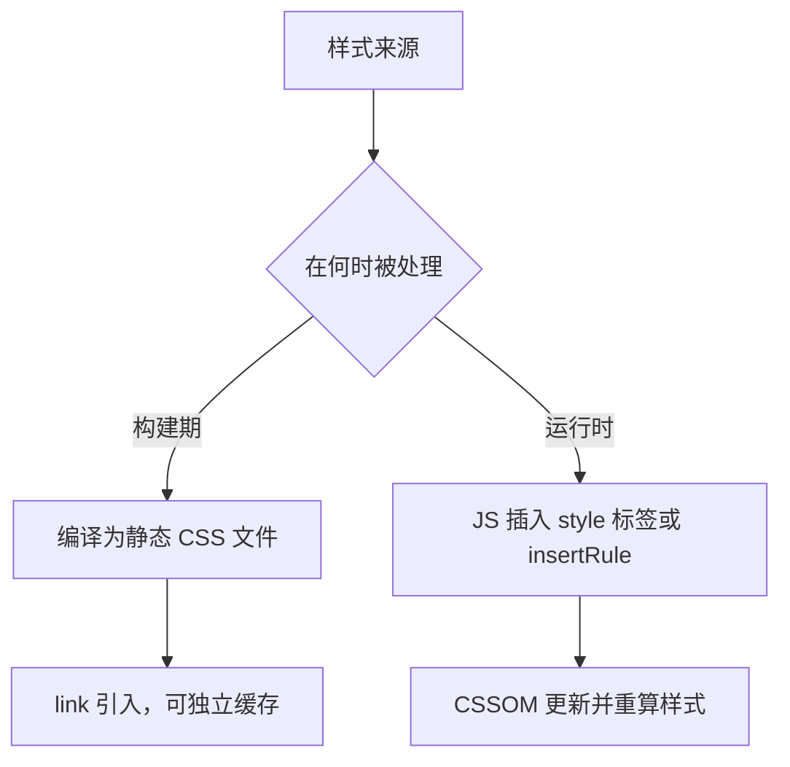

> 本文从一行 `<link rel="stylesheet" />` 出发，追踪样式表从网络请求到样式计算的全过程，并澄清一个在工程实践中广泛流传的误解：把 CSS 的「局部生效」理解为标签位置带来的效果。文中结论分别依据 HTML Living Standard、CSS Cascading and Inheritance、CSS Scoping 与 DOM Standard。

## 一、link 标签触发的不是插入，而是一次独立的样式表请求

`<link href="main.css" rel="stylesheet" />` 常被理解为「把样式文件引入文档」，仿佛样式文件的内容被搬进了 HTML。更准确的描述是：它是一个资源请求指令，样式表作为一份独立文档被下载、解析，并生成一棵与 DOM 平行的规则树。



整条链路可以拆成五步：

1. 解析器遇到 `<link>`，若 `rel` 为 `stylesheet`，发起网络请求。`rel` 是唯一的触发器，缺少它浏览器只会下载文件而不当作样式表使用。
2. 下载完成后按 CSS 语法解析，构建 CSSOM（CSS Object Model）。它是一棵只装「选择器与声明块」的规则树，与 DOM 平行存在，互不隶属。
3. 样式计算。浏览器遍历 DOM 的每个元素，在 CSSOM 中找出所有能够命中它的规则。选择器匹配的实际顺序是自右向左，先定位最右侧的选择器主体，再逐级向左校验上下文条件。
4. 命中的规则按层叠规则计算出该元素的计算样式。层叠的判定顺序为：来源与重要性、层叠层、特异性、出现顺序。
5. 计算样式进入布局、绘制与合成。

这一链路中最重要的认知是：**样式是匹配出来的，不是放置进去的。** 样式表中写着 `p { color: red }`，并不意味某个 `<p>` 元素「持有」了这条规则。风格类似图书馆的索引卡，规则留在卡片上，命中与否取决于每个元素在检索时所满足的条件。

## 二、标签位置真正影响的两件事

既然样式不依赖位置生效，那么位置究竟决定了什么？结论是两件事，都与作用域无关。



**其一，层叠顺序。** 在来源、层叠层与特异性均相同的情况下，后出现的规则覆盖先出现的规则。因此下面两行的顺序具有实际意义，`theme.css` 会在冲突处胜出。

```html
<link href="base.css" rel="stylesheet" />
<link href="theme.css" rel="stylesheet" />
```

**其二，渲染阻塞。** `<style>` 会阻塞其后内容的渲染，其后的同步脚本也必须等待该样式表解析完成。外链样式表位于 `<head>` 中时默认参与渲染阻塞。阻塞的意义在于避免 FOUC（Flash of Unstyled Content），若不等待样式表，浏览器将先绘制一版无样式页面，样式到达后再重绘一次。

这里有一个容易被误传的规范细节。HTML Living Standard 中定义了一组 body-ok 链接类型，包括 `dns-prefetch`、`modulepreload`、`pingback`、`preconnect`、`prefetch`、`preload` 与 `stylesheet`。凡是属于该组的 `link`，都允许出现在 body 中，因此把外链样式表写在正文中间甚至嵌在某个 `<div>` 内，都属于合法 HTML。合法与合理是两件事：只有 `<head>` 中的外链样式表默认具备渲染阻塞语义，而由脚本动态插入的样式表需要显式声明 `blocking="render"` 才会阻塞渲染。

需要与 `link` 区分的是 `<style>` 的约定层面。该元素在规范中属于元数据内容，[MDN 的说明](https://developer.mozilla.org/zh-CN/docs/Web/HTML/Reference/Elements/style)直接要求其位于 `<head>` 之内。而浏览器实现对位置的检查远没有这么严格，出现在 body 中的 `<style>` 依旧会被正常解析并应用。约定层面受限、实现层面不受限，这一处的不一致解释了为何「写在正文里的样式元素也能生效」在实践中成立，却不构成推荐的写法。

## 三、运行时并不存在「作用域」这一概念

理解第四节的前提，是先建立「位置」与「作用域」正交的判断。CSSOM 中不存在「某条规则归属于某个子树」这样的数据结构，规则始终是文档级的，所谓的归属感完全来自选择器是否命中。

| 维度   | 是否由标签位置决定 | 说明                    |
| ---- | --------- | --------------------- |
| 生效与否 | 否         | 写在任意位置都参与样式计算         |
| 层叠顺序 | 是         | 同等优先级下后者胜出            |
| 渲染阻塞 | 是         | 位置与 `blocking` 属性共同决定 |
| 作用范围 | 否         | 完全由选择器决定              |

一个常见的历史注脚值得补充：HTML 曾经有过 `<style scoped>` 提案，试图让样式只作用于父元素子树，但仅在 Firefox 短暂实现，最终从规范中移除。今天浏览器中不存在任何基于位置的样式作用域。

## 四、四种「看似局部」的手段

要让样式真正受限，只有四条路径。它们的隔离强度依次递增，实现者却不尽相同。

| 手段         | 实现者 | 机制              | 隔离强度    |
| ---------- | --- | --------------- | ------- |
| 全局规则       | 浏览器 | 按选择器直接匹配        | 无       |
| 构建期改写      | 编译器 | 编译时追加属性选择器或哈希类名 | 靠特异性模拟  |
| `@scope`   | 浏览器 | 原生声明作用域根与边界     | 有范围，非封闭 |
| Shadow DOM | 浏览器 | 影子树与外部分隔        | 真隔离     |

第二种是日常使用最广的一类，Vue 的 `scoped`、CSS Modules 都属于构建期改写，运行时产出的仍然是普通全局规则，隔离效果依靠抬高选择器特异性或使用哈希类名来模拟。

第三种 `@scope` 是较新的原生方案，允许声明作用域的根元素与可选的下边界，使规则只在指定的子树内匹配。该规则自 Chrome 118 起进入主流浏览器，并在其后一年内于三大引擎完成落地。

第四种 Shadow DOM 是唯一的真隔离。外部选择器无法选中影子树内部的元素，内部样式也不会泄漏到外部文档。这里有一处需要精确把握的边界：隔离并不等于完全切断，可继承属性（如 `color`、`font-family`）与自定义属性仍会穿透影子边界，这也是主题变量能够从宿主传入组件内部的原因。

## 五、Vue scoped 的编译期真相

Vue 的 `<style scoped>` 并非浏览器能力。浏览器并不认识 `scoped` 这个属性，历史提案也已废弃。它实际由编译器在构建期完成改写。

```vue
<style scoped>
.title { color: red }
</style>
```

编译后的产物近似于：

```css
.title[data-v-7ba5bd90] { color: red }
```

编译器同时完成两件事：为每条选择器追加一个属性选择器，并为组件模板内的每个元素打上同名属性。所谓的作用域，是通过抬高特异性在层叠中胜出来模拟的，并非运行时的隔离能力。

由此可以推出三个早就在日常开发中出现、却常被当作「框架特性」记住的现象：

1. **父组件的 scoped 样式会影响子组件的根元素。** 根元素同时携带父组件与子组件两个 scope 属性，因此父组件的选择器能够命中它。
2. **需要穿透时使用 `:deep()`。** 该伪类指示编译器不对其后的选择器追加属性后缀，使规则能够命中子组件内部的元素。
3. **第二块不带 `scoped` 的 `<style>` 仍然全局生效。** 编译器只处理声明了 `scoped` 的那一块。

## 六、运行时注入样式为何可行，代价是什么

CSS-in-JS 库与 Vite 的开发模式都依赖同一个性质：向文档插入 `<style>` 标签即可全局生效。它们不关心标签位置，只关心如何让新样式尽快进入 CSSOM。



Vite 在开发模式下借助 HMR 插入新的 `<style>` 标签以替换旧样式。styled-components 与 Emotion 一类库则在组件渲染时通过 CSSOM 的 `insertRule` 或文本节点写入规则。

这种能力换来的是开发体验，付出的代价也相当明确：

- **首屏时序。** 样式在脚本执行后才会存在，服务端渲染场景需要额外提取（例如 `ServerStyleSheet`）才能在 HTML 中直出关键样式。
- **样式表膨胀。** 规则数量随组件渲染次数增长，长时间运行的页面中会积累大量失效规则。
- **优先级失控。** 规则之间的胜负由插入顺序决定，多个库共存时协调成本显著上升。
- **调试困难。** DevTools 中样式来源指向动态生成的标签，难以回溯到源码位置。

作为对照，原子化 CSS 选择在构建期生成静态文件。类名是预先定义的常量集合，使用某个类并不产生新的 CSS，因此没有运行时开销。Tailwind v4 将构建引擎整体重写以提升生成速度，方向同样是尽量把工作前移到构建期。

## 七、工程推论与验证方法

把上述结论落到选型上，判断标准只有一条：样式是否需要在运行前就存在。

| 场景          | 适用方案                   | 理由                   |
| ----------- | ---------------------- | -------------------- |
| 常规业务项目      | CSS Modules、Vue scoped | 编译期产出静态文件，可缓存、可调试    |
| 组件库、微前端     | Shadow DOM             | 需要与宿主环境强隔离           |
| 新项目局部作用域    | `@scope`               | 原生能力，避免编译期改写带来的特异性抬升 |
| 需要主题动态计算    | CSS 自定义属性              | 变量穿透影子边界，运行时改值成本极低   |
| 强依赖 JS 计算样式 | CSS-in-JS              | 接受运行时代价以换取表达力        |

验证过程无需额外工具，Chrome DevTools 中三个位置即可完成全部确认：

- **Elements 面板的 Styles 子面板**会逐条列出命中当前元素的规则，并标注来源文件与行号，这正是样式计算的可视化结果。
- **在 Styles 子面板中检索 `data-v-` 前缀**，可以直接观察到 Vue scoped 的编译产物，即属性选择器如何被追加到每条规则上。
- **Coverage 面板**可以查看本次加载中未被使用的 CSS 字节比例，用于判断样式拆分是否合理。

面试场景下，这一主题的回答可以归纳为一句话：浏览器的样式应用是选择器匹配的结果，运行时不存在作用域概念，标签位置只影响层叠顺序与渲染阻塞；Vue 的 scoped 属于编译期追加属性选择器的特异性模拟，真正的隔离只有 Shadow DOM 提供，可继承属性与自定义属性仍会穿透其边界。

## 八、参考资料

### 规范原文

- [HTML Standard：`link` 元素](https://html.spec.whatwg.org/multipage/semantics.html#the-link-element)，给出内容模型、资源抓取与处理流程，是 body-ok 判定的依据。
- [HTML Standard：Link types 链接类型](https://html.spec.whatwg.org/multipage/links.html#linkTypes)，逐条定义 `stylesheet`、`preload`、`preconnect` 等类型及其所属分组。
- [HTML Standard：`style` 元素](https://html.spec.whatwg.org/multipage/semantics.html#the-style-element)，样式元素的内容模型，规范中未对其位置设限。
- [HTML Standard：Interactions of styling and scripting](https://html.spec.whatwg.org/multipage/semantics.html#interactions-of-styling-and-scripting)，规定样式表解析与后续脚本执行之间的阻塞关系。
- [CSS Cascading and Inheritance Level 5：Cascade Sorting Order](https://www.w3.org/TR/css-cascade-5/#cascade-sort)，层叠判定的完整顺序，即来源与重要性、层叠层、特异性、出现顺序。
- [CSS Cascading and Inheritance Level 6：`@scope` 规则](https://www.w3.org/TR/css-cascade-6/#scope-atrule)，作用域根与作用域边界的语法定义。
- [CSS Scoping Module Level 1](https://drafts.csswg.org/css-scoping/)，影子树内部的选择器匹配与样式隔离规则。
- [DOM Standard：Shadow trees](https://dom.spec.whatwg.org/#shadow-trees)，影子树的结构定义及其边界语义。
- [CSS Object Model（CSSOM）](https://drafts.csswg.org/cssom/)，`CSSStyleSheet.insertRule` 等运行时样式表操作接口。

### 文档与实践

- [MDN：`<link>` 外部资源链接元素](https://developer.mozilla.org/zh-CN/docs/Web/HTML/Reference/Elements/link)，含 body-ok 与元素位置的说明。
- [MDN：`<style>` 元素](https://developer.mozilla.org/zh-CN/docs/Web/HTML/Reference/Elements/style)，样式元素的基本语义。
- [MDN：HTMLLinkElement.blocking](https://developer.mozilla.org/en-US/docs/Web/API/HTMLLinkElement/blocking)，head 中的 `link` 默认阻塞渲染，脚本动态插入需显式声明 `blocking="render"`。
- [MDN：`@scope`](https://developer.mozilla.org/en-US/docs/Web/CSS/@scope)，作用域规则的语法与浏览器支持情况。
- [MDN：CSSStyleSheet.insertRule()](https://developer.mozilla.org/en-US/docs/Web/API/CSSStyleSheet/insertRule)，运行时插入样式规则的接口。
- [Vue：SFC CSS Features](https://vuejs.org/api/sfc-css-features.html#scoped)，`scoped` 的编译期处理与 `:deep()` 的用法。
- [styled-components：Server-side rendering](https://styled-components.com/docs/advanced)，运行时注入样式在服务端渲染场景下的提取方式。
- [Tailwind CSS v4](https://tailwindcss.com/blog/tailwindcss-v4)，构建期生成静态样式的引擎说明。

上述规范链接均指向 2026 年 9 月 15 日访问时的最新版本，标准与草案仍在演进，具体条款编号可能随修订变动。

